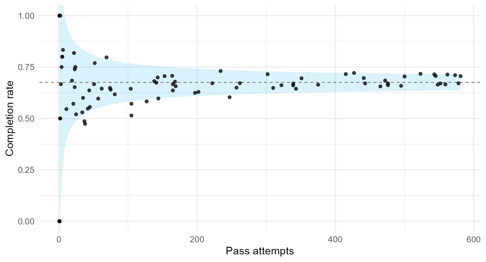
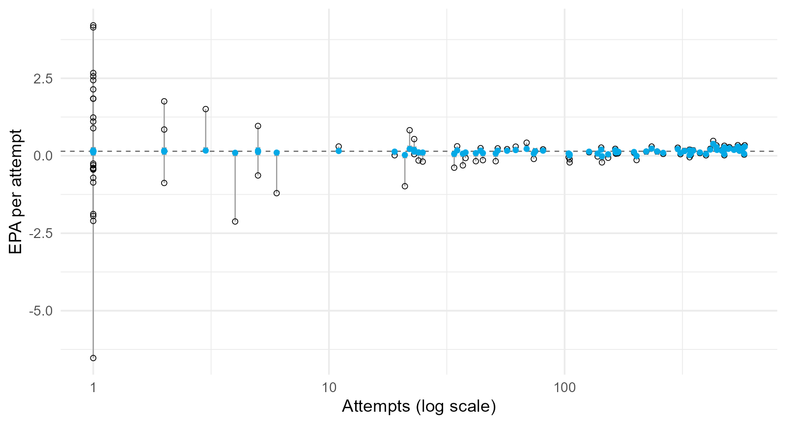
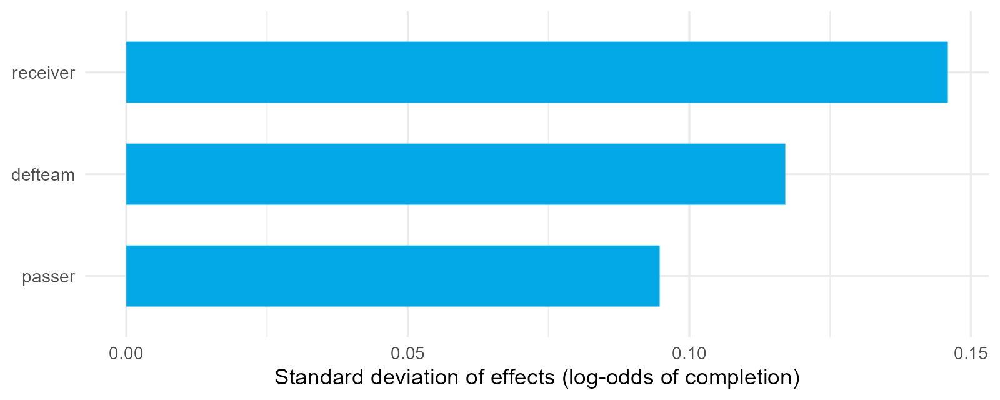
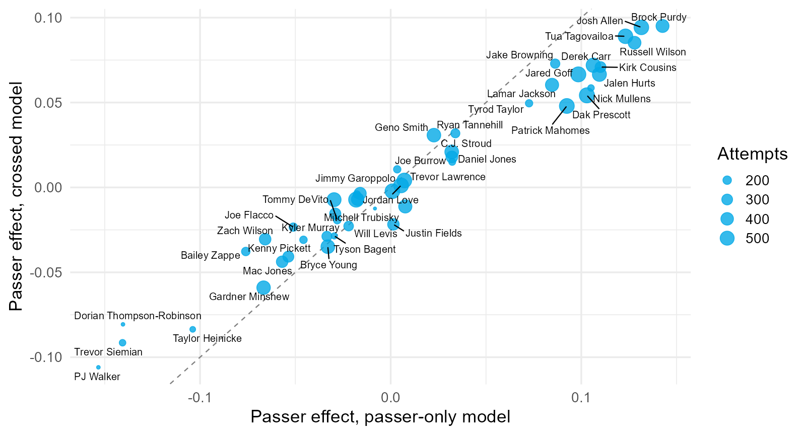
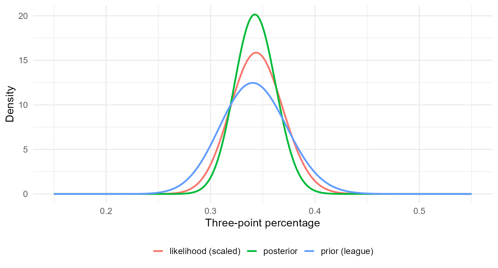
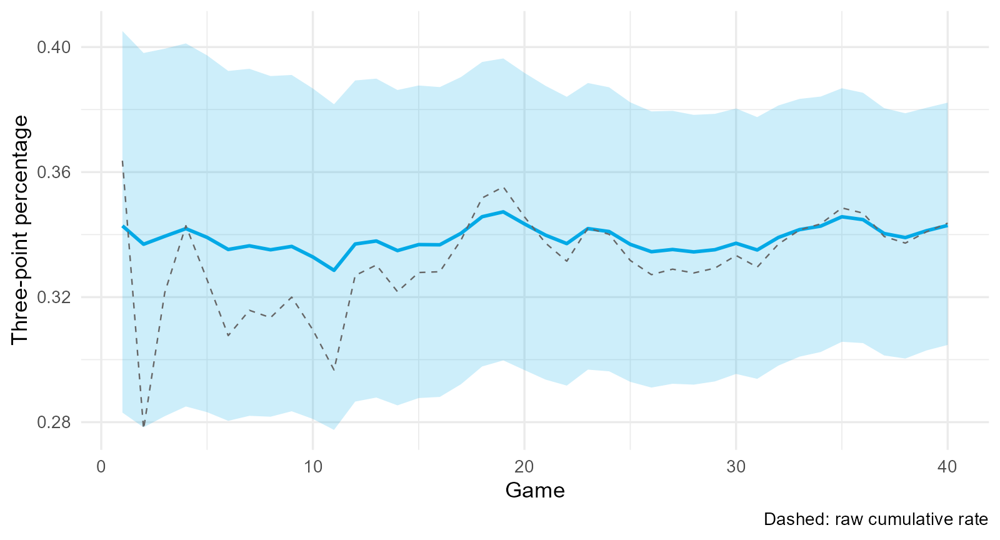
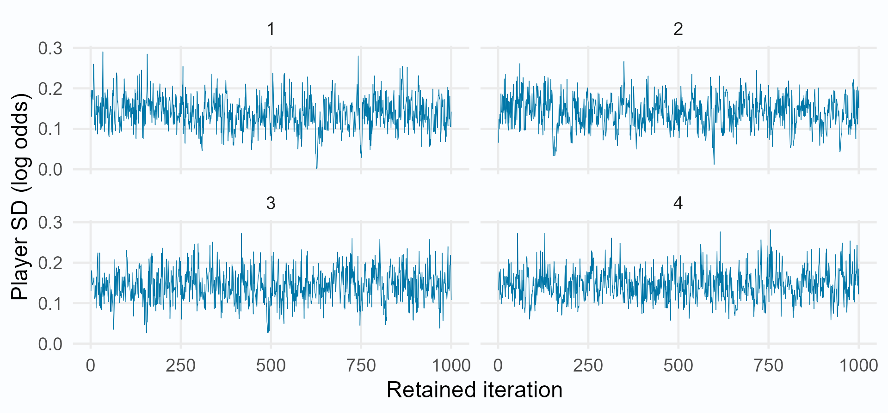
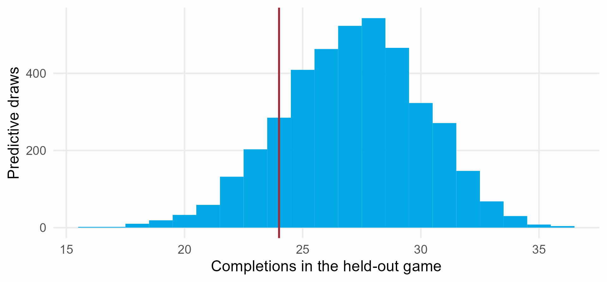
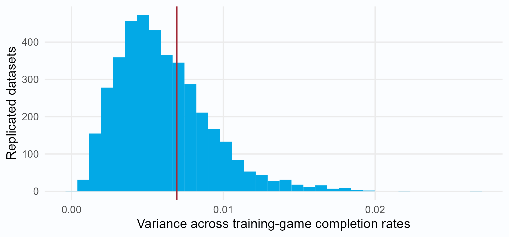
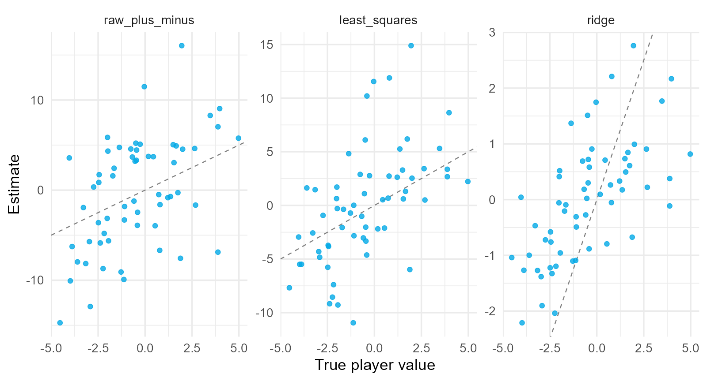

## 4.0.1 How good is a quarterback?

In the filtered 2023 sample, Mason Rudolph averaged **0.422 expected points added (EPA) per attempt** over 69 attempts; Dak Prescott averaged **0.339 EPA per attempt** over 581 attempts.

An observed average reflects the player, the context of the attempts, and sampling variation.

::: {.question}
Which passer is better? What would you need to know before answering?
:::

::: {.notes}
Source: data/nfl_passes_2023.rds, qb_summary() in R/player_helpers.R. EPA values are raw averages of qb_epa over the included attempts.

Collect the objections: sample size, who the receivers were, which defenses, how deep the throws were. Each one maps to a tutorial in this lecture.
:::

## 4.0.2 Section map: from a raw average to a posterior

| Section | Question |
|---|---|
| **4.1** Player Evaluation and Small Samples (Optional) | How much of an average is noise? |
| **4.2** Multilevel Models with Varying Intercepts | How does a model estimate $\tau^2$ and shrink? |
| **4.3** Covariates, Slopes, and Crossed Effects (Optional) | How do we separate passer, receiver, and defense? |
| **4.4** Bayesian Thinking and the Connection | How does partial pooling connect to Bayesian inference? |
| **4.5** Bayesian Player Models in Stan | How do we fit, predict, and check a player model? |
| **4.6** Regularization and Plus-Minus | Why is ridge regression a prior, and what is RAPM? |

## 4.1 Player Evaluation and Small Samples (Optional) {.section-slide}

An observed average is an estimate. Measure its reliability before comparing players.

::: {.notes}
Source and code: Tutorial 4.1, `4.1-player-evaluation-small-samples.qmd`. Numerical examples use the bundled datasets or the explicitly identified simulation described there. Treat ratings as conditional on the stated model and sample.
:::

## 4.1.1 A raw statistic is a group mean

For attempt $i$ by passer $j$, with $n_j$ attempts,

$$
\bar y_j=\frac{1}{n_j}\sum_{i=1}^{n_j}y_{ij}
\quad\text{estimates}\quad
\theta_j,
$$

$y_{ij}$ is completion (0 or 1) or EPA (expected points added) on attempt $i$ by passer $j$. $\bar y_j$ is the observed average and $\theta_j$ the underlying mean in the sampled context. Raw averages do not adjust context. These 2023 records use the filtered attempts in the course data, so they differ from official season totals.

| Passer | Attempts | Completion rate | EPA per attempt |
|---|---:|---:|---:|
| Dak Prescott | 581 | .706 | .339 |
| Jared Goff | 573 | .710 | .289 |
| Patrick Mahomes | 562 | .714 | .217 |
| Josh Allen | 545 | .706 | .283 |

::: {.notes}
Source and code: Tutorial 4.1, `4.1-player-evaluation-small-samples.qmd`. Numerical examples use the bundled datasets or the explicitly identified simulation described there. Treat ratings as conditional on the stated model and sample.
:::

## 4.1.2 Raw averages are noisy

{fig-align="center" width="74%"}

::: {.small}
Band: $\bar p\pm2\sqrt{\bar p(1-\bar p)/n}$. $\bar p$: pooled completion rate. $n$: attempts at that horizontal position. This approximate binomial reference band assumes a common completion probability, not different player abilities.
:::

::: {.notes}
Source and code: Tutorial 4.1, `4.1-player-evaluation-small-samples.qmd`. Numerical examples use the bundled datasets or the explicitly identified simulation described there. Treat ratings as conditional on the stated model and sample.
:::

## 4.1.3 Completion rates: exact sampling and approximation

For $n_j$ conditionally independent attempts with completion probability $\theta_j$:

$$
S_j\mid\theta_j\sim\operatorname{Binomial}(n_j,\theta_j),\qquad
\bar Y_j=S_j/n_j=\theta_j+\varepsilon_j.
$$

$S_j$: completion count. $\bar Y_j$: random sample rate. $\varepsilon_j=\bar Y_j-\theta_j$: sampling error. Lowercase $\bar y_j$ denotes the observed rate.

$$
\begin{aligned}
E(\bar Y_j\mid\theta_j)&=E(S_j\mid\theta_j)/n_j=\theta_j,\\
E(\varepsilon_j\mid\theta_j)&=0,\qquad
\operatorname{Var}(\varepsilon_j\mid\theta_j)=\theta_j(1-\theta_j)/n_j.
\end{aligned}
$$

These statements are exact. Approximating this discrete error by a normal distribution is a separate step. Replacing $\theta_j(1-\theta_j)$ by common $\sigma^2$ is another simplification.

The additive identity holds for completion rates without assuming normal errors. The normal approximation is most useful when expected makes and misses are both sufficiently large.

## 4.1.4 Signal plus noise

$$
\bar Y_j=\theta_j+\varepsilon_j,
\qquad
\operatorname{Var}(\bar Y_j)=\underbrace{\tau^2}_{\text{signal}}+\underbrace{\sigma^2/n_j}_{\text{noise}}.
$$

For conditionally independent attempts with common variance $\sigma^2$, the average error has variance $\sigma^2/n_j$. The **reliability** is the signal share,

$$
R_j=\frac{\tau^2}{\tau^2+\sigma^2/n_j}=\frac{n_j}{n_j+\sigma^2/\tau^2}.
$$

::: {.takeaway}
$\sigma^2/\tau^2$ is the number of attempts at which an average becomes half signal.
:::

::: {.notation}
$j$: player; $n_j$: fixed attempt count; $\bar Y_j$: random sample mean; $\theta_j$: underlying mean; $\varepsilon_j$: sample-mean error. Assume $E(\varepsilon_j\mid\theta_j)=0$, $\operatorname{Var}(\theta_j)=\tau^2$, and $\operatorname{Var}(\varepsilon_j)=\sigma^2/n_j$. $R_j=w_j$: reliability. Zero conditional error mean implies $\operatorname{Cov}(\theta_j,\varepsilon_j)=0$, giving the variance sum. This calculation needs finite variances, not normality. Assume $\tau^2>0$.
:::

::: {.notes}
Source and code: Tutorial 4.1, `4.1-player-evaluation-small-samples.qmd`. Numerical examples use the bundled datasets or the explicitly identified simulation described there. Treat ratings as conditional on the stated model and sample.
:::

## 4.1.5 Estimates from 2023

Method of moments for $J$ passer records with at least 50 included attempts in 2023:

$$
\hat\tau^2=\max\left\{0,\ s_{\bar y}^2-\frac1J\sum_{j=1}^J\frac{\hat\sigma^2}{n_j}\right\}.
$$

$s_{\bar y}^2$: sample variance of player averages. $\hat\sigma^2$: estimated per-attempt noise variance. $n_j$: attempts for player $j$. $\hat\tau$: estimated between-player standard deviation.

| Statistic | Within variance $\hat\sigma^2$ | Between SD $\hat\tau$ | Attempts for half reliability |
|---|---:|---:|---:|
| completion rate | .219 | .031 | 231 |
| EPA per attempt | 2.34 | .107 | 206 |

These rounded estimates use a common noise variance. With 35 attempts, reliability is about 13% to 15%.

::: {.notes}
Source and code: Tutorial 4.1, `4.1-player-evaluation-small-samples.qmd`. Numerical examples use the bundled datasets or the explicitly identified simulation described there. Treat ratings as conditional on the stated model and sample.
:::

## 4.1.6 Split halves: why correlation measures reliability

For each passer, put attempts 1, 3, 5, ... in the odd half and attempts 2, 4, 6, ... in the even half. Correlate the two half-sample averages **across passers**.

For equal half sizes of $m$ attempts and stable player means,

$$
\bar Y_{j,o}=\theta_j+\varepsilon_{j,o},\qquad
\bar Y_{j,e}=\theta_j+\varepsilon_{j,e}.
$$

$$
\begin{aligned}
\operatorname{Cov}(\bar Y_{j,o},\bar Y_{j,e})&=\tau^2,\\
\operatorname{Var}(\bar Y_{j,o})=\operatorname{Var}(\bar Y_{j,e})&=\tau^2+\sigma^2/m,\\
\operatorname{Corr}(\bar Y_{j,o},\bar Y_{j,e})&=\frac{\tau^2}{\tau^2+\sigma^2/m}=R_{\mathrm{half}}.
\end{aligned}
$$

::: {.notation}
$j$: passer; $o,e$: odd and even halves; $\theta_j$: player mean with variance $\tau^2$; $\varepsilon_{j,o},\varepsilon_{j,e}$: errors with zero conditional means and variance $\sigma^2/m$. Assume the half errors are conditionally independent given $\theta_j$. $\sigma^2$: per-attempt noise variance; $R_{\mathrm{half}}$: half-sample reliability. Normality is not required. Unequal half sizes and common completion-rate noise make the data comparison approximate.
:::

::: {.notes}
Source: Tutorial 4.1, "Check the decomposition with split halves." The shared player mean produces covariance tau squared. Independent sampling errors add variance within each half without adding covariance between halves. The observed correlation also has sampling uncertainty.
:::

## 4.1.7 Reliability depends on the population

Split the seasons of 34 passers with at least 200 attempts into odd and even attempts. Correlate the two averages across passers.

| Statistic | Observed split-half $r$ | Predicted, $\tau^2$ from records with 50+ attempts | Predicted, $\tau^2$ from the same 34 passers |
|---|---:|---:|---:|
| completion rate | .165 | .479 | .226 |
| EPA per attempt | .613 | .507 | .496 |

::: {.takeaway}
For completion rate, estimating the population spread from the same passers brings predicted reliability closer to the observed correlation. EPA changes little. Reliability depends on the comparison population.
:::

::: {.notation}
$r$: Pearson correlation between odd-attempt and even-attempt averages across passers. $\tau^2$: between-passer ability variance in the specified comparison population. Predictions use a common noise variance and a typical half-season attempt count, so they are approximate. Equal-sized halves with errors conditionally independent given stable ability have correlation equal to half-sample reliability.
:::

::: {.notes}
Source and code: Tutorial 4.1, `4.1-player-evaluation-small-samples.qmd`. Numerical examples use the bundled datasets or the explicitly identified simulation described there. Treat ratings as conditional on the stated model and sample.
:::

## 4.1.8 Regression to the mean is arithmetic

Since $\operatorname{Cov}(\theta_j,\bar Y_j)=\tau^2$, the best linear predictor at a fixed attempt count $n_j$ is

$$
\hat\theta_j=\mu+R_j(\bar y_j-\mu),\qquad
R_j=\frac{\operatorname{Cov}(\theta_j,\bar Y_j)}{\operatorname{Var}(\bar Y_j)}
=\frac{\tau^2}{\tau^2+\sigma^2/n_j}.
$$

$\theta_j$: player mean; $\hat\theta_j$: estimated mean; $\mu$: population mean; $\bar y_j$: observed average over $n_j$ attempts; $R_j$: reliability; $\tau^2$: ability variance; $\sigma^2$: per-attempt noise variance. If $\theta_j\sim N(\mu,\tau^2)$ and $\bar Y_j\mid\theta_j\sim N(\theta_j,\sigma^2/n_j)$, this predictor equals $E(\theta_j\mid\bar Y_j=\bar y_j)$ at fixed population parameters.

| Passer | Attempts | Completion rate | $R_j$ | Estimated ability |
|---|---:|---:|---:|---:|
| Mason Rudolph | 69 | .797 | .23 | .703 |
| Jake Browning | 234 | .731 | .50 | .703 |
| Brock Purdy | 427 | .721 | .65 | .705 |

Completion-rate values use a Gaussian approximation. Future noise has expected value zero; a lower next rate is not guaranteed.

::: {.notes}
Source and code: Tutorial 4.1, `4.1-player-evaluation-small-samples.qmd`. Numerical examples use the bundled datasets or the explicitly identified simulation described there. Treat ratings as conditional on the stated model and sample.
:::

## 4.1.9 Regression to the mean in future performance

Let the future average be $\widetilde{\bar Y}_j=\theta_j+\widetilde\varepsilon_j$. Assume the player's mean is unchanged and future errors have mean zero given ability and past data.

$$
\begin{aligned}
E(\widetilde{\bar Y}_j\mid\bar Y_j=\bar y_j)
&=E\{E(\widetilde{\bar Y}_j\mid\theta_j,\bar Y_j=\bar y_j)\mid\bar Y_j=\bar y_j\}\\
&=E(\theta_j\mid\bar Y_j=\bar y_j)\\
&=\mu+R_j(\bar y_j-\mu).
\end{aligned}
$$

The final equality uses the normal-normal model. When $0<R_j<1$, the expected future average is closer to the population mean, even though the player's ability has not changed.

::: {.notation}
$j$: player; $\theta_j$: underlying mean; $\bar Y_j$: past random average; $\bar y_j$: its observed value; $\widetilde{\bar Y}_j$: future average; $\widetilde\varepsilon_j$: future sampling error. $\mu$: population mean; $R_j$: reliability of the past average. A realized future average can still increase or decrease.
:::

::: {.notes}
The first equality is iterated conditional expectation. The second uses zero-mean future error conditional on ability and past data. The conditional-mean formula in the final line additionally uses the Gaussian hierarchy with fixed population parameters. This separates estimating the player mean from predicting a future realized average.
:::

## 4.1.10 Context: not every pass is equally hard

Fit an expectation model without the passer,

$$
\hat p_i=\operatorname{logit}^{-1}\!\left(\hat\beta_0+\mathbf x_i^{\mathsf T}\hat{\boldsymbol\beta}\right),
\qquad
\mathrm{CPOE}_i=y_i-\hat p_i.
$$

| Term | Estimate |
|---|---:|
| air yards (linear term) | $-.073$ |
| passer hit | $-.823$ |
| receiver is a tight end | $+.092$ |

A passer's CPOE is the average of their residuals. The fitted model includes a quadratic air-yards term and other context covariates.

::: {.notation}
$i$: attempt. $y_i\in\{0,1\}$: completion outcome. $\hat p_i$: fitted completion probability. $\mathbf x_i$: throw-context covariates. $\hat\beta_0$: fitted intercept. $\hat{\boldsymbol\beta}$: fitted slopes. CPOE means completion percentage over expectation; the formula is on the proportion scale (multiply by 100 for percentage points).
:::

::: {.notes}
Source and code: Tutorial 4.1, `4.1-player-evaluation-small-samples.qmd`. Numerical examples use the bundled datasets or the explicitly identified simulation described there. Treat ratings as conditional on the stated model and sample.
:::

## 4.1.11 Residual allocation is an assumption

Averaging residuals by passer credits the passer with **everything** the expectation model did not explain.

::: {.danger}
The receiver who caught it, the defense that allowed it, the protection, and chance are all in the residual.
:::

Section 4.2 first addresses sampling noise with partial pooling. Section 4.3 then adds measured context and crossed effects. These adjustments estimate conditional associations and do not establish causal credit.

::: {.notes}
Source and code: Tutorial 4.1, `4.1-player-evaluation-small-samples.qmd`. Numerical examples use the bundled datasets or the explicitly identified simulation described there. Treat ratings as conditional on the stated model and sample.
:::

## 4.2 Multilevel Models with Varying Intercepts {.section-slide}

Estimate how much players differ, then let that estimate decide how far to trust each player's data.

::: {.notes}
Source and code: Tutorial 4.2, `4.2-multilevel-varying-intercepts.qmd`. Numerical examples use the bundled datasets or the explicitly identified simulation described there. Treat ratings as conditional on the stated model and sample.
:::

## 4.2.1 Three estimators

$$
\hat\theta_j^{\text{pool}}=\bar y,
\qquad
\hat\theta_j^{\text{none}}=\bar y_j,
\qquad
\hat\theta_j^{\text{partial}}=\bar y+w_j\left(\bar y_j-\bar y\right).
$$

- complete pooling ignores the player;
- no pooling ignores the league; and
- partial pooling weights them by reliability, and the model estimates the weight.

::: {.notation}
$j$: player. $\bar y_j$: player average. $\bar y$: pooled average across attempts. $\hat\theta_j$: estimate of player mean. $w_j=n_j\tau^2/(n_j\tau^2+\sigma^2)$ is the data weight; $n_j$: attempts; $\tau^2$: player variance; $\sigma^2$: attempt-error variance. These illustrate pooling with $\bar y$ as a plug-in population mean; a fitted mixed model estimates its own population intercept.
:::

::: {.notes}
Source and code: Tutorial 4.2, `4.2-multilevel-varying-intercepts.qmd`. Numerical examples use the bundled datasets or the explicitly identified simulation described there. Treat ratings as conditional on the stated model and sample.
:::

## 4.2.2 The two-level model

We now use a Gaussian working model for continuous EPA. Completion outcomes return at the end of this section.

Level one, attempts within a passer:

$$
y_{ij}=\beta_{0j}+\varepsilon_{ij},
\qquad
\varepsilon_{ij}\sim N(0,\sigma^2).
$$

Level two, passers within the league:

$$
\beta_{0j}=\beta_0+u_j,
\qquad
u_j\sim N(0,\tau^2).
$$

Composite: $y_{ij}=\beta_0+u_j+\varepsilon_{ij}$.

::: {.notation}
$y_{ij}$: EPA for attempt $i$ by player $j$. $\beta_{0j}=\theta_j$: player mean. $\beta_0=\mu$: population intercept. $u_j$: player deviation. $\varepsilon_{ij}$: attempt error. $\tau^2$ and $\sigma^2$: player and residual variances. Assume independent player effects and independent errors, also independent of each other.
:::

::: {.notes}
Source and code: Tutorial 4.2, `4.2-multilevel-varying-intercepts.qmd`. Numerical examples use the bundled datasets or the explicitly identified simulation described there. Treat ratings as conditional on the stated model and sample.
:::

## 4.2.3 Laird-Ware form

$$
\mathbf y=X\boldsymbol\beta+Z\mathbf u+\boldsymbol\varepsilon,
\qquad
\mathbf u\sim N(\mathbf 0,\tau^2I_J),
\qquad
\boldsymbol\varepsilon\sim N(\mathbf 0,\sigma^2I_N).
$$

Integrating out $\mathbf u$,

$$
\mathbf y\sim N\!\left(X\boldsymbol\beta,\ \tau^2ZZ^{\mathsf T}+\sigma^2I_N\right).
$$

Two attempts by the same passer have covariance $\tau^2$; attempts by different passers are independent. Maximum likelihood fits this marginal model.

::: {.notation}
$N$: total attempts; $J$: players; $p$: fixed-effect coefficients. $\mathbf y$ and $\boldsymbol\varepsilon$: $N$-vectors. $X$: $N\times p$ fixed-effect design; $\boldsymbol\beta$: $p$-vector. $Z$: $N\times J$ player indicators; $\mathbf u$: $J$ player deviations. $I_N,I_J$: identity matrices. Effects and errors are independent. The same-passer covariance statement describes the intercept-only model.
:::

::: {.notes}
Source and code: Tutorial 4.2, `4.2-multilevel-varying-intercepts.qmd`. Numerical examples use the bundled datasets or the explicitly identified simulation described there. Treat ratings as conditional on the stated model and sample.
:::

## 4.2.4 Fixed and random effects

| | Fixed effect $\beta_0$ | Random effects $u_j$ |
|---|---|---|
| what it is | one league constant | one deviation per passer |
| what is estimated | the value | the variance $\tau^2$, then each $u_j$ |
| "random" means | nothing | modeled as draws from a population |

"Random" does not mean the passers were sampled at random. It means we borrow strength across them.

::: {.notes}
Source and code: Tutorial 4.2, `4.2-multilevel-varying-intercepts.qmd`. Numerical examples use the bundled datasets or the explicitly identified simulation described there. Treat ratings as conditional on the stated model and sample.
:::

## 4.2.5 Fit and variance components

```r
library(lme4)
epa_fit <- lmer(qb_epa ~ 1 + (1 | passer), data = passes)
```

| Component | Standard deviation |
|---|---:|
| passer $\tau$ | .115 |
| residual $\sigma$ | 1.540 |

Intraclass correlation:

$$
\rho=\frac{\tau^2}{\tau^2+\sigma^2}=.0056.
$$

Less than 1% of per-attempt variance is between passers; hundreds of attempts are needed before it shows.

::: {.notation}
$\rho$: correlation between two distinct attempts by the same player in this intercept-only Gaussian model. $\tau$: player-effect SD. $\sigma$: residual SD. Both are measured in EPA per attempt.
:::

::: {.notes}
Source and code: Tutorial 4.2, `4.2-multilevel-varying-intercepts.qmd`. Numerical examples use the bundled datasets or the explicitly identified simulation described there. Treat ratings as conditional on the stated model and sample.
:::

## 4.2.6 Deep dive: the shrinkage estimator

The Gaussian model implies $u_j\sim N(0,\tau^2)$ and $\bar y_j\mid u_j\sim N(\beta_0+u_j,\sigma^2/n_j)$. Conditioning gives:

$$
E[u_j\mid\bar y_j]=\frac{\dfrac{n_j}{\sigma^2}(\bar y_j-\beta_0)+\dfrac{1}{\tau^2}\cdot0}{\dfrac{n_j}{\sigma^2}+\dfrac{1}{\tau^2}}
=\boxed{\frac{n_j\tau^2}{n_j\tau^2+\sigma^2}\left(\bar y_j-\beta_0\right)}.
$$

The player estimate is $\hat\beta_{0j}=\beta_0+E(u_j\mid\bar y_j)$. This is the same shrinkage rule as Section 4.1. Section 4.4 derives its Bayesian interpretation from Bayes' rule.

::: {.notation}
$j$: player; $n_j$: attempts; $\bar y_j$: player average; $\beta_0$: population mean; $u_j$: deviation. $\tau^2$: prior variance; $\sigma^2$: per-attempt error variance. Precision means inverse variance. Hold $\beta_0,\tau^2,\sigma^2$ fixed here. BLUP means best linear unbiased predictor; plugging in estimated parameters gives an empirical BLUP.
:::

::: {.notes}
Source and code: Tutorial 4.2, `4.2-multilevel-varying-intercepts.qmd`. Numerical examples use the bundled datasets or the explicitly identified simulation described there. Treat ratings as conditional on the stated model and sample.
:::

## 4.2.7 The hand calculation matches lme4

| Passer | Attempts | $\bar y_j$ | $w_j$ | by hand | `ranef()` |
|---|---:|---:|---:|---:|---:|
| Dak Prescott | 581 | .339 | .76 | .148 | .148 |
| Tyrod Taylor | 164 | .225 | .48 | .038 | .038 |
| Jerick McKinnon | 1 | 1.105 | .006 | .005 | .005 |

A passer with one attempt is estimated at almost exactly the league mean.

::: {.notation}
$\bar y_j$: mean EPA; $w_j$: data weight. Both final columns show $\hat u_j=w_j(\bar y_j-\hat\beta_0)$, a deviation from the fitted population intercept. The estimated player mean is $\hat\beta_0+\hat u_j$.
:::

::: {.notes}
Source and code: Tutorial 4.2, `4.2-multilevel-varying-intercepts.qmd`. Numerical examples use the bundled datasets or the explicitly identified simulation described there. Treat ratings as conditional on the stated model and sample.
:::

## 4.2.8 Every estimate is pulled toward the mean

{fig-align="center" width="72%"}

::: {.small}
Open circles: no pooling. Filled circles: partial pooling. The fraction of the gap removed is larger with fewer attempts. Arrow length also depends on the original distance from the fitted population mean.
:::

::: {.notes}
Source and code: Tutorial 4.2, `4.2-multilevel-varying-intercepts.qmd`. Numerical examples use the bundled datasets or the explicitly identified simulation described there. Treat ratings as conditional on the stated model and sample.
:::

## 4.2.9 ML and REML

The variance components are estimated by maximizing the marginal likelihood of $y$ after integrating out $\mu$. There are two versions:

- **ML** maximizes the full marginal likelihood; variance estimates can be biased downward in finite samples because $\boldsymbol\beta$ is estimated from the same data.
- **REML** maximizes the likelihood of contrasts free of $\boldsymbol\beta$; it accounts for estimating fixed effects, analogous to dividing a sample variance by $n-1$. It need not remove all finite-sample bias.

`lmer()` defaults to REML. Use `REML = FALSE` to compare models with different fixed effects.

::: {.notation}
ML: maximum likelihood. REML: restricted maximum likelihood. $\boldsymbol\beta$: fixed-effect coefficient vector. $n$: sample size in the sample-variance analogy. $\tau^2$: population variance of player effects.
:::

::: {.notes}
Source and code: Tutorial 4.2, `4.2-multilevel-varying-intercepts.qmd`. Numerical examples use the bundled datasets or the explicitly identified simulation described there. Treat ratings as conditional on the stated model and sample.
:::

## 4.2.10 Uncertainty about each effect

$$
\operatorname{Var}(u_j\mid\mathbf y)=\left(\frac{1}{\tau^2}+\frac{n_j}{\sigma^2}\right)^{-1}
=\frac{\sigma^2\tau^2}{n_j\tau^2+\sigma^2}.
$$

This is exact for the Gaussian intercept-only EPA model with population parameters fixed. `ranef(epa_fit, condVar = TRUE)` plugs in fitted population parameters.

::: {.question}
This interval describes uncertainty about the player mean. A future EPA average also includes new attempt noise.
:::

::: {.notation}
$u_j$: player deviation; $\mathbf y$: all observed outcomes; $n_j$: player attempts; $\tau^2$: player-effect variance; $\sigma^2$: per-attempt error variance. An effect of zero means that the passer mean equals the population mean EPA.
:::

::: {.notes}
Source and code: Tutorial 4.2, `4.2-multilevel-varying-intercepts.qmd`. Numerical examples use the bundled datasets or the explicitly identified simulation described there. Treat ratings as conditional on the stated model and sample.
:::

## 4.2.11 A binary outcome: the GLMM

Completion is binary, so we replace the Gaussian outcome distribution with a Bernoulli distribution and model its log-odds.

$$
\operatorname{logit}P(y_{ij}=1\mid u_j)=\beta_0+u_j,
\qquad
u_j\sim N(0,\tau^2).
$$

```r
glmer(complete ~ 1 + (1 | passer), data = passes, family = binomial())
```

$\hat\tau=.102$ on the log-odds scale; the latent residual variance is fixed at $\pi^2/3$.

| Passer | Attempts | Raw rate | Shrunken rate |
|---|---:|---:|---:|
| Dontayvion Wicks | 1 | 1.000 | .672 |
| C.J. Stroud | 476 | .670 | .671 |

::: {.notation}
$y_{ij}$: 0/1 completion on attempt $i$ by player $j$. $\beta_0$: population log-odds intercept. $u_j$: player log-odds deviation. $\tau$: SD of those deviations. $\operatorname{logit}(p)=\log[p/(1-p)]$. GLMM: generalized linear mixed model. $\pi\approx3.14159$; $\pi^2/3$ is a latent logistic-error variance, not the observed Bernoulli variance.
:::

The Gaussian shrinkage weight is no longer exact. `glmer()` returns conditional modes on the log-odds scale, which we transform to rates. Next we add throw difficulty, receivers, and defenses.

::: {.notes}
Reference: https://lme4.github.io/lme4/reference/ranef.html

Source and code: Tutorial 4.2, `4.2-multilevel-varying-intercepts.qmd`. Numerical examples use the bundled datasets or the explicitly identified simulation described there. Treat ratings as conditional on the stated model and sample.
:::

## 4.3 Covariates, Varying Slopes, and Crossed Effects (Optional) {.section-slide}

Estimate passer associations conditional on throw characteristics, receivers, and defenses in one model.

::: {.notes}
Source and code: Tutorial 4.3, `4.3-covariates-slopes-crossed-effects.qmd`. Numerical examples use the bundled datasets or the explicitly identified simulation described there. Treat ratings as conditional on the stated model and sample.
:::

## 4.3.1 Level-one covariates

$$
\operatorname{logit}P(y_{ij}=1)=\beta_{0j}+\mathbf x_{ij}^{\mathsf T}\boldsymbol\beta,
\qquad
\beta_{0j}=\beta_0+u_j.
$$

The expectation model and the passer effects are now estimated **jointly**.

| Term | Estimate |
|---|---:|
| air yards (standardized) | $-.63$ |
| passer hit | $-.85$ |

Passer SD changes from .102 to .117 after adjustment. Logistic-model SDs are conditional on the covariates and are not directly comparable as changes in true ability spread.

::: {.notation}
$y_{ij}$: completion outcome; $\mathbf x_{ij}$: attempt covariates; $\boldsymbol\beta$: common slopes. $\beta_{0j}$: player log-odds intercept; $\beta_0$: population intercept; $u_j$: player deviation. The probability is conditional on covariates and player effects.
:::

::: {.notes}
Source and code: Tutorial 4.3, `4.3-covariates-slopes-crossed-effects.qmd`. Numerical examples use the bundled datasets or the explicitly identified simulation described there. Treat ratings as conditional on the stated model and sample.
:::

## 4.3.2 A level-two covariate

$$
\beta_{0j}=\gamma_0+\gamma_1 w_j+u_j,
$$

$w_j$: standardized passer-average air yards (`passer_air_z`), a level-two covariate here rather than the earlier shrinkage weight. $\gamma_0$: population intercept at $w_j=0$; $\gamma_1$: between-passer slope; $u_j$: remaining player deviation; $\beta_{0j}$: player intercept. SE: standard error.

| Term | Estimate | SE |
|---|---:|---:|
| air yards of this throw | $-.630$ | .019 |
| passer's average air yards | $+.035$ | .020 |

After adjusting each throw's depth, the extra association with a passer's average depth is modest and its approximate 95% interval includes zero.

::: {.notes}
Source and code: Tutorial 4.3, `4.3-covariates-slopes-crossed-effects.qmd`. Numerical examples use the bundled datasets or the explicitly identified simulation described there. Treat ratings as conditional on the stated model and sample.
:::

## 4.3.3 Varying slopes

$$
\begin{pmatrix}u_{0j}\\u_{1j}\end{pmatrix}\sim N\!\left(\mathbf 0,
\begin{pmatrix}\tau_0^2&\rho\tau_0\tau_1\\\rho\tau_0\tau_1&\tau_1^2\end{pmatrix}\right)
$$

```r
glmer(complete ~ air_yards_z + qb_hit + pass_location +
        receiver_position + (1 + air_yards_z | passer),
      data = passes, family = binomial())
```

| $\tau_0$ | $\tau_1$ | $\rho$ | Nominal LRT $p$ |
|---:|---:|---:|---:|
| .112 | .087 | .89 | .015 |

The fitted positive correlation links higher completion at average depth to a less negative depth slope.

::: {.notation}
$u_{0j}$ and $u_{1j}$: player $j$ deviations from the population intercept and air-yards slope. $\tau_0,\tau_1$: their SDs; $\rho$: their correlation (not the ICC). The linear predictor includes $(\beta_0+u_{0j})+(\beta_1+u_{1j})x_{ij}$; $\beta_0,\beta_1$ are the population intercept and slope, and $x_{ij}$ is standardized air yards. Nominal LRT $p$: likelihood-ratio-test p-value using a nominal chi-square reference. Testing a zero variance lies on a boundary, so bootstrap calibration is preferable.
:::

::: {.notes}
Source and code: Tutorial 4.3, `4.3-covariates-slopes-crossed-effects.qmd`. Numerical examples use the bundled datasets or the explicitly identified simulation described there. Treat ratings as conditional on the stated model and sample.
:::

## 4.3.4 Nested and crossed structures

**Nested**: each level of the inner factor belongs to one level of the outer factor.

```r
(1 | passer) + (1 | passer:game_id)  # passer-game units within passers
```

**Crossed**: levels of one factor combine with many levels of another.

```r
(1 | passer) + (1 | receiver) + (1 | defteam)
```

A passer-game unit belongs to one passer, although an actual game includes multiple passers. Across passes, receivers can appear with multiple passers, and passers face multiple defenses.

::: {.notes}
Source and code: Tutorial 4.3, `4.3-covariates-slopes-crossed-effects.qmd`. Numerical examples use the bundled datasets or the explicitly identified simulation described there. Treat ratings as conditional on the stated model and sample.
:::

## 4.3.5 The crossed model shares the residual

$$
\operatorname{logit}P(y_i=1)=\beta_0+\mathbf x_i^{\mathsf T}\boldsymbol\beta+u_{q(i)}+v_{r(i)}+d_{k(i)}
$$

{fig-align="center" width="70%"}

In this fitted completion model, receiver effects have at least as much estimated spread as passer effects. This comparison does not measure their relative causal importance.

::: {.notation}
$i$: attempt; $y_i$: completion; $\mathbf x_i$: context; $\beta_0,\boldsymbol\beta$: intercept and slopes. $q(i),r(i),k(i)$ identify the passer, receiver, and defense. $u,v,d$ are their log-odds effects, with separate zero-mean normal population distributions. The probability is conditional on these effects.
:::

::: {.notes}
Source and code: Tutorial 4.3, `4.3-covariates-slopes-crossed-effects.qmd`. Numerical examples use the bundled datasets or the explicitly identified simulation described there. Treat ratings as conditional on the stated model and sample.
:::

## 4.3.6 What changes when receivers and defenses are in the model

{fig-align="center" width="66%"}

::: {.small}
Above the line: a higher fitted passer effect after adding receiver and defense effects. Below: a lower effect. Both adjustments and changed shrinkage contribute to the difference.
:::

::: {.notes}
Source and code: Tutorial 4.3, `4.3-covariates-slopes-crossed-effects.qmd`. Numerical examples use the bundled datasets or the explicitly identified simulation described there. Treat ratings as conditional on the stated model and sample.
:::

## 4.3.7 Uncertainty for variance components

We switch from completion to a Gaussian EPA model with the same context covariates and crossed effects. A **parametric bootstrap** estimates uncertainty in its population SDs:

1. simulate new random effects and residuals from the fitted model;
2. refit; 3. record $\hat\tau$; 4. repeat 200 times.

| Component (EPA model) | Estimate | 95% interval |
|---|---:|:--:|
| defense | .053 | [.000, .078] |
| passer | .097 | [.054, .131] |
| receiver | .112 | [.063, .145] |

The defense SD interval reaches zero. These data leave its magnitude uncertain, and this analysis does not test stability across seasons.

::: {.notation}
$\hat\tau$: estimated SD of the selected population of effects. The table reports SDs of defense, passer, and receiver effects on the EPA scale; they have separate variance parameters.
:::

::: {.notes}
Source and code: Tutorial 4.3, `4.3-covariates-slopes-crossed-effects.qmd`. Numerical examples use the bundled datasets or the explicitly identified simulation described there. Treat ratings as conditional on the stated model and sample.
:::

## 4.3.8 Two kinds of uncertainty

| Question | Tool |
|---|---|
| how well do we know $\tau^2$? | parametric bootstrap with `use.u = FALSE` |
| how well do we know passer $j$'s effect, given $\tau^2$? | conditional variance (`condVar = TRUE`) |
| both at once? | a full hierarchical posterior (Sections 4.4–4.5) |

::: {.takeaway}
A bootstrap that resimulates the random effects describes the population, not any particular passer.
:::

::: {.notation}
$j$: passer. $\tau^2$: variance across passer effects. A conditional player interval treats all fitted population parameters as fixed; a full posterior can integrate their uncertainty.
:::

::: {.notes}
Source and code: Tutorial 4.3, `4.3-covariates-slopes-crossed-effects.qmd`. Numerical examples use the bundled datasets or the explicitly identified simulation described there. Treat ratings as conditional on the stated model and sample.
:::

## 4.4 Bayesian Thinking and the Multilevel Connection {.section-slide}

The same population distribution supports frequentist partial pooling and a Bayesian prior. Full Bayes also assigns priors to unknown population parameters.

::: {.notes}
Source and code: Tutorial 4.4, `4.4-bayesian-thinking-multilevel-connection.qmd`. Numerical examples use the bundled datasets or the explicitly identified simulation described there. Treat ratings as conditional on the stated model and sample.
:::

## 4.4.1 Bayes' rule for a parameter

$$
p(\theta\mid y)=\frac{p(y\mid\theta)\,p(\theta)}{p(y)}
\ \propto\
\underbrace{p(y\mid\theta)}_{\text{likelihood}}\ \underbrace{p(\theta)}_{\text{prior}}.
$$

- A frequentist probability is a long-run frequency.
- A Bayesian probability is a degree of belief about anything uncertain, including $\theta$.

The posterior combines the likelihood and prior under the stated model.

::: {.notation}
$\theta$: unknown parameter (or vector); $y$: observed data. $p(\theta\mid y)$: posterior density; $p(y\mid\theta)$: sampling density viewed as a likelihood; $p(\theta)$: prior density; $p(y)$: marginal data density that normalizes the posterior.
:::

::: {.notes}
Source and code: Tutorial 4.4, `4.4-bayesian-thinking-multilevel-connection.qmd`. Numerical examples use the bundled datasets or the explicitly identified simulation described there. Treat ratings as conditional on the stated model and sample.
:::

## 4.4.2 Beta-binomial conjugacy

For a binary rate, a beta prior pairs with exact binomial sampling. This provides a direct alternative to the Gaussian approximation in Section 4.1.

Likelihood $s\mid\theta\sim\text{Binomial}(n,\theta)$; prior $\theta\sim\text{Beta}(a,b)$:

$$
p(\theta\mid s)\propto\theta^{s+a-1}(1-\theta)^{n-s+b-1}
\ \Longrightarrow\
\theta\mid s\sim\text{Beta}(a+s,\ b+n-s).
$$

The posterior mean is a weighted average,

$$
E[\theta\mid s]=\frac{a+b}{a+b+n}\cdot\frac{a}{a+b}+\frac{n}{a+b+n}\cdot\frac{s}{n}.
$$

$a+b$ acts like a prior sample size.

::: {.notation}
$s$: observed successes; $n$: attempts; $\theta\in[0,1]$: success probability. $a,b>0$: beta prior shape parameters. $a/(a+b)$ is the prior mean and $s/n$ the observed rate. The posterior mean expression assumes $n>0$.
:::

::: {.notes}
Source and code: Tutorial 4.4, `4.4-bayesian-thinking-multilevel-connection.qmd`. Numerical examples use the bundled datasets or the explicitly identified simulation described there. Treat ratings as conditional on the stated model and sample.
:::

## 4.4.3 Caitlin Clark's three-point shooting

- 2024 regular season: 122 makes in 355 attempts (.344).
- League prior fitted by marginal likelihood from 84 other shooters: $\text{Beta}(75.1,\ 144.7)$, mean .342.

$$
\theta\mid\text{data}\sim\text{Beta}(197.1,\ 377.7).
$$

| | Mean | 95% interval |
|---|---:|:--:|
| prior | .342 | [.281, .406] |
| posterior | .343 | [.305, .382] |

::: {.notation}
$\theta$: Clark's three-point success probability. The rounded beta parameters are prior shapes plus makes and misses. Intervals are central 95% prior/posterior probability intervals. The league prior is estimated from other eligible shooters' full 2024 seasons and held fixed (empirical Bayes). This is a retrospective example.
:::

::: {.notes}
Source and code: Tutorial 4.4, `4.4-bayesian-thinking-multilevel-connection.qmd`. Numerical examples use the bundled datasets or the explicitly identified simulation described there. Treat ratings as conditional on the stated model and sample.
:::

## 4.4.4 Prior, likelihood, posterior

{fig-align="center" width="74%"}

::: {.notation}
$\theta$: three-point success probability. Prior: league reference distribution fitted without Clark's outcomes. Likelihood: evidence from her makes and misses as a function of $\theta$. Posterior: updated density. A plotted likelihood may be rescaled for comparison with densities.
:::

::: {.notes}
Source and code: Tutorial 4.4, `4.4-bayesian-thinking-multilevel-connection.qmd`. Numerical examples use the bundled datasets or the explicitly identified simulation described there. Treat ratings as conditional on the stated model and sample.
:::

## 4.4.5 Sequential updating

{fig-align="center" width="74%"}

::: {.small}
Solid line: posterior mean of the three-point success probability. Shading: central 95% credible interval. Dashed line: cumulative observed rate. Sequential updates give the same final posterior in any order under this fixed-probability model. The full-season league prior makes this a retrospective illustration.
:::

::: {.notes}
Source and code: Tutorial 4.4, `4.4-bayesian-thinking-multilevel-connection.qmd`. Numerical examples use the bundled datasets or the explicitly identified simulation described there. Treat ratings as conditional on the stated model and sample.
:::

## 4.4.6 Posterior predictive probability

For $m$ future attempts, integrate the binomial over the posterior:

$$
P(\tilde s=k\mid s)=\binom{m}{k}\frac{B(k+a',\ m-k+b')}{B(a',b')}.
$$

| $P(\text{at least 5 of the next 10})$ | |
|---|---:|
| posterior predictive | .235 |
| plug-in binomial at the posterior mean | .233 |

The predictive is slightly wider because $\theta$ itself is uncertain.

::: {.notation}
$s$: observed makes out of $n$ attempts; $m$: future attempts; $\tilde s$: future makes; $k=0,\ldots,m$: possible count. $a'=a+s$, $b'=b+n-s$: updated beta shapes. $B(u,v)=\int_0^1t^{u-1}(1-t)^{v-1}\,dt$ is the beta function, and $\binom{m}{k}$ counts ways to choose $k$ successes.
:::

::: {.notes}
Source and code: Tutorial 4.4, `4.4-bayesian-thinking-multilevel-connection.qmd`. Numerical examples use the bundled datasets or the explicitly identified simulation described there. Treat ratings as conditional on the stated model and sample.
:::

## 4.4.7 Normal-normal conjugacy

Returning to continuous EPA, the normal-normal posterior recovers the shrinkage rule from Section 4.2.

$$
\bar y_j\mid\theta_j\sim N(\theta_j,\sigma^2/n_j),
\qquad
\theta_j\sim N(\mu,\tau^2)
$$

$$
\theta_j\mid\bar y_j\sim N(m_j,v_j),
\qquad
\frac1{v_j}=\frac1{\tau^2}+\frac{n_j}{\sigma^2},
\qquad
m_j=\mu+\frac{n_j\tau^2}{n_j\tau^2+\sigma^2}(\bar y_j-\mu).
$$

::: {.takeaway}
The multilevel BLUP **is** this posterior mean, and the conditional variance **is** $v_j$.
:::

::: {.notation}
$j$: player; $\bar y_j$: average over $n_j$ attempts; $\theta_j$: player mean; $\mu$: population mean. $\sigma^2$: attempt variance; $\tau^2$: between-player variance. $m_j$: posterior mean; $v_j$: posterior variance. Treat $\mu,\tau^2,\sigma^2$ as known for these formulas.
:::

::: {.notes}
Source and code: Tutorial 4.4, `4.4-bayesian-thinking-multilevel-connection.qmd`. Numerical examples use the bundled datasets or the explicitly identified simulation described there. Treat ratings as conditional on the stated model and sample.
:::

## 4.4.8 Where do $\mu$ and $\tau^2$ come from?

| Approach | Treatment of $\mu,\tau^2$ | Software | Consequence |
|---|---|---|---|
| externally specified prior | fixed from external information | any | depends on the choice |
| empirical Bayes | estimated by ML or REML, then treated as known | `lme4` | population-parameter uncertainty omitted from conditional effects |
| fully Bayesian | given priors, integrated over | Stan, `rstanarm`, `brms` | uncertainty propagates |

`lme4` is the middle row.

::: {.notation}
$\mu$: population mean; $\tau^2$: between-player variance. The same distinction applies to residual variance $\sigma^2$. ML and REML estimate these quantities; a full Bayesian analysis assigns priors to all unknown population parameters.
:::

::: {.notes}
Source and code: Tutorial 4.4, `4.4-bayesian-thinking-multilevel-connection.qmd`. Numerical examples use the bundled datasets or the explicitly identified simulation described there. Treat ratings as conditional on the stated model and sample.
:::

## 4.4.9 Averaging over population uncertainty

Full Bayes averages the conditional player posterior over uncertain population parameters:

$$
p(\theta_j\mid\mathbf y)=\int p(\theta_j\mid\mathbf y,h)\,p(h\mid\mathbf y)\,dh.
$$

- Each population-parameter draw changes the shrinkage calculation.
- Marginal uncertainty includes average conditional variance and variation in conditional means.
- The resulting interval width depends on the data and priors.

::: {.notation}
$\theta_j$: player mean EPA; $\mathbf y$: all observed EPA values; $h=(\mu,\tau^2,\sigma^2)$: population mean, between-player variance, and residual variance. Integration averages over the posterior of $h$.
:::

::: {.notes}
Source: Tutorial 4.4, section "Averaging over population uncertainty." The law of total variance explains the two components. Including hyperparameter uncertainty does not guarantee an interval wider than a plug-in interval under different priors.
:::

## 4.4.10 The dictionary

| Multilevel (`lme4`) | Bayesian hierarchical |
|---|---|
| fixed effect $\beta$ | parameter assigned a prior |
| random effect $u_j\sim N(0,\tau^2)$ | parameter with a hierarchical prior |
| variance component $\tau^2$ | hyperparameter |
| BLUP $\hat u_j$ | Gaussian posterior mean at fitted population parameters |
| conditional variance | Gaussian posterior variance at fitted population parameters |
| ML / REML estimates population parameters | hyperpriors and joint inference for population parameters |
| bootstrap: new datasets, refitting | posterior draws: parameters given observed data |

::: {.notation}
$\beta$: population regression coefficient; $u_j$: player deviation; $\tau^2$: population variance of deviations; $\hat u_j$: fitted deviation. The exact BLUP/posterior correspondence here is Gaussian; a GLMM generally reports conditional modes.
:::

::: {.notes}
Source and code: Tutorial 4.4, `4.4-bayesian-thinking-multilevel-connection.qmd`. Numerical examples use the bundled datasets or the explicitly identified simulation described there. Treat ratings as conditional on the stated model and sample.
:::

## 4.4.11 The full Gaussian hierarchy for Gibbs

$$
\begin{aligned}
Y_{ij}\mid\theta_j,\sigma^2&\sim N(\theta_j,\sigma^2),\\
\theta_j\mid\mu,\tau^2&\sim N(\mu,\tau^2),\\
\mu&\sim N(0,1),\\
\tau^2&\sim\operatorname{IG}(2,0.04),\qquad
\sigma^2\sim\operatorname{IG}(2,4).
\end{aligned}
$$

Our target is the **joint posterior** of all unknowns:

$$
p(\boldsymbol\theta,\mu,\tau^2,\sigma^2\mid\mathbf y).
$$

**Gibbs sampling** updates one parameter block at a time. Draw from its **full conditional**: its distribution given the observed data and all other current parameter values. Keep those other values fixed during that update.

::: {.notation}
$Y_{ij}$: EPA on attempt $i$ by player $j$; $\mathbf y$: observed outcomes; $\boldsymbol\theta=(\theta_1,\ldots,\theta_J)$: means for $J$ players. $\mu$: population mean; $\tau^2,\sigma^2$: player and residual variances. $N(m,v)$ uses mean $m$ and variance $v$. $\operatorname{IG}(a,b)$ means $1/V\sim\operatorname{Gamma}(a,\text{rate}=b)$ for a positive variance $V$; $a$: shape, $b$: reciprocal-gamma rate. Assume conditional independence at both levels and independent top-level priors.
:::

::: {.notes}
Source: Tutorial 4.4, Gaussian hierarchy and folded full-conditionals block. A parameter block can contain all player means, which are conditionally independent given the population parameters and data. Gibbs avoids drawing all unknowns simultaneously: repeated conditional draws target their joint posterior. These priors give convenient conjugate updates and are teaching assumptions, not universal defaults.
:::

## 4.4.12 The player update inside Gibbs

Hold the **current** $\mu,\tau^2,\sigma^2$ fixed. For each player, calculate a conditional mean and variance, then draw a new mean:

$$
\theta_j^{\mathrm{new}}\mid\mathbf y,\mu,\tau^2,\sigma^2\sim N(m_j,v_j),\qquad
v_j=\left(n_j/\sigma^2+1/\tau^2\right)^{-1}.
$$

$$
m_j=\mu+w_j(\bar y_j-\mu),\qquad
w_j=\frac{n_j\tau^2}{n_j\tau^2+\sigma^2}.
$$

```r
v <- 1 / (stats$n / sigma2 + 1 / tau2)
m <- v * (stats$sy / sigma2 + mu / tau2)
theta <- rnorm(J, m, sqrt(v))
```

**Sample around the shrunken mean; do not just set $\theta_j=m_j$.** The new player draws become inputs to the population updates on the next slide.

::: {.notation}
$j$: player; $n_j$: attempts; $\bar y_j$: observed mean EPA; $\mathbf y$: all observed EPA; $\theta_j$: player mean; $\mu$: population mean. $\tau^2,\sigma^2$: player and residual variances; $m_j,v_j$: conditional mean and variance; $w_j$: data weight; new: replacement draw. `stats$n`, `stats$sy`: attempt counts and EPA sums; `J`: players. `mu`, `tau2`, `sigma2`: current parameter values. R's `rnorm()` takes SD, hence `sqrt(v)`.
:::

::: {.notes}
Source: Tutorial 4.4 and gibbs_epa() in R/bayesian_player_helpers.R. The code is the player-update excerpt. The formula for m_j equals v_j times (sum_i y_ij / sigma^2 + mu / tau^2). All J means can be drawn together because their full conditionals are independent at the current population values. Replacing the random draw by the conditional mean would remove uncertainty and would not be this Gibbs sampler.
:::

## 4.4.13 Gibbs sampling and partial pooling

**Initialize:** choose player means and a population mean, plus positive player and residual variances. Then repeat this full cycle:

| Step | Draw from this conditional | Use the latest values |
|---|---|---|
| 1. Player means: normal | $p(\boldsymbol\theta\mid\mathbf y,\mu,\tau^2,\sigma^2)$ | Population values from the previous cycle |
| 2. Population mean: normal | $p(\mu\mid\boldsymbol\theta,\tau^2)$ | New player means from step 1 |
| 3. Player variance: inverse gamma | $p(\tau^2\mid\boldsymbol\theta,\mu)$ | New player means and new population mean |
| 4. Residual variance: inverse gamma | $p(\sigma^2\mid\mathbf y,\boldsymbol\theta)$ | New player means and observed EPA |

Save the complete updated state; return to step 1. Repeating these conditional updates targets the joint posterior. Discard initial **warmup**, check multiple chains, and summarize the retained, **dependent** draws. For example,

$$
E(\theta_j\mid\mathbf y)\approx\frac1M\sum_{m=1}^{M}\theta_j^{(m)}.
$$

The sampled variances change the pooling weights across cycles. Averaging retained draws includes uncertainty about how strongly to pool.

::: {.notation}
$\boldsymbol\theta$: player-mean vector; $\theta_j$: mean for player $j$; $\mathbf y$: observed EPA; $\mu$: population mean; $\tau^2,\sigma^2$: player and residual variances. $p$: conditional posterior density; $M$: retained draws; $m$: draw index. Each conditional omits quantities irrelevant to that update under this hierarchy. One full cycle is one Gibbs iteration.
:::

::: {.notes}
Source: Tutorial 4.4, folded full-conditionals block and R/bayesian_player_helpers.R. The population-mean update uses the just-drawn theta vector and the previous tau squared. The tau-squared update then uses the just-drawn mu; the sigma-squared update uses the just-drawn theta vector. Use the most recent value of every conditioning quantity, not a single stale snapshot for all four updates. Warmup does not itself prove convergence: check trace plots, R-hat, ESS, and Monte Carlo error across chains, as explained in 4.5. Under this proper Gaussian hierarchy, Gibbs targets the joint posterior; finite runs approximate it. Stan uses HMC/NUTS rather than these Gibbs updates.
:::

## 4.5 Bayesian Player Models in Stan {.section-slide}

The quarterback-effects completion model from Section 4.2 becomes a fully Bayesian model. We implement it with cmdstanr and rstanarm, then predict and check game outcomes.

::: {.notes}
Source: Tutorial 4.5, 4.5-computing-posteriors.qmd. Code: R/completion_player.stan and R/fit_completion_stan.R. Results: data/completion_stan_results.rds. All fits use Weeks 1-10 of the bundled pass sample.
:::

## 4.5.1 The completion model from 4.2

$$
Y_{ij}\mid\alpha,u_j\sim\operatorname{Bernoulli}(\theta_j),\qquad
\theta_j=\operatorname{logit}^{-1}(\alpha+u_j),\qquad
u_j\mid\tau\sim N(0,\tau^2).
$$

```r
# Frequentist reference, restricted to the training attempts
training_passes <- passes[passes$week <= 10, ]
completion_fit <- glmer(complete ~ 1 + (1 | passer),
                       data = training_passes, family = binomial())
```

The model partially pools quarterbacks through their population distribution.

::: {.notation}
$Y_{ij}$: completion indicator on attempt $i$ by quarterback $j$; $\theta_j$: completion probability; $\alpha$: population intercept in log odds; $u_j$: player deviation; $\tau$: SD of player deviations. $\operatorname{logit}^{-1}(a)=1/(1+e^{-a})$. `training_passes` contains Weeks 1-10.
:::

::: {.notes}
Source: Tutorials 4.2 and 4.5. Refit on the same training data before comparing frequentist and Bayesian estimates. No covariates or receiver/defense effects enter this model.
:::

## 4.5.2 Priors complete the Bayesian hierarchy

$$
\alpha\sim N(0,2.5^2),\qquad
\tau\sim\operatorname{Exponential}(\text{rate}=1),\qquad
u_j\mid\tau\sim N(0,\tau^2).
$$

- The posterior includes the population intercept, player spread, and all player effects.
- Sampling the player spread lets pooling strength vary across draws.
- These prior constants are explicit assumptions for this example.

::: {.notation}
$\alpha$: population log-odds intercept; $u_j$: player deviation; $\tau>0$: player SD. Normal notation uses variance. The exponential prior has density $e^{-\tau}$ for $\tau>0$ and mean 1. It is a prior on SD, not variance.
:::

::: {.notes}
Source: Tutorial 4.5. These priors differ from the Gaussian Gibbs illustration in 4.4. Conditional independence and constant player probabilities are working assumptions.
:::

## 4.5.3 Whole games define the data split

| Sample | Quarterback-game rows | Attempts |
|---|---:|---:|
| Weeks 1-10, training | 363 | 9,754 |
| Weeks 11-18, known quarterbacks | 246 | 6,664 |

For quarterback-game row $g$,

$$
S_g\mid\alpha,\mathbf u\sim\operatorname{Binomial}(n_g,\theta_{j(g)}).
$$

Aggregation preserves the parameter likelihood when all attempts for a quarterback share the same probability. No game random effect is added.

::: {.notation}
$S_g$: completions; $n_g$: attempts; $j(g)$: row $g$'s quarterback; $\theta_j$: player probability; $\alpha$: population log-odds intercept; $\mathbf u$: all player effects. The 72 training quarterbacks define the index mapping. Test outcomes do not enter fitting.
:::

::: {.notes}
Source: prepare_completion() in R/bayesian_player_helpers.R and data/completion_stan_results.rds. Test predictions exclude new quarterbacks and condition on actual attempt counts. The binomial likelihood differs from the Bernoulli likelihood by parameter-independent factors.
:::

## 4.5.4 The R data list

```r
input <- prepare_completion(passes, cutoff = 10L)
train <- input$train
test <- input$test
players <- input$players
stan_data <- list(
  J = length(players), G = nrow(train),
  n = train$attempts, s = train$completions,
  qb = as.integer(train$passer),
  G_test = nrow(test), n_test = test$attempts,
  qb_test = as.integer(test$passer))
```

The training factor levels also index test quarterbacks. Held-out outcomes are absent from this list.

::: {.notation}
`train`, `test`: quarterback-game tables. `players`: ordered training-player names. `J`: player count; `G`, `G_test`: row counts; `n`, `s`: training attempts and completions; `qb`: player indices; `n_test`, `qb_test`: held-out attempt counts and player indices.
:::

::: {.notes}
Source: Tutorial 4.5. Load R/player_helpers.R and R/bayesian_player_helpers.R and set passes <- load_passes() from the lecture root before running the examples. The helper sets training factor levels before encoding test rows. A new independent factor encoding could attach predictions to the wrong quarterback.
:::

## 4.5.5 Stan parameters and likelihood

```stan
parameters {
  real alpha;
  real<lower=0> tau;
  vector[J] z;
}
transformed parameters {
  vector[J] u = tau * z;
  vector[J] theta = inv_logit(alpha + u);
}
model {
  alpha ~ normal(0, 2.5);
  tau ~ exponential(1);
  z ~ std_normal();
  s ~ binomial_logit(n, alpha + u[qb]);
}
```

::: {.notation}
`J`: quarterbacks; `alpha`: population intercept; `tau`: player SD; `z`: standard-normal effects; `u`: player deviations; `theta`: probabilities. `s`, `n`: training counts; `qb`: row-to-player mapping. Stan `normal()` takes an SD. The tutorial supplies the complete data declarations.
:::

::: {.notes}
Source: R/completion_player.stan. The non-centered representation u = tau * z preserves u_j | tau ~ Normal(0, tau^2). This slide is an excerpt; the tutorial and source file contain the complete program.
:::

## 4.5.6 Generated quantities simulate outcomes

```stan
generated quantities {
  array[G] int s_rep;
  array[G_test] int s_test_rep;
  for (g in 1:G)
    s_rep[g] = binomial_rng(n[g], theta[qb[g]]);
  for (g in 1:G_test)
    s_test_rep[g] = binomial_rng(n_test[g], theta[qb_test[g]]);
}
```

Each retained draw supplies player probabilities, then new completion outcomes. This block does not update the posterior with test outcomes.

::: {.notation}
`g`: row index; `G`, `G_test`: training and test row counts. `s_rep`, `s_test_rep`: simulated counts. `n`, `n_test`: attempts. `qb`, `qb_test`: player indices. `theta`: sampled probabilities. `binomial_rng()` generates a random completion count.
:::

::: {.notes}
Source: R/completion_player.stan. The same player's sampled probability is reused across all that player's rows within a joint draw. Predictions condition on counts rather than forecasting attempts.
:::

## 4.5.7 Custom Stan through cmdstanr

```r
model <- cmdstanr::cmdstan_model("R/completion_player.stan")
fit_stan <- model$sample(
  data = stan_data, chains = 4, parallel_chains = 4, seed = 431,
  iter_warmup = 1000, iter_sampling = 1000,
  adapt_delta = 0.95, max_treedepth = 12)
draw_matrix <- as.matrix(fit_stan$draws(
  variables = c("alpha", "tau", "theta", "s_rep", "s_test_rep"),
  format = "matrix"))
post_stan <- completion_draws(draw_matrix, players, nrow(train), nrow(test))
```

Four chains retain 4,000 joint draws after warmup. The complete R script includes setup and saves results as an RDS file.

::: {.notation}
`stan_data`: data list; `fit_stan`: fitted model; `draw_matrix`: joint draws; `post_stan`: named matrices from `completion_draws()`, preserving player/game order. `iter_warmup` and `iter_sampling` specify separate iteration counts. `model`: compiled Stan program; `parallel_chains`: chains running concurrently. `adapt_delta`: adaptation target acceptance probability; `max_treedepth`: trajectory expansion limit; `seed`: reproducible random seed.
:::

::: {.notes}
Source: Tutorial 4.5 and R/fit_completion_stan.R. Custom Stan requires a separate CmdStan installation and working C++ toolchain. Official interface: https://mc-stan.org/cmdstanr/reference/model-method-sample.html
:::

## 4.5.8 The same model through rstanarm

```r
fit_arm <- rstanarm::stan_glmer(
  cbind(completions, attempts - completions) ~ 1 + (1 | passer),
  data = train, family = binomial(link = "logit"),
  prior_intercept = rstanarm::normal(0, 2.5, autoscale = FALSE),
  prior_covariance = rstanarm::decov(shape = 1, scale = 1),
  chains = 4, iter = 2000, warmup = 1000, seed = 432,
  adapt_delta = 0.95, control = list(max_treedepth = 12))
rstanarm::prior_summary(fit_arm)
```

For one random intercept, `decov(shape = 1, scale = 1)` implies the same exponential prior on the player SD. `rstanarm` uses its own RStan backend.

::: {.notation}
`train`: training quarterback-game table; `fit_arm`: Bayesian fit. `cbind()` supplies completions and incompletions. `prior_intercept` controls the population intercept; `prior_covariance` controls player variability. `autoscale = FALSE` preserves the stated normal-prior scale. `iter` counts all iterations per chain, including `warmup`.
:::

::: {.notes}
Source: Tutorial 4.5. Matching applies to the single random intercept, not automatically to larger covariance structures. https://mc-stan.org/rstanarm/reference/priors.html and https://mc-stan.org/rstanarm/reference/stan_glmer.html
:::

## 4.5.9 Matching model assumptions across interfaces

| Quantity | Custom Stan | rstanarm |
|---|---|---|
| Population intercept | `normal(0, 2.5)` | `prior_intercept = normal(0, 2.5, autoscale = FALSE)` |
| Player SD | `exponential(1)` | `prior_covariance = decov(shape = 1, scale = 1)` |
| Likelihood | binomial with logit link | `family = binomial(link = "logit")` |

Compare the same data, likelihood, and priors before comparing results. Finite sampling can still produce small differences.

::: {.notation}
The population intercept and player SD are on the log-odds scale. SD: standard deviation. For this one-by-one covariance, Gamma(shape = 1, scale = 1) is Exponential(rate = 1).
:::

::: {.notes}
Source: Tutorial 4.5 and rstanarm prior documentation, https://mc-stan.org/rstanarm/reference/priors.html. Priors have been explicitly checked with prior_summary() in the executed workflow.
:::

## 4.5.10 MCMC and HMC in one slide

- **MCMC** generates dependent draws targeting the posterior.
- **HMC** uses log-posterior derivatives to explore continuous parameters.
- **NUTS** chooses HMC trajectory lengths during sampling.
- **Warmup** adapts settings and precedes the retained draws.

Gibbs in 4.4 and Stan sampling pursue the same joint-posterior goal with different algorithms.

::: {.notation}
MCMC: Markov chain Monte Carlo. HMC: Hamiltonian Monte Carlo. NUTS: No-U-Turn Sampler. A joint draw retains population and player parameters together, preserving their dependence.
:::

::: {.notes}
Source: Tutorial 4.5 and https://mc-stan.org/cmdstanr/reference/model-method-sample.html. Warmup adapts quantities such as step size and metric. NUTS chooses trajectory lengths during sampling. The lesson does not derive Hamiltonian dynamics.
:::

## 4.5.11 Reading the sampling checks

```r
bayesplot::mcmc_trace(fit_stan$draws(variables = c("alpha", "tau")))
fit_stan$diagnostic_summary()
fit_stan$summary(variables = c("alpha", "tau"))
```

- Trace plots should show stable exploration and agreement across chains.
- Aim for rank-normalized $\widehat R<1.01$ and enough bulk and tail effective draws for the reported quantity.
- Investigate divergences and treedepth hits before reporting rankings.
- Posterior SD describes parameter uncertainty; MCSE describes numerical uncertainty in a computed summary.

::: {.notation}
$\alpha$: population log-odds intercept; $\tau$: player SD; $\widehat R$: comparison of chain behavior; ESS: effective sample size; MCSE: Monte Carlo standard error; SD: standard deviation. Bulk ESS concerns central summaries; tail ESS concerns tails. These checks support computation, not the likelihood's realism.
:::

::: {.notes}
Source: Tutorial 4.5, "Sampling checks before interpretation." CmdStanR's diagnostic_summary() reports sampler checks; summary() supplies posterior summaries including R-hat and effective sample sizes. https://mc-stan.org/cmdstanr/reference/fit-method-diagnostic_summary.html and https://mc-stan.org/misc/warnings.html
:::

## 4.5.12 Sampling diagnostics

{fig-align="center" width="74%"}

::: {.notation}
Each panel is a retained chain for $\tau$, the player SD in log odds. Across intercept, SD, and player-probability summaries, the largest rank-normalized $\widehat R$ is 1.004 for cmdstanr and 1.005 for rstanarm. Both fits have zero divergences and treedepth hits.
:::

::: {.notes}
Source: data/completion_stan_results.rds, four chains per implementation, 1,000 retained iterations per chain. Check bulk/tail ESS and MCSE too. Stable chains support computation but do not validate the model. https://mc-stan.org/misc/warnings.html
:::

## 4.5.13 Posterior population summaries

| Implementation | Parameter | Mean | Posterior SD | MCSE of mean |
|---|---|---:|---:|---:|
| cmdstanr | population intercept | .725 | .033 | .0008 |
| rstanarm | population intercept | .725 | .033 | .0007 |
| cmdstanr | player SD | .142 | .039 | .0011 |
| rstanarm | player SD | .144 | .038 | .0010 |

The estimates describe the same model. Monte Carlo uncertainty measures precision of the computed means, not uncertainty about player performance.

::: {.notation}
The population intercept is $\alpha$ and player SD is $\tau$, both in log-odds units. Posterior SD: posterior uncertainty. MCSE: Monte Carlo standard error. Small implementation differences should be assessed relative to MCSE.
:::

::: {.notes}
Source: data/completion_stan_results.rds and Tutorial 4.5. No data are invented. The finite-draw population summaries agree within about two combined MCSEs; exact numerical equality is not expected.
:::

## 4.5.14 Player probabilities use joint draws

$$
\theta_j^{(m)}=\operatorname{logit}^{-1}
  \!\left(\alpha^{(m)}+u_j^{(m)}\right),\qquad
E(\theta_j\mid\mathbf y)\approx\frac1M\sum_{m=1}^{M}\theta_j^{(m)}.
$$

Transform each draw, then average. Transforming parameter averages generally gives a different result.

```r
player_settings <- data.frame(
  passer = factor(players, levels = players), attempts = 1L, completions = 0L)
theta_arm <- rstanarm::posterior_epred(
  fit_arm, newdata = player_settings, re.form = NULL)
```

At one attempt, expected completion counts equal player probabilities.

The `lme4` fit gives conditional player modes at fitted population parameters. Bayesian summaries integrate over population uncertainty.

::: {.notation}
$j$: quarterback; $m=1,\ldots,M$: retained joint draw; $\theta_j$: completion probability; $\alpha$: population intercept; $u_j$: player effect; $\mathbf y$: training outcomes. The inverse logit maps log odds to probabilities.
:::

::: {.notes}
Source: Tutorial 4.5, player probability table. posterior_epred() at one attempt returns player-probability draws. posterior_predict() simulates outcomes. Exact agreement with glmer predictions is not expected.
:::

## 4.5.15 Held-out log posterior predictive density

For a known quarterback, evaluate the probability of the observed completion count.

$$
\begin{aligned}
\ell_*&=\log P(S_*=s_*\mid\mathbf y,n_*)\\
&=\log\int\operatorname{Binomial}(s_*\mid n_*,\theta_j)
      p(\theta_j\mid\mathbf y)\,d\theta_j\\
&\approx\log\left[\frac1M\sum_{m=1}^{M}
  \operatorname{Binomial}(s_*\mid n_*,\theta_j^{(m)})\right].
\end{aligned}
$$

Average probability masses over posterior draws, then take the natural logarithm. A higher score means more predictive probability for the observed count.

::: {.notation}
$S_*$: random held-out completions; $s_*$: observed count; $n_*$: attempts; $j$: quarterback; $\theta_j$: player probability; $\mathbf y$: training outcomes; $\ell_*$: game log score; $m=1,\ldots,M$: retained posterior draws. Binomial notation denotes probability mass at $s_*$. Averaging log masses gives a different quantity.
:::

::: {.notes}
Source: Tutorial 4.5, Held-out log posterior predictive density, and https://mc-stan.org/docs/stan-users-guide/cross-validation.html. The player's posterior already integrates population parameters. Binomial(s | n, theta) = choose(n, s) * theta^s * (1-theta)^(n-s). Use probability mass for this discrete outcome. Fit only training games and condition predictions on held-out attempts. A new player needs a new effect drawn from the population distribution.
:::

## 4.5.16 Calculating the held-out log score in R

```r
log_mean_exp <- function(log_prob) {
  a <- max(log_prob)
  a + log(mean(exp(log_prob - a)))
}
heldout_row <- which(test$passer == "Patrick Mahomes")[1]
heldout_game <- test[heldout_row, ]
theta_draws <- post_stan$theta[, "Patrick Mahomes"]
log_prob <- dbinom(
  heldout_game$completions, heldout_game$attempts,
  theta_draws, log = TRUE)
heldout_log_score <- log_mean_exp(log_prob)
```

`dbinom()` evaluates the observed count at each posterior probability draw. The stable helper returns the log of their average probability.

::: {.notation}
`test`: held-out game table; `heldout_row`: Mahomes's first row; `heldout_game`: that row; `post_stan$theta`: draws-by-player probability matrix; `theta_draws`: Mahomes probabilities; `log_prob`: conditional log masses; `a`: their maximum; `heldout_log_score`: one game's score. `exp()` reverses the natural log.
:::

::: {.notes}
Source: Tutorial 4.5, Held-out log posterior predictive density. Results can be read without a new fit with results <- readRDS("data/completion_stan_results.rds") and post_stan <- results$cmdstanr$draws. The helper implements log-mean-exp, rather than the mean of log masses. Evaluate scores after fitting, without using held-out completions to update the posterior. https://mc-stan.org/docs/stan-users-guide/cross-validation.html
:::

## 4.5.17 Mahomes's first held-out game

{fig-align="center" width="74%"}

::: {.notation}
Week 11, Philadelphia at Kansas City: 39 included attempts and 24 completions (red line). Predictive mean: 27.13. Central 95% predictive interval: [21, 33]. The probability of exactly 24 completions is about 7.2%, with log score $-2.632$. Only Weeks 1-10 fit the model.
:::

::: {.notes}
Source: data/completion_stan_results.rds and R/export_stan_figures.R. Game ID 2023_11_PHI_KC. Posterior draws of ability and binomial sampling both contribute to the predictive interval. Compute the score using binomial probability masses at theta draws, rather than estimating the mass from histogram frequencies. Verified score -2.631846 and probability 0.071946 for the filtered lecture sample.
:::

## 4.5.18 Prediction and scoring through rstanarm

```r
future_game <- heldout_game
future_game$completions <- 0L
predicted_arm <- rstanarm::posterior_predict(
  fit_arm, newdata = future_game, seed = 435)
quantile(predicted_arm[, 1], c(0.025, 0.5, 0.975))
mahomes_index <- match("Patrick Mahomes", players)
heldout_log_score_arm <- log_mean_exp(dbinom(
  heldout_game$completions, heldout_game$attempts,
  theta_arm[, mahomes_index], log = TRUE))
```

The placeholder fixes trials for simulation. Score the actual count using probability draws from `posterior_epred()` at one attempt.

::: {.notation}
`fit_arm`: training fit; `predicted_arm`: simulated counts; `players`: ordered player names; `mahomes_index`: Mahomes's column in `theta_arm`, the probability-draw matrix from slide 4.5.14; `log_mean_exp()`: preceding helper; `heldout_log_score_arm`: game log score.
:::

::: {.notes}
Source: Tutorial 4.5 and https://mc-stan.org/rstanarm/reference/posterior_predict.stanreg.html. With cbind(completions, attempts - completions), newdata must supply the trial-count variables. Their sum fixes trials. theta_arm comes from posterior_epred() with attempts=1 for player_settings in training-player order. Matching priors and likelihoods make this a check of implementation agreement, rather than comparison of distinct statistical models.
:::

## 4.5.19 A check of game-to-game variation

For Mahomes's training games, define

$$
r_g=S_g/n_g,\qquad
\bar r=\frac1{G_j}\sum_{g=1}^{G_j}r_g,\qquad
T(\mathbf S)=\frac1{G_j-1}\sum_{g=1}^{G_j}(r_g-\bar r)^2.
$$

Replicate completion counts at each game's observed attempt count. Compare simulated rate variation with observed rate variation.

::: {.notation}
$G_j>1$: training games for quarterback $j$; $g$: game index; $S_g,n_g$: completions and attempts; $r_g$: game rate; $\bar r$: unweighted average game rate; $\mathbf S$: game-count vector; $T$: sample variance of game rates. Replications preserve unequal attempt counts.
:::

::: {.notes}
Source: Tutorial 4.5, posterior predictive check. This tests a feature beyond fitting total completions. It can reveal variation inconsistent with a constant player probability, but does not isolate its cause.
:::

## 4.5.20 The posterior predictive Bayesian p-value

$$
p_B=P\!\left(T(\mathbf S^{\mathrm{rep}})\ge T(\mathbf S)\mid\mathbf y\right)
\approx\frac1M\sum_{m=1}^{M}
 I\!\left[T(\mathbf S^{\mathrm{rep},(m)})\ge T(\mathbf S)\right].
$$

```r
check_rows <- which(train$passer == "Patrick Mahomes")
check_attempts <- train$attempts[check_rows]
T_observed <- game_dispersion(train$completions[check_rows], check_attempts)
T_replicated <- game_dispersion(
  post_stan$s_rep[, check_rows, drop = FALSE], check_attempts)
p_B <- mean(T_replicated >= T_observed)
```

The training data both fit the model and provide the observed statistic. This check has a different role from evaluating an unused game.

::: {.notation}
$T$: variance of game rates from the preceding slide; $\mathbf S$: observed training-game counts; $\mathbf S^{\mathrm{rep}}$: replicated counts; $\mathbf y$: all training outcomes; $M$: retained draws; $m=1,\ldots,M$: draw index; $I[A]$: 1 when statement $A$ holds, 0 otherwise. `game_dispersion()` computes game-rate variances; `T_observed` is one value and `T_replicated` has one value per draw.
:::

::: {.notes}
Source: Tutorial 4.5 and https://mc-stan.org/docs/stan-users-guide/posterior-predictive-checks.html. Bayesian predictive p-values are not generally uniform under the model and are not model-truth probabilities.
:::

## 4.5.21 Interpreting the predictive check

{fig-align="center" width="74%"}

::: {.notation}
Red line: observed training-game rate variance, .00693. Replicated mean: .00604. Bayesian $p_B\approx.332$ shows no obvious discrepancy for this statistic. It does not validate every aspect of the model or give the probability the model is true.
:::

::: {.notes}
Source: data/completion_stan_results.rds. 4,000 replications, 1,000 per chain, Mahomes's training games. Very small upper-tail values would indicate unusually large observed variation. Use graphical checks alongside the number.
:::

## 4.5.22 Predictive comparison and model checking

| Quantity | Data used for comparison | Interpretation |
|---|---|---|
| Held-out predictive interval | unused game | plausible future completion counts |
| Held-out log predictive score | unused games | predictive probability assigned to observed counts, on the log scale |
| Posterior predictive Bayesian p-value | training games | discrepancy between an observed statistic and replicated training statistics |

$$
\mathrm{LPD}_{\mathrm{test}}=\sum_{g=1}^{G_{\mathrm{test}}}
\log P(S_g=s_g\mid\mathbf y,n_g,j(g)).
$$

For 246 held-out quarterback-games: total score $-572.384$, mean score $-2.327$. Compare models on the same games and split. **Higher scores indicate better predictive performance.**

::: {.notation}
$g$: held-out row; $G_{\mathrm{test}}$: row count; $S_g$: random completions; $s_g$: observed completions; $n_g$: attempts; $j(g)$: quarterback; $\mathbf y$: training data; $\mathrm{LPD}_{\mathrm{test}}$: sum of marginal game log scores. A tail probability is a diagnostic, rather than a score to maximize.
:::

::: {.notes}
Source: Tutorial 4.5, Scores across held-out games, and data/completion_stan_results.rds. Total -572.38449397 and mean -2.32676624 for 246 rows. The tutorial's vapply() evaluates each game's observed count against its player's training-posterior probability draws, then applies log_mean_exp(). Sum marginal game scores without updating on test outcomes. This is not the joint log probability of all test games. Compare distinct models with the same outcome and aggregation unit. ELPD averages log predictive scores over future outcomes, whereas posterior averaging of probability mass happens within each game score. https://mc-stan.org/loo/reference/elpd.html. Predictive intervals include parameter and outcome variability. Bayesian p-values check a selected training statistic and have no automatic frequentist 0.05 interpretation.
:::

## 4.6 Regularization as a Prior and Adjusted Plus-Minus {.section-slide}

The Gaussian prior that shrinks passer effects also produces ridge estimates. In basketball, the same idea stabilizes player contributions estimated from shared lineups.

::: {.notes}
Source and code: Tutorial 4.6, `4.6-regularization-priors-plus-minus.qmd`. Numerical examples use the bundled datasets or the explicitly identified simulation described there. Treat ratings as conditional on the stated model and sample.
:::

## 4.6.1 From a Gaussian prior to a ridge penalty

With $\mathbf y=X\boldsymbol\beta+\boldsymbol\varepsilon$, $\boldsymbol\varepsilon\sim N(\mathbf 0,\sigma^2I_N)$, and $\beta_j\sim N(0,\tau^2)$,

$$
\log p(\boldsymbol\beta\mid\mathbf y)=-\frac{1}{2\sigma^2}\lVert\mathbf y-X\boldsymbol\beta\rVert^2-\frac{1}{2\tau^2}\lVert\boldsymbol\beta\rVert^2+\text{const}.
$$

Maximizing it minimizes

$$
\lVert\mathbf y-X\boldsymbol\beta\rVert^2+\lambda\lVert\boldsymbol\beta\rVert^2,
\qquad
\boxed{\lambda=\sigma^2/\tau^2},
$$

$$
\hat{\boldsymbol\beta}=\left(X^{\mathsf T}X+\lambda I\right)^{-1}X^{\mathsf T}\mathbf y,
\qquad
\operatorname{Cov}(\boldsymbol\beta\mid\mathbf y)=\sigma^2\left(X^{\mathsf T}X+\lambda I\right)^{-1}.
$$

::: {.notation}
$N$: observations; $p$: penalized coefficients; $j=1,\ldots,p$: coefficient index; $X$: $N\times p$ design; $\mathbf y$: outcome vector; $\boldsymbol\beta$: coefficient vector. $\sigma^2$: error variance; $\tau^2$: independent prior variance. $\lambda$: ridge penalty; $\|\cdot\|^2$: sum of squares. $I$ in the solution is $I_p$. Hold both variances fixed; all displayed coefficients are penalized. The covariance is posterior covariance, not repeated-sampling covariance of the ridge estimate.
:::

::: {.notes}
Source and code: Tutorial 4.6, `4.6-regularization-priors-plus-minus.qmd`. Numerical examples use the bundled datasets or the explicitly identified simulation described there. Treat ratings as conditional on the stated model and sample.
:::

## 4.6.2 Three consequences

- **Prior strength is relative to noise.** Larger $\lambda=\sigma^2/\tau^2$ means more shrinkage toward zero.
- **The same estimate has several fitting routes.** Choose the penalty by cross-validation, estimate variance components by ML/REML, or give them priors in a full Bayesian model.
- **Other priors give other modes.** Independent Laplace priors produce the lasso objective, whose mode can set coefficients to zero. Its posterior mean generally does not.

::: {.notation}
$\lambda=\sigma^2/\tau^2$: penalty under the displayed unscaled sum-of-squares objective. $\sigma^2$: error variance; $\tau^2$: prior variance. Software may rescale its objective and therefore report a differently scaled penalty.
:::

::: {.notes}
Source and code: Tutorial 4.6, `4.6-regularization-priors-plus-minus.qmd`. Numerical examples use the bundled datasets or the explicitly identified simulation described there. Treat ratings as conditional on the stated model and sample.
:::

## 4.6.3 Adjusted plus-minus

Unit: a **stint** with the same ten players on the floor.

$$
x_{sj}=\begin{cases}+1&j\text{ on court for home}\\-1&j\text{ on court for away}\\0&\text{otherwise}\end{cases},
\qquad
y_s=\sum_jx_{sj}\beta_j+\varepsilon_s,
\quad
\operatorname{Var}(\varepsilon_s)=\frac{\sigma^2}{w_s},
$$

With $w_s$ = possessions / 100, longer stints receive greater weight. For a Gaussian fit, minimize $\sum_s w_s(y_s-\sum_j x_{sj}\beta_j)^2+\lambda\sum_j\beta_j^2$. The zero-centered prior anchors the player contributions.

::: {.notation}
$s$: stint; $j$: player; $x_{sj}$: signed on-court indicator. $y_s$: home-minus-away margin per 100 possessions in stint $s$; $\varepsilon_s$: zero-mean residual. $w_s$: possession exposure; $\sigma^2$: residual variance for 100 possessions. $\beta_j$: player contribution on that same scale.
:::

::: {.notes}
Source and code: Tutorial 4.6, `4.6-regularization-priors-plus-minus.qmd`. Numerical examples use the bundled datasets or the explicitly identified simulation described there. Treat ratings as conditional on the stated model and sample.
:::

## 4.6.4 Identification and lineup collinearity

With five home and five away players, every row of $X$ sums to zero. Adding the same constant to every player effect leaves fitted margins unchanged. The likelihood therefore identifies relative contributions only.

Players who always share the floor also have identical columns. Those data cannot separate their contributions. Players who usually share the floor can still be difficult to distinguish.

::: {.takeaway}
A zero-centered Gaussian prior gives a unique ridge estimate and stabilizes relative effects. It supplies assumptions about the split, rather than new lineup information. This is **RAPM**.
:::

::: {.notation}
$X$: stint-by-player matrix with entries $+1$, $-1$, or $0$. RAPM: regularized adjusted plus-minus. Ridge uses a positive penalty. Its fitted coefficients sum to zero for this balanced design and zero-centered prior.
:::

::: {.notes}
The balanced signed design has X times the all-ones vector equal to zero. Thus even without extra teammate collinearity, unpenalized coefficients require an identifying constraint. Tutorial 4.6 approximates a minimum-norm least-squares solution using a tiny ridge penalty. Interpret the simulation comparison on that relative-effect scale.
:::

## 4.6.5 A simulation with known truth

60 players, six teams, 2,500 stints, true values $N(0,2^2)$, noise sd 25 per 100 possessions.

| Estimator | Correlation with truth | RMSE |
|---|---:|---:|
| raw plus-minus | .50 | 5.37 |
| least squares (minimum-norm limit) | .55 | 4.51 |
| ridge, $\lambda=10$ | .59 | 3.14 |
| ridge, $\lambda=\sigma^2/\tau^2=156.25$ | .64 | 1.82 |

::: {.notation}
$\lambda$: penalty in weighted least squares; $\sigma=25$: residual scale; $\tau=2$: true player-effect SD. RMSE: root mean squared error of estimated versus true player contributions, in points per 100 possessions.
:::

::: {.notes}
Source and code: Tutorial 4.6, `4.6-regularization-priors-plus-minus.qmd`. Numerical examples use the bundled datasets or the explicitly identified simulation described there. Treat ratings as conditional on the stated model and sample.
:::

## 4.6.6 The three estimators against the truth

{fig-align="center" width="86%"}

::: {.notes}
Source and code: Tutorial 4.6, `4.6-regularization-priors-plus-minus.qmd`. Numerical examples use the bundled datasets or the explicitly identified simulation described there. Treat ratings as conditional on the stated model and sample.
:::

## 4.6.7 Choosing the penalty

**Cross-validation** over independent simulated stints: minimum near $\lambda\approx100$ to $150$. For real games, choose grouped or chronological splits that match the prediction task.

**Marginal likelihood**, integrating the player values out:

$$
\tilde{\mathbf y}\sim N\!\left(\mathbf 0,\ \tau^2\tilde X\tilde X^{\mathsf T}+\sigma^2I\right).
$$

| | $\hat\tau$ | $\hat\sigma$ | $\hat\lambda$ |
|---|---:|---:|---:|
| estimate | 2.48 | 25.5 | 106 |
| truth | 2.00 | 25.0 | 156.25 |

The multilevel estimate of $\lambda$, with no cross-validation.

::: {.notation}
$s$: stint; $w_s$: possessions divided by 100; $W=\operatorname{diag}(w_s)$: diagonal exposure matrix; $\tilde{\mathbf y}=W^{1/2}\mathbf y$; $\tilde X=W^{1/2}X$: weighted outcome/design. Here a tilde denotes weighting, not prediction. $\tau$: player-effect SD; $\sigma$: residual scale; $\lambda=\sigma^2/\tau^2$. $I$: identity with one row per stint; hats denote fitted values.
:::

::: {.notes}
Source and code: Tutorial 4.6, `4.6-regularization-priors-plus-minus.qmd`. Numerical examples use the bundled datasets or the explicitly identified simulation described there. Treat ratings as conditional on the stated model and sample.
:::

## 4.6.8 Posterior intervals and rank probabilities

Posterior: $N\!\left(\hat{\boldsymbol\beta},\ \hat\sigma^2(\tilde X^{\mathsf T}\tilde X+\hat\lambda I)^{-1}\right)$.

- 95% intervals covered all 60 true values.
- Posterior sd about 2 points for every player, comparable to the spread of true values.
- The estimated top player had $P(\text{top 5})=.55$ and a true rank of 9.

::: {.danger}
In this simulation, precise-looking ranks conceal substantial uncertainty. Rank probabilities retain information that a single leaderboard omits.
:::

::: {.notation}
$\boldsymbol\beta$: player contributions; $\hat{\boldsymbol\beta}$: ridge mean. $\tilde X=W^{1/2}X$: weighted design, with $X$ the signed stint-by-player matrix and $W$ diagonal possession weights. $\hat\sigma^2$: fitted residual variance; $\hat\lambda$: fitted penalty; $I$: player-sized identity. This is a Gaussian empirical-Bayes posterior conditional on fitted population parameters. Coverage refers to this one simulation, not a guaranteed 100% rate.
:::

::: {.notes}
Source and code: Tutorial 4.6, `4.6-regularization-priors-plus-minus.qmd`. Numerical examples use the bundled datasets or the explicitly identified simulation described there. Treat ratings as conditional on the stated model and sample.
:::

## 4.6.9 RAPM in practice

- offense and defense coefficients per player;
- several seasons pooled with decaying weights, sparse solvers such as `glmnet`;
- **informative priors**: $\hat{\boldsymbol\beta}=(X^{\mathsf T}WX+\lambda I)^{-1}(X^{\mathsf T}W\mathbf y+\lambda\boldsymbol\beta_0)$ with $\boldsymbol\beta_0$ from box scores or last season;
- hockey shifts and soccer substitution segments use the same design;
- a penalty stabilizes estimation, but it cannot create evidence separating players who share the floor.

::: {.notation}
$X$: stint-by-player design; $W$: diagonal exposure weights; $\mathbf y$: stint margin rates. $\boldsymbol\beta_0$: prior-mean vector from external information; $\lambda$: penalty; $I$: player-sized identity. The formula is the conditional posterior mean under $\boldsymbol\beta\sim N(\boldsymbol\beta_0,\tau^2I)$ and residual covariance $\sigma^2W^{-1}$.
:::

::: {.notes}
Source and code: Tutorial 4.6, `4.6-regularization-priors-plus-minus.qmd`. Numerical examples use the bundled datasets or the explicitly identified simulation described there. Treat ratings as conditional on the stated model and sample.
:::
