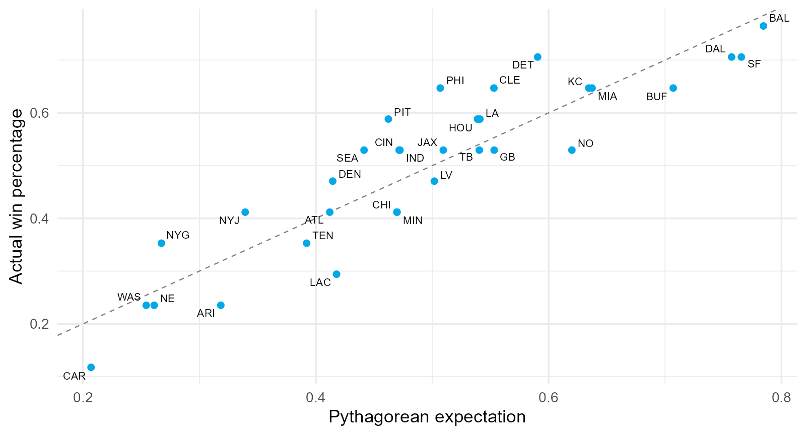
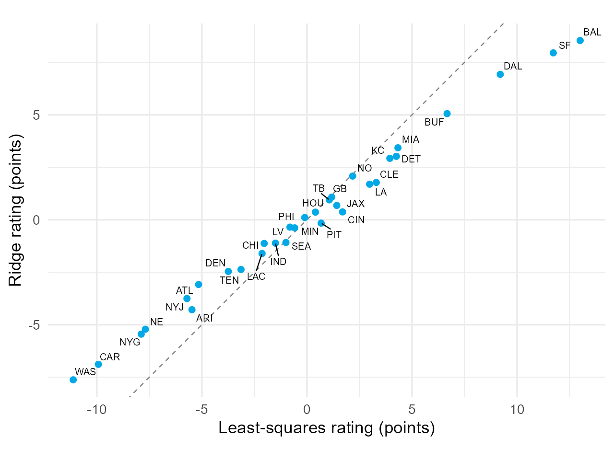
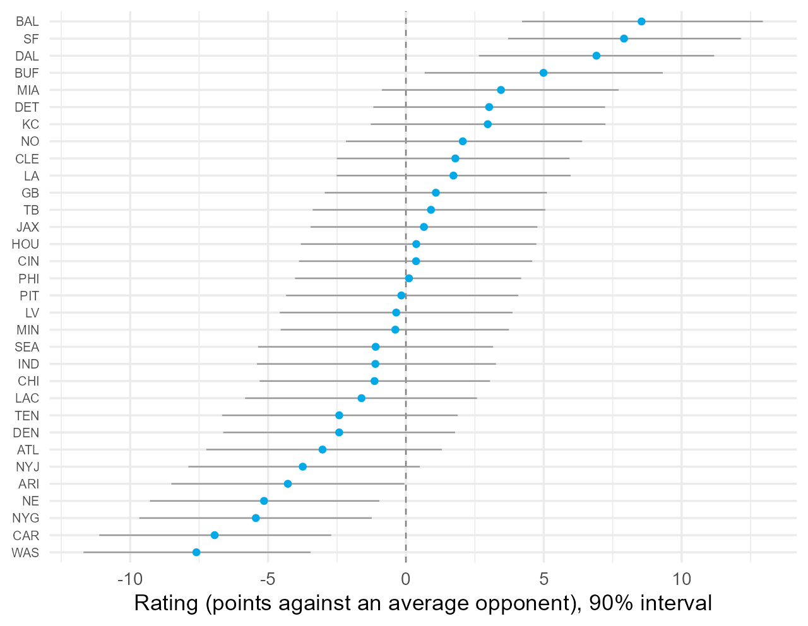
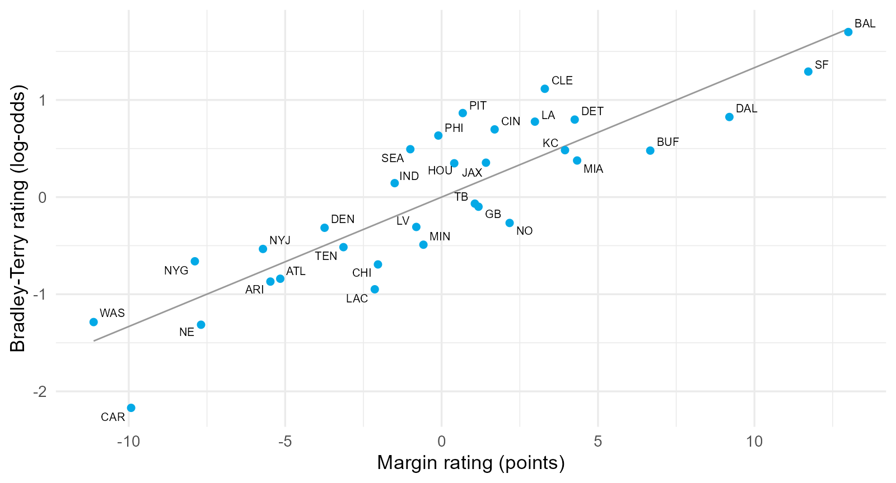
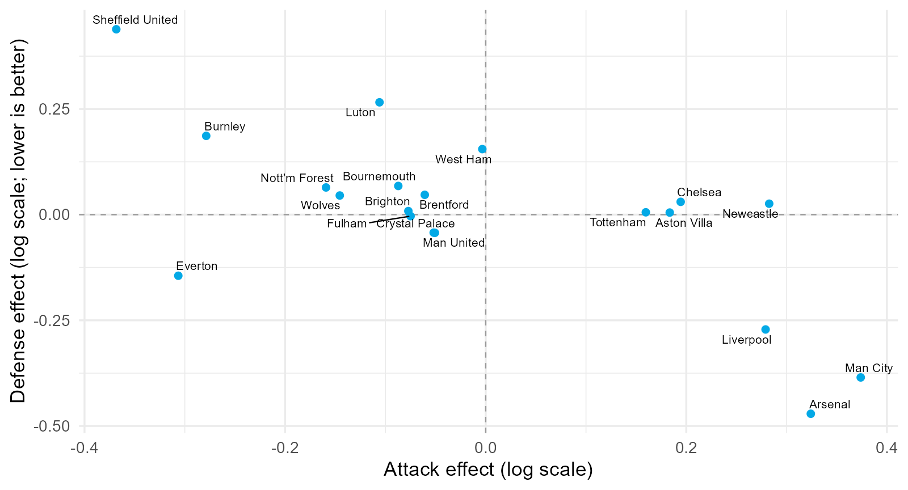
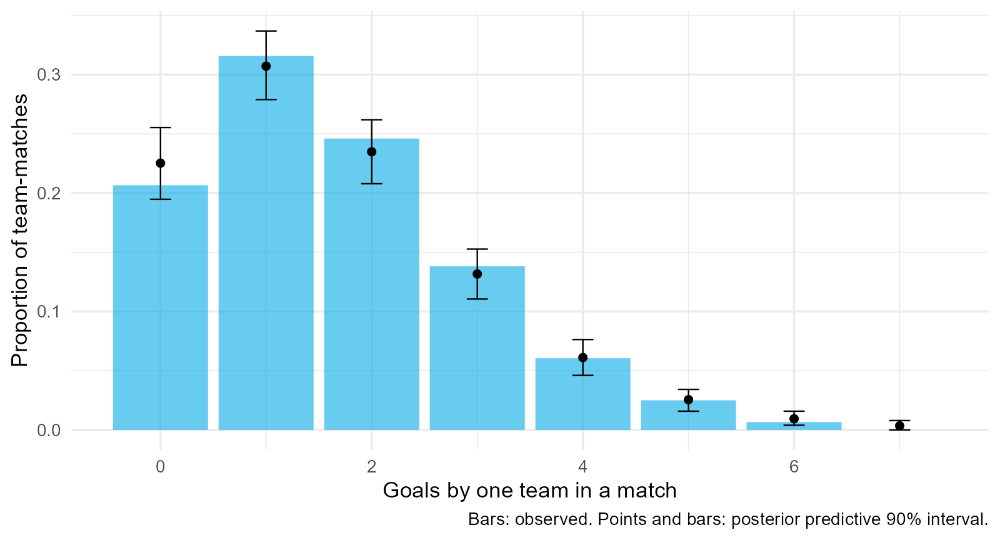
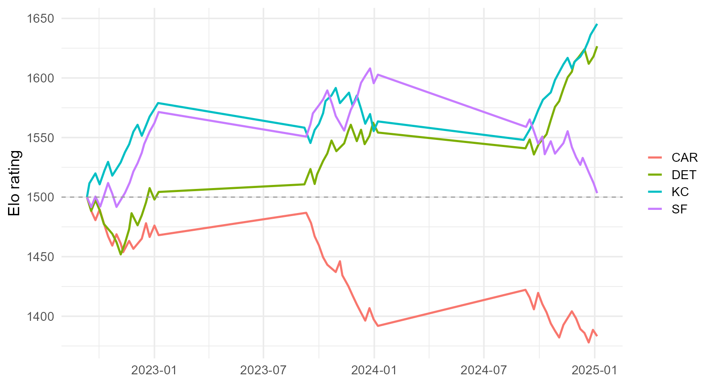
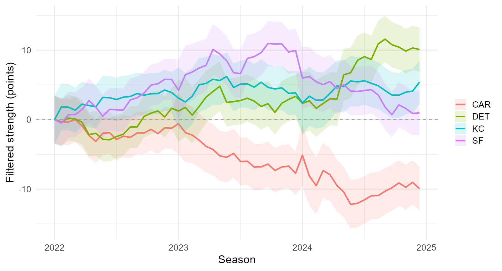
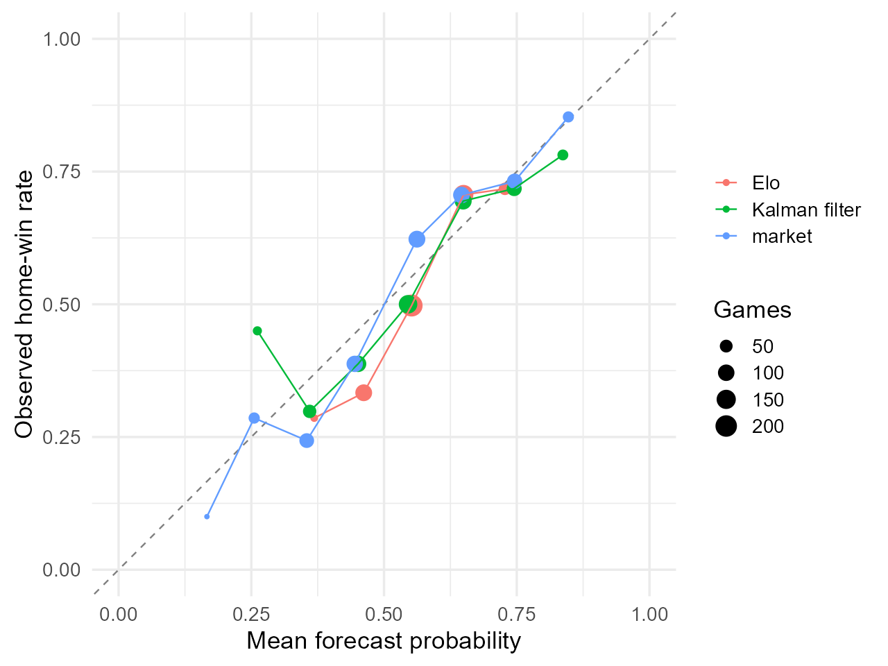
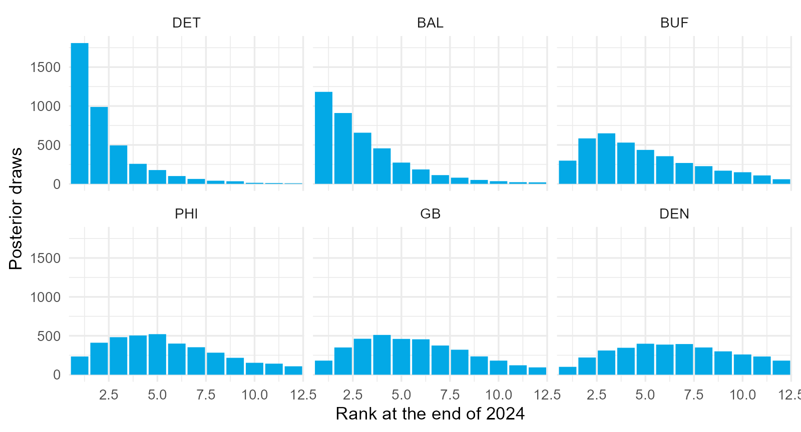

## 5.0.1 How strong is a team, and how sure are we?

A 12-5 record answers neither question well.

- it ignores margins;
- it ignores who the opponents were; and
- over 17 games it contains a great deal of luck.

::: {.question}
Two teams finish 12-5. One outscored opponents by 190 points, the other by 20. Are they equally strong?
:::

## 5.0.2 One latent quantity, many observable outcomes

Let $\theta_j$ be team $j$'s expected margin against an average opponent on a neutral field. A game reveals a noisy function of $\theta_i-\theta_j$:

$$
\text{winner},\qquad\text{margin},\qquad\text{or a pair of goal counts}.
$$

Every rating system is a rule for turning outcomes into estimates of $\theta$, and every one must handle noise, schedules, and home advantage.

## 5.0.3 Section map: from records to posteriors over time

| Section | Question |
|---|---|
| **5.1** Outcomes, Luck, and Schedules | How much of a record is luck, and what does schedule do? |
| **5.2** Ratings from Margins | How do least squares, ridge, and a Gaussian prior rate teams? |
| **5.3** Bradley-Terry and Logistic Ratings | How do we rate from wins alone, and why is Elo the same model? |
| **5.4** A Bayesian Poisson Goal Model | How do attack and defense effects produce match probabilities? |
| **5.5** Dynamic Ratings | How do Elo, state-space models, and the Kalman filter track change? |
| **5.6** Evaluating and Communicating | How do ratings compare with the market, and how are rankings reported? |

## 5.1 Outcomes, Luck, and Schedules {.section-slide}

Records mislead in three ways. Measure each before building a rating.

## 5.1.1 Win percentage against point differential

| Team (2023) | Wins | Win % | Point differential |
|---|---:|---:|---:|
| BAL | 13 | .765 | $+203$ |
| DAL | 12 | .706 | $+194$ |
| DET | 12 | .706 | $+66$ |
| SF | 12 | .706 | $+193$ |

The record treats a 30-point win and a 1-point win as the same evidence. Over long histories, point differential predicts the following season at least as well as the record.

## 5.1.2 Pythagorean expectation

$$
\widehat{\mathrm{WP}}=\frac{\mathrm{PF}^{\,k}}{\mathrm{PF}^{\,k}+\mathrm{PA}^{\,k}},
\qquad
k\approx2.37\text{ for the NFL}.
$$

Actual minus expected wins is a natural definition of luck.

| Team | Win % | Pythagorean | Luck (wins) |
|---|---:|---:|---:|
| PHI | .647 | .507 | $+2.4$ |
| PIT | .588 | .462 | $+2.1$ |
| LAC | .294 | .418 | $-2.1$ |

## 5.1.3 Actual against expected records

{fig-align="center" width="66%"}

::: {.small}
Teams above the line won more close games than their scoring suggests. Close-game records are unstable from season to season.
:::

## 5.1.4 Talent and luck

$$
\operatorname{Var}\!\left(\widehat{\mathrm{WP}}\right)=\underbrace{\operatorname{Var}(p)}_{\text{talent}}+\underbrace{\frac{\bar p(1-\bar p)}{G}}_{\text{luck}}
$$

| Observed variance | Luck variance ($G=17$) | Talent variance | Talent share | Games for equal share |
|---:|---:|---:|---:|---:|
| .0351 | .0147 | .0204 | .58 | 12 |

::: {.takeaway}
About 40% of the spread in NFL records is luck. The same signal-plus-noise decomposition as Lecture 4, applied to teams.
:::

## 5.1.5 Schedules: a system of equations

Naive rating: average margin. Fair rating: add back the opponents' quality,

$$
r_j^{(t+1)}=\frac{1}{G_j}\sum_{g\in\mathcal G_j}\left[\text{margin}_g+r^{(t)}_{\text{opp}(g)}\right].
$$

| Team | Average margin | Adjusted rating | Strength of schedule |
|---|---:|---:|---:|
| BAL | 11.9 | 13.4 | $+1.5$ |
| DAL | 11.4 | 8.9 | $-2.5$ |
| CLE | 2.0 | 3.6 | $+1.6$ |

The fixed point is a least-squares regression. Section 5.2.

## 5.1.6 Soccer changes the problem

| Season | Home goals | Away goals | Home win | Draw | Away win |
|---|---:|---:|---:|---:|---:|
| 2023-24 | 1.80 | 1.48 | .46 | .22 | .32 |

- low scores: margins take a handful of values;
- draws: a third outcome; and
- home advantage: about 0.3 goals in a low-scoring sport.

Goal counts are close to Poisson, which is the foundation of Section 5.4.

## 5.2 Ratings from Margins: Least Squares, Ridge, and a Gaussian Prior {.section-slide}

One column per team, one row per game.

## 5.2.1 The design matrix

$$
x_{gj}=\begin{cases}+1&j\text{ is home}\\-1&j\text{ is away}\\0&\text{otherwise}\end{cases},
\qquad
y_g=\alpha h_g+\theta_{\text{home}(g)}-\theta_{\text{away}(g)}+\varepsilon_g.
$$

```
     ARI ATL BAL BUF CAR CHI CIN CLE
[2,]  -1   0   0   0   0   0   0   0
[3,]   0   1   0   0  -1   0   0   0
[4,]   0   0   0   0   0   0  -1   1
```

Every row sums to zero: $X^{\mathsf T}X$ is singular and only differences between ratings are identified.

## 5.2.2 Least-squares (Massey) ratings

| Team | Rating (points) |
|---|---:|
| BAL | 13.0 |
| SF | 11.7 |
| DAL | 9.2 |
| BUF | 6.7 |

Home advantage $\hat\alpha=2.6$ points; residual sd $12.1$ points.

$$
\text{approximate rating SE}\approx\frac{\sigma}{\sqrt{17}}\approx3\text{ points}.
$$

Differences of a few points are within noise.

## 5.2.3 A Gaussian prior on the ratings

$$
\theta_j\sim N(0,\tau^2)
\ \Longrightarrow\
\hat{\boldsymbol\theta}=\left(X^{\mathsf T}X+\lambda I\right)^{-1}X^{\mathsf T}(\mathbf y-\hat\alpha\mathbf h),
\qquad
\lambda=\frac{\sigma^2}{\tau^2}.
$$

For $G$ games against average opponents,

$$
\hat\theta_j\approx\frac{G}{G+\lambda}\bar m_j.
$$

With $\sigma=13$, $\tau=5$: $\lambda\approx6.8$ and a 17-game season keeps $17/23.8\approx71\%$ of the observed deviation. The prior also fixes identification.

## 5.2.4 Estimate the variances by marginal likelihood

$$
\mathbf y-\alpha\mathbf h\sim N\!\left(\mathbf 0,\ \tau^2XX^{\mathsf T}+\sigma^2I\right)
$$

| $\hat\alpha$ | $\hat\tau$ | $\hat\sigma$ | $\hat\lambda$ | Retained share, 17 games |
|---:|---:|---:|---:|---:|
| 2.6 | 4.7 | 12.8 | 7.4 | .70 |

::: {.takeaway}
Team strength spreads about 5 points; one game's margin has 13 points of noise. Every NFL rating system is built around these two numbers.
:::

## 5.2.5 Ridge against least squares

{fig-align="center" width="52%"}

## 5.2.6 The fully Bayesian version

```r
stan_glm(margin ~ 0 + ., data = design,
         prior = normal(0, c(3, rep(tau_hat, 32))),
         prior_aux = exponential(1 / 13))
```

{fig-align="center" width="52%"}

## 5.2.7 Comparisons as probabilities

| Question | Posterior probability |
|---|---:|
| BAL stronger than SF | .57 |
| BAL is the best team | .42 |
| SF is the best team | .29 |
| DAL is the best team | .17 |

::: {.takeaway}
No team is the best with certainty after one season. Posterior draws turn ratings into probabilities.
:::

## 5.2.8 Held-out evaluation

Fit on weeks 1 to 14, predict weeks 15 to 18 with $P(\text{home wins})=\Phi(\hat y_g/\hat\sigma)$.

| Model | Log loss | Brier |
|---|---:|---:|
| home advantage only | .686 | .246 |
| least squares | .646 | .227 |
| ridge, marginal-likelihood penalty | .635 | .223 |
| ridge, four times the penalty | .648 | .228 |

Sixty games cannot separate the models sharply. Shrinkage matters most early in a season.

## 5.3 Win-Loss Ratings: Bradley-Terry and Logistic Models {.section-slide}

Rating teams from who beat whom, and why Elo is the same model.

## 5.3.1 The Bradley-Terry model

$$
P(i\text{ beats }j)=\frac{\pi_i}{\pi_i+\pi_j}=\sigma(\theta_i-\theta_j),
\qquad
\theta_j=\log\pi_j.
$$

With home advantage and the $\pm1$ design,

$$
P(\text{home wins }g)=\sigma\!\left(\alpha h_g+\textstyle\sum_jx_{gj}\theta_j\right):
$$

a logistic regression with no intercept. Concave log-likelihood, one `glm()` call, ratings in log-odds.

## 5.3.2 2023 ratings from wins alone

| Team | Rating (log-odds) |
|---|---:|
| BAL | 1.70 |
| SF | 1.29 |
| CLE | 1.12 |
| PIT | 0.87 |

Home term $\hat\alpha=.26$: two equal teams give the home side 56.5%.

Correlation with the margin ratings: .88. Because $\Phi(z)\approx\sigma(1.7z)$, one point of margin rating is worth about $1.7/13\approx.13$ log-odds.

## 5.3.3 Bradley-Terry against margins

{fig-align="center" width="66%"}

::: {.small}
Teams above the line won more games than their margins predict. Margins carry more information per game.
:::

## 5.3.4 The separation problem

After five weeks of 2023:

| Team | Maximum-likelihood rating |
|---|---:|
| PHI (5-0) | 36.3 |
| SF (5-0) | 21.8 |
| CAR (0-5) | $-38.9$ |

::: {.danger}
An undefeated team sends its rating to $+\infty$. No finite value makes the probability of its record equal to one.
:::

## 5.3.5 A prior restores finite ratings

$\theta_j\sim N(0,1)$: before the season a typical team beats an average one between 27% and 73% of the time.

```r
stan_glm(home_win ~ 0 + ., family = binomial(), prior = normal(0, 1), ...)
```

| Team | Posterior mean | Posterior sd |
|---|---:|---:|
| SF | 1.23 | .76 |
| PHI | 1.20 | .73 |
| CAR | $-1.23$ | .75 |

Finite, and honest about what five games establish.

## 5.3.6 Deep dive: Elo is an online Bradley-Terry model

$$
E_i=\frac{1}{1+10^{-(R_i-R_j)/400}}=\sigma\!\left(\frac{\ln10}{400}(R_i-R_j)\right)
\ \Longrightarrow\
\theta_j=\frac{\ln 10}{400}R_j.
$$

The gradient of one game's log-likelihood is

$$
\frac{\partial}{\partial\theta_i}\left[y\log p+(1-y)\log(1-p)\right]=y-p,
$$

so the update $R_i\leftarrow R_i+K(S_i-E_i)$ is **stochastic gradient ascent** with step size $K$, one game at a time.

## 5.3.7 Ordered outcomes for soccer

Order away win $\prec$ draw $\prec$ home win, $z_g=\alpha+\theta_{\text{home}}-\theta_{\text{away}}$:

$$
P(\text{away})=\sigma(c_1-z_g),
\qquad
P(\text{away or draw})=\sigma(c_2-z_g),
\qquad
c_1<c_2.
$$

| Threshold | Value |
|---|---:|
| $c_1$ (away, draw) | $-.98$ |
| $c_2$ (draw, home) | $.21$ |

Two equal teams: away .27, draw .28, home .45. $c_1=c_2$ collapses to Bradley-Terry.

## 5.3.8 Held-out comparison

Weeks 1 to 14 fit, weeks 15 to 18 scored:

| Model | Log loss | Brier |
|---|---:|---:|
| Bradley-Terry, penalized | .655 | .230 |
| ridge on margins | .635 | .223 |

::: {.takeaway}
Margin models extract more information per game. Use win-loss models when margins are unavailable or untrustworthy.
:::

## 5.4 Goals as Counts: A Bayesian Multilevel Poisson Model {.section-slide}

Attack and defense effects, posterior predictive checks, and match probabilities.

## 5.4.1 The Poisson model

$$
Y_m^{H}\sim\text{Poisson}(\lambda_m^{H}),\qquad\log\lambda_m^{H}=\mu+\beta+a_i+d_j,
$$

$$
Y_m^{A}\sim\text{Poisson}(\lambda_m^{A}),\qquad\log\lambda_m^{A}=\mu+a_j+d_i.
$$

- $\mu$: log baseline rate; $\beta$: home advantage on the log scale;
- $a$: attack; $d$: effect of facing that defense (negative is good);
- the log link makes effects multiplicative and rates positive.

## 5.4.2 The multilevel layer

$$
a_i\sim N(0,\tau_a^2),\qquad d_j\sim N(0,\tau_d^2)
$$

Crossed random effects, exactly as in Lecture 4. Each match becomes two rows:

| match | attack | defense | home | goals |
|---:|---|---|---:|---:|
| 1 | Burnley | Man City | 1 | 0 |
| 1 | Man City | Burnley | 0 | 3 |

```r
stan_glmer(goals ~ home + (1 | attack) + (1 | defense), family = poisson(), ...)
```

## 5.4.3 Posterior summaries

| Quantity | Posterior mean |
|---|---:|
| baseline goals, away against average | 1.40 |
| home multiplier $e^{\beta}$ | 1.22 |
| $\tau_a$ | .26 |
| $\tau_d$ | .26 |

A one-standard-deviation-better attack scores $e^{.26}\approx1.3$ times as many goals. $\hat R\le1.01$, effective sample sizes in the thousands.

## 5.4.4 Attack and defense effects

{fig-align="center" width="70%"}

## 5.4.5 Posterior predictive checks

A Bayesian model generates data. Compare 500 simulated seasons with the real one.

{fig-align="center" width="62%"}

## 5.4.6 Three checks, three assumptions

| Statistic | Observed | Predictive 90% interval | Posterior $p$ |
|---|---:|:--:|---:|
| draw share | .216 | [.174, .242] | .38 |
| maximum goals | 8 | [7, 10] | .67 |
| dispersion (var / mean) | 1.08 | [1.09, 1.34] | .97 |

The draw share tests independence at low scores; the maximum tests the tail; dispersion tests the Poisson variance. Real counts are slightly *less* variable than the model's, which mixes over uncertain effects.

## 5.4.7 Match probabilities

For each posterior draw, $(\lambda^H,\lambda^A)$ gives a score grid:

$$
P(\text{home win})=\sum_{h>a}\frac{e^{-\lambda^H}(\lambda^H)^h}{h!}\cdot\frac{e^{-\lambda^A}(\lambda^A)^a}{a!}.
$$

Average over draws to integrate out the uncertainty.

| Match | Home | Draw | Away |
|---|---:|---:|---:|
| Burnley v Man City | .12 | .17 | .72 |
| Arsenal v Nott'm Forest | .75 | .16 | .09 |

## 5.4.8 Against the bookmaker

Decimal odds $\to$ implied probability $1/o$; divide by the sum to remove the margin.

| Source | Log loss (3 outcomes) |
|---|---:|
| Poisson model, fitted to the same season | .914 |
| bookmaker, vig removed | .909 |

::: {.danger}
The model saw every match it is scoring and still does not beat the market. A fair test predicts matches after the fitting window.
:::

## 5.4.9 Replaying the season

| Team | Actual points | Expected points | $P(\text{champion})$ | $P(\text{relegated})$ |
|---|---:|---:|---:|---:|
| Man City | 91 | 80.3 | .40 | .00 |
| Arsenal | 89 | 80.4 | .38 | .00 |
| Liverpool | 82 | 73.6 | .15 | .00 |
| Sheffield United | 16 | 24.6 | .00 | .92 |

::: {.takeaway}
Given these strengths, the title was close to a coin flip between two teams.
:::

## 5.4.10 Limitations and extensions

- **Independence**: Dixon-Coles adjust the four lowest scorelines; bivariate Poisson adds a shared component.
- **Overdispersion**: rare for goals, common for shots and corners; negative binomial.
- **Time**: exponential down-weighting of old matches, or an explicit dynamic model (Section 5.5).
- **Expected goals** as the response: less noise, different target.

## 5.5 Dynamic Ratings: Elo and State-Space Models {.section-slide}

Strength that changes over time, from a constant-gain update to a Bayesian filter.

## 5.5.1 The Elo system

$$
E_i=\frac{1}{1+10^{-(R_i+A-R_j)/400}},
\qquad
R_i\leftarrow R_i+K(S_i-E_i),
\qquad
R_j\leftarrow R_j-K(S_i-E_i).
$$

- home advantage $A$ in rating points;
- between seasons, regress a fraction $r$ toward 1500;
- optional margin-of-victory multiplier on $K$.

Everything is a rule; nothing is a variance.

## 5.5.2 Ratings that move

{fig-align="center" width="74%"}

## 5.5.3 Tune $K$ by forecast quality

Log loss on 2023-2024 games, 2022 as warm-up:

| $K$ | No margin multiplier | With multiplier |
|---:|---:|---:|
| 10 | .663 | .645 |
| 20 | .650 | **.639** |
| 40 | **.643** | .654 |
| 60 | .647 | .684 |

The multiplier helps because margins carry information; it also lowers the best $K$.

## 5.5.4 A state-space model for strength

Following Glickman and Stern (1998):

$$
\theta_{j,t}=\theta_{j,t-1}+\omega_{j,t},\qquad\omega_{j,t}\sim N(0,\sigma_w^2)
$$

$$
\theta_{j,\text{new season}}=\rho\,\theta_{j,\text{last week}}+v_j,\qquad v_j\sim N(0,\sigma_s^2)
$$

$$
y_g=\theta_{\text{home}(g),t}-\theta_{\text{away}(g),t}+h\cdot\text{home}_g+\varepsilon_g,\qquad\varepsilon_g\sim N(0,\sigma^2)
$$

Every parameter has a meaning: game noise, weekly drift, between-season change, regression, home field.

## 5.5.5 Deep dive: the Kalman filter

Everything is normal and linear, so the posterior after each game is normal, $N(\mathbf m,P)$.

**Predict**: $\mathbf m_t^{-}=\mathbf m_{t-1}$, $\ P_t^{-}=P_{t-1}+\sigma_w^2I$.

**Update** with $\mathbf H_g=\mathbf e_{\text{home}}-\mathbf e_{\text{away}}$:

$$
\hat y_g=\mathbf H_g^{\mathsf T}\mathbf m+h,
\qquad
S_g=\mathbf H_g^{\mathsf T}P\mathbf H_g+\sigma^2,
\qquad
\mathbf k_g=\frac{P\mathbf H_g}{S_g},
$$

$$
\mathbf m\leftarrow\mathbf m+\mathbf k_g(y_g-\hat y_g),
\qquad
P\leftarrow P-\mathbf k_g\mathbf H_g^{\mathsf T}P.
$$

Prediction error times a **gain**: Bayesian sequential updating.

## 5.5.6 Elo is a constant-gain Kalman filter

| | Elo | Kalman filter |
|---|---|---|
| update | $K(S_i-E_i)$ | $\mathbf k_g(y_g-\hat y_g)$ |
| gain | constant $K$ | large when uncertain, settles to a steady state |
| uncertainty | none | $P$ for every team |
| parameters | tuned | estimated |

::: {.takeaway}
Elo with a good $K$ approximates the steady-state filter. The state-space model adds a starting gain, intervals, and estimable hyperparameters.
:::

## 5.5.7 Filtered strength with uncertainty

{fig-align="center" width="74%"}

::: {.small}
Bands widen at each season boundary and narrow as games are played. Every value uses only earlier games.
:::

## 5.5.8 Hyperparameters from Stan

```stan
theta[, t] = season_start[t] ? rho * theta[, t-1] + sigma_season * z[, t]
                             : theta[, t-1] + sigma_week * z[, t];
margin ~ normal(theta[home, period] - theta[away, period] + h * home_field, sigma_obs);
```

| Parameter | Mean | 90% interval |
|---|---:|:--:|
| $\sigma$ game noise | 11.9 | [11.4, 12.5] |
| $\sigma_w$ weekly drift | 0.6 | [0.1, 1.1] |
| $\sigma_s$ between seasons | 4.0 | [2.5, 5.4] |
| $\rho$ | .65 | [.42, .86] |
| $h$ | 2.2 | [1.4, 2.9] |

## 5.5.9 What the posterior says

- within-season drift over 17 weeks: sd $\approx0.6\sqrt{17}\approx2.5$ points;
- between seasons: regress about a third of the way to zero, then a 4-point shock;
- the Elo rule of thumb of one-third regression is close to what the data say.

::: {.takeaway}
**Filtered** estimates use the past only and are legitimate forecasts. **Smoothed** estimates use the whole season and describe hindsight. Never evaluate forecasts with the smoother.
:::

## 5.6 Evaluating and Communicating Team Ratings {.section-slide}

Honest forecast scoring, the betting market as a benchmark, and rankings with uncertainty.

## 5.6.1 The rule for scoring sequential forecasts

- a forecast may use only information available before kickoff;
- a static regression must be refit before every week;
- use 2022 as a warm-up, score 2023 and 2024;
- exclude ties, which a home-win probability cannot express.

## 5.6.2 The market as a benchmark

$$
p_{\text{implied}}=\begin{cases}\dfrac{|M|}{|M|+100}&M<0\\[8pt]\dfrac{100}{M+100}&M>0\end{cases}
$$

| Game | Moneylines | Implied | Hold | Fair home |
|---|---|---|---:|---:|
| KC v DET | $-198$ / $+164$ | .664 / .379 | .043 | .637 |
| CLE v CIN | $-108$ / $-112$ | .519 / .528 | .048 | .496 |

The two sides sum to more than one; the excess is the **vig**. Divide by the sum.

## 5.6.3 Results-only models against the market

| Model | Log loss | Brier | Accuracy |
|---|---:|---:|---:|
| constant home-win rate | .689 | .248 | .544 |
| rolling ridge, within season | .649 | .229 | .614 |
| Elo with margin multiplier | .639 | .224 | .632 |
| Kalman filter | .639 | .224 | .640 |
| market: closing spread | .609 | .210 | .697 |
| market: moneyline, vig removed | .607 | .209 | .699 |

544 games, 2023-2024.

## 5.6.4 Calibration

{fig-align="center" width="52%"}

::: {.small}
None of the forecasters is systematically over- or underconfident; the market is sharper.
:::

## 5.6.5 Break-even, expected value, and why the market is hard to beat

$$
\text{EV}=p\,o-1,\qquad p^{*}=1/o,\qquad f^{*}_{\text{Kelly}}=\frac{po-1}{o-1}.
$$

Betting the Kalman model whenever its EV exceeded 5%:

| Bets | Win rate | Return per unit staked |
|---:|---:|---:|
| 326 | .35 | $-.12$ |

::: {.danger}
The apparent edges were errors in the model, not in the market. Treat the market's log loss as the bar to clear.
:::

## 5.6.6 Rankings with uncertainty

| Team, end of 2024 | Posterior mean | $P(\text{best})$ | $P(\text{top 5})$ | Expected rank |
|---|---:|---:|---:|---:|
| DET | 10.9 | .45 | .93 | 2.3 |
| BAL | 9.7 | .30 | .87 | 3.1 |
| BUF | 7.3 | .07 | .62 | 5.3 |
| PHI | 6.7 | .06 | .54 | 5.9 |

## 5.6.7 Rank distributions

{fig-align="center" width="70%"}

::: {.small}
Even the strongest team has a meaningful chance of being only third or fourth best.
:::

## 5.6.8 Communicating a rating

1. **Scale**: points, log-odds, or Elo points, with the home advantage on the same scale.
2. **Uncertainty**: an interval or standard deviation for every rating.
3. **Timing**: season average, smoothed estimate for a date, or forecast for the next game.
4. **Blind spots**: injuries, weather, motivation; compare with the market.

::: {.takeaway}
A published ranking that omits rank probabilities states a posterior mode as if it were a fact.
:::

## 5.6.9 Exit problem: design the next rating system

You have every college basketball game of a season with scores, dates, and neutral-site flags, and 360 teams that play unbalanced schedules.

::: {.question}
Which outcome do you model? How do you identify the ratings? What prior, and how would you estimate its variance? How do you let strength change within the season, and how do you evaluate the forecasts?
:::
