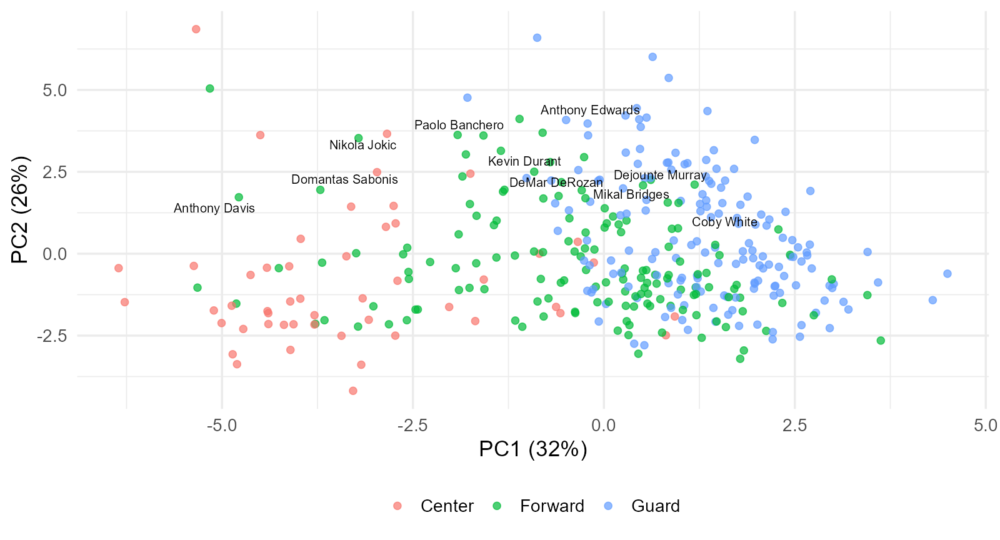
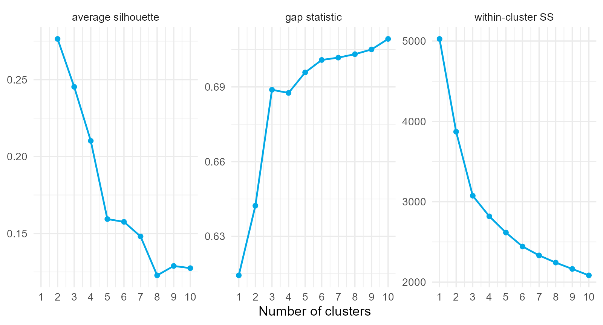
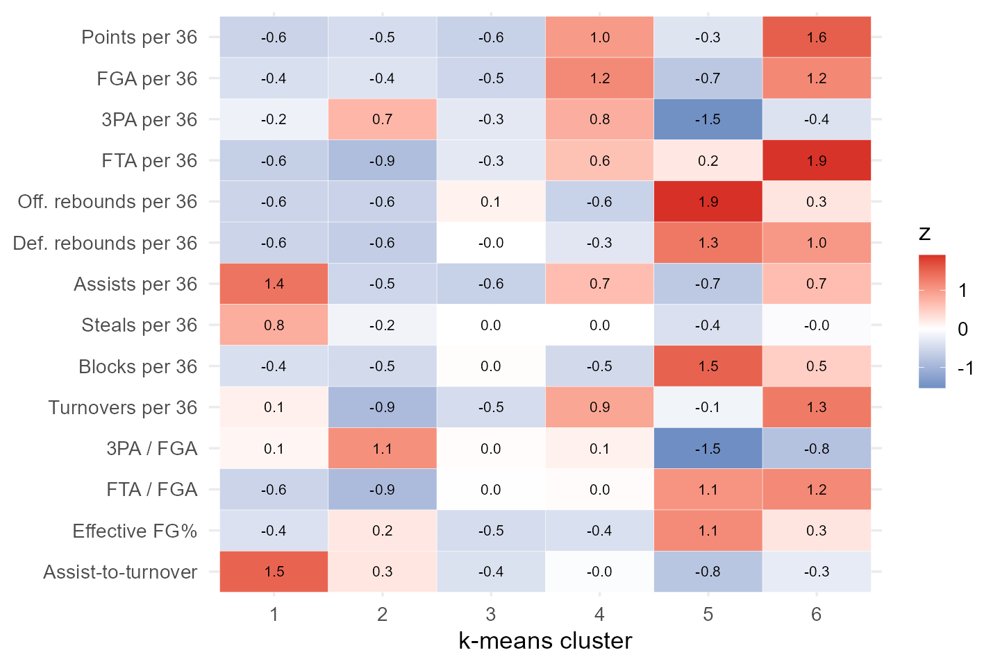
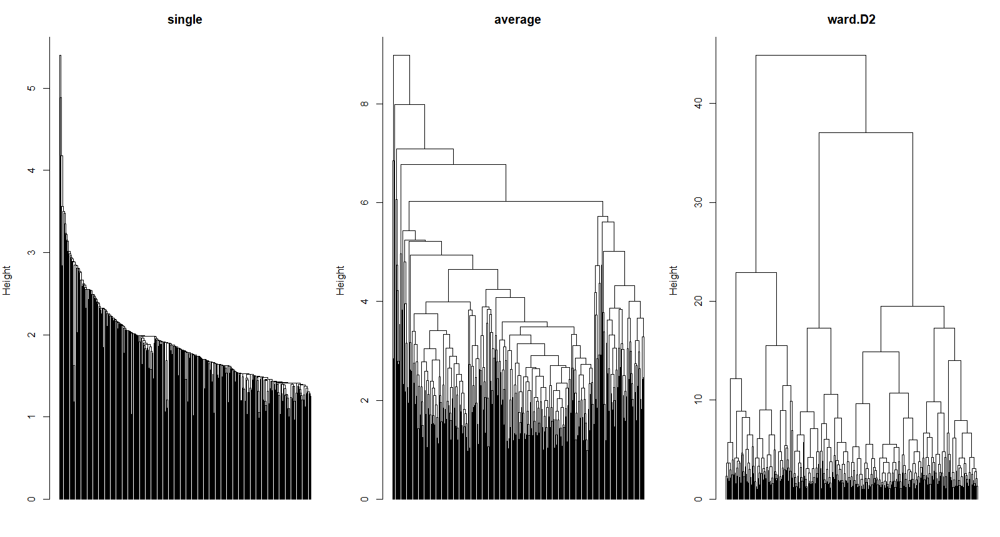
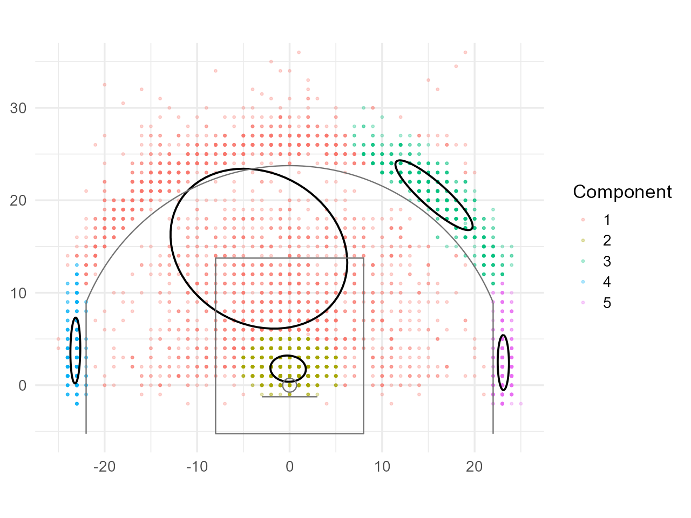
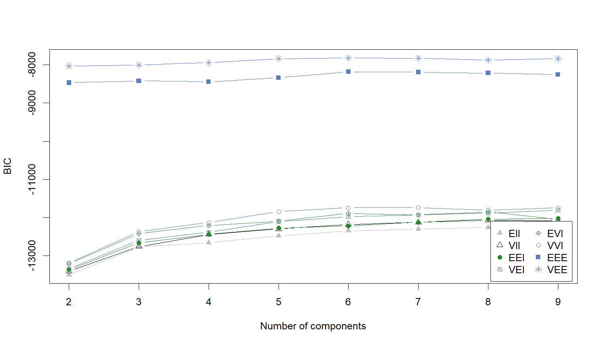
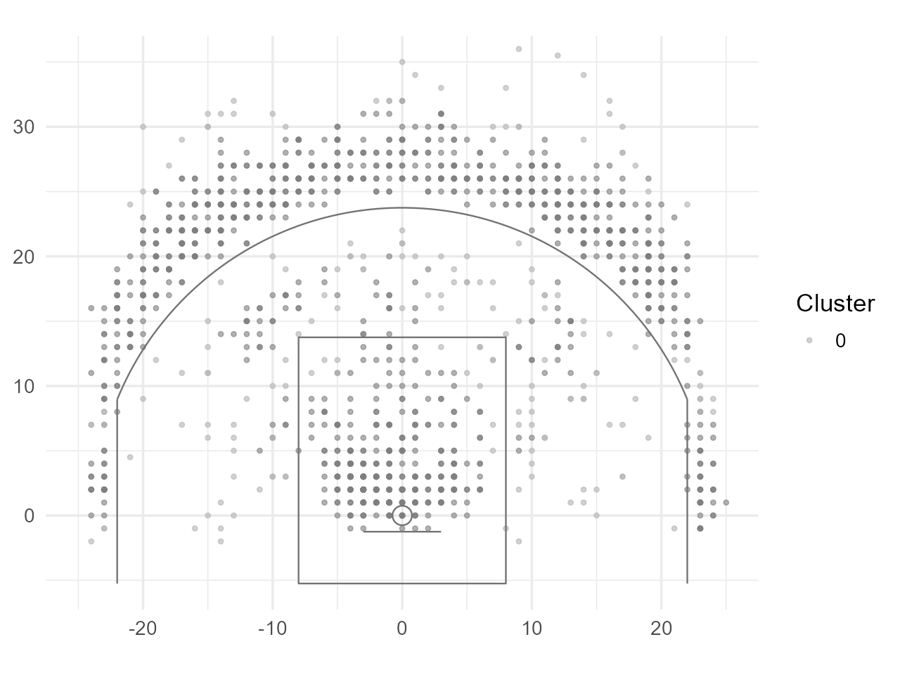
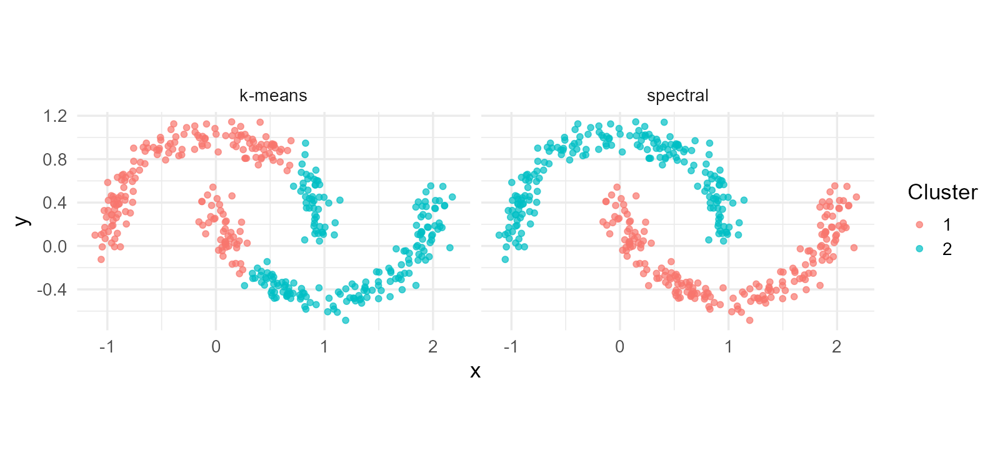
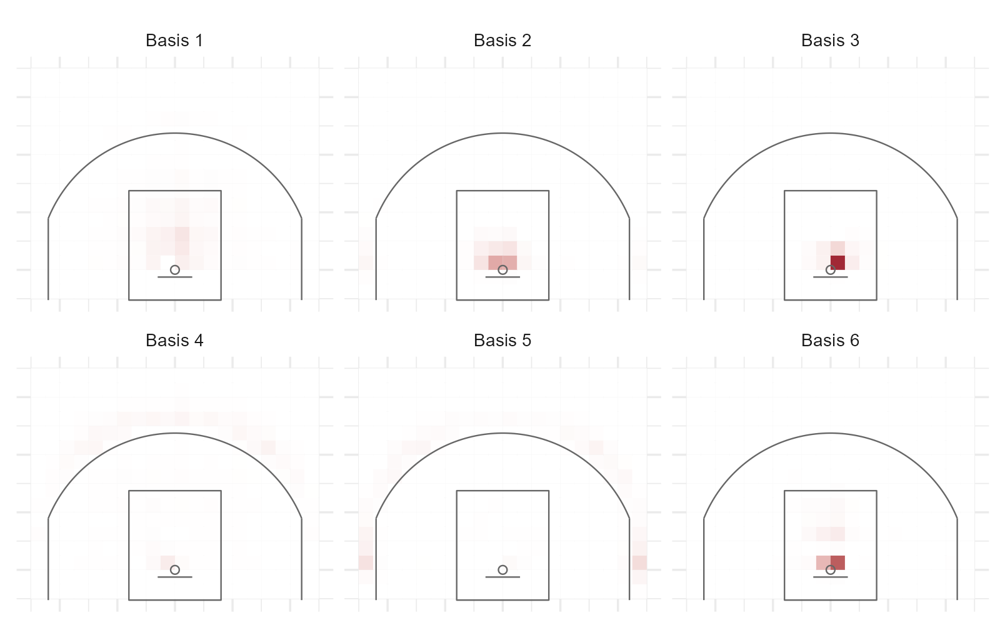
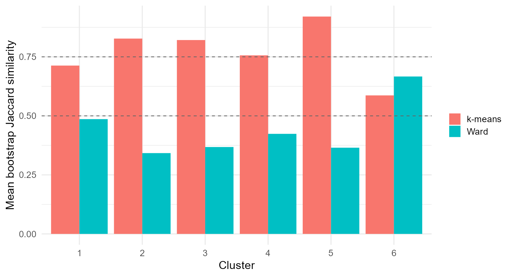

## 6.0.1 What kinds of players are there?

Positions are labels handed down by tradition. A modern roster has centers who shoot threes, forwards who run the offense, and guards who never handle the ball.

::: {.question}
Given fourteen per-minute statistics for 360 players, how many kinds of players are there, and which players are alike?
:::

::: {.notes}
Ask for a definition of "alike" before showing any algorithm. Every answer students give is a distance choice.
:::

## 6.0.2 Clustering is a modeling decision, not a button

There is no outcome to check against. The analyst chooses:

$$
\text{features}\ \rightarrow\ \text{transformation and weights}\ \rightarrow\ \text{distance}\ \rightarrow\ \text{algorithm}\ \rightarrow\ k.
$$

The algorithm computes a consequence of those choices. Validation asks whether the result is **real**, **stable**, and **useful**.

## 6.0.3 Section map: the classics, then what they miss

| Section | Question |
|---|---|
| **6.1** Goals, Features, and Distances | What does "similar" mean, and for what purpose? |
| **6.2** k-Means and k-Medoids | How does the workhorse work, and how many clusters? |
| **6.3** Hierarchical Clustering | How do trees give clusters at every resolution? |
| **6.4** Gaussian Mixture Models | What does clustering look like as a probability model? |
| **6.5** Density, Graphs, and Factorization | What do DBSCAN, spectral methods, and NMF find that the classics cannot? |
| **6.6** Validation | Are the clusters real, and how do we report them? |

## 6.1 Unsupervised Learning: Goals, Features, and Distances {.section-slide}

What a clustering can claim, and the decisions that determine it.

## 6.1.1 Two purposes, two kinds of answer

| Purpose | Clusters | Size | Use | What matters |
|---|---|---|---|---|
| **archetypes** | few (4 to 8) | large | roster construction, lineup balance | separation, interpretability |
| **comparables** | many (20 to 50) | small | scouting, contracts, projections | tight within-cluster similarity |

Decide which before running anything. A method tuned for one produces a poor answer to the other.

## 6.1.2 Five decisions in a dissimilarity

Akhanli and Hennig (2023):

1. **Representation**: totals confound role with minutes; per-36 rates and shot shares isolate style.
2. **Transformation**: a square root makes the gap between 0 and 1 block count more than 3 to 4.
3. **Standardization**: $z_{ik}=(x_{ik}-\bar x_k)/s_k$, or range or robust scaling.
4. **Weighting**: $d_w=\sqrt{\sum_kw_k(z_{ik}-z_{jk})^2}$; standardization is itself an equal-weight choice.
5. **Aggregation**: Minkowski $d_q=\left(\sum_kw_k|z_{ik}-z_{jk}|^q\right)^{1/q}$.

::: {.danger}
`dist()` returns Euclidean distance on whatever it is given. That is a default, not a decision.
:::

## 6.1.3 Distances measure different things

| Distance | Formula | Answers |
|---|---|---|
| Euclidean | $\sqrt{\sum_k(z_{ik}-z_{jk})^2}$ | overall difference, large gaps emphasized |
| Manhattan | $\sum_k\lvert z_{ik}-z_{jk}\rvert$ | overall difference, gaps counted linearly |
| correlation | $1-r(\mathbf z_i,\mathbf z_j)$ | same *pattern* regardless of level |
| Mahalanobis | $\sqrt{(\mathbf x_i-\mathbf x_j)^{\mathsf T}S^{-1}(\mathbf x_i-\mathbf x_j)}$ | difference after removing redundancy |
| Gower | average of $[0,1]$ per-variable dissimilarities | mixed numeric and categorical |

## 6.1.4 The same player, different neighbors

Nearest neighbors of Nikola Jokic:

| Euclidean | Manhattan | Correlation | Mahalanobis |
|---|---|---|---|
| LeBron James | LeBron James | Domantas Sabonis | LeBron James |
| Domantas Sabonis | Alperen Sengun | Alperen Sengun | Domantas Sabonis |
| Alperen Sengun | Domantas Sabonis | LeBron James | Jonas Valanciunas |
| Scottie Barnes | Giannis Antetokounmpo | Bam Adebayo | Khris Middleton |

::: {.takeaway}
Neighbors are a property of the distance. Choose the distance for what "comparable" means.
:::

## 6.1.5 The curse of dimensionality

Ratio of the farthest to the nearest neighbor of one point, uniform data:

| Dimensions | 2 | 5 | 10 | 14 | 50 | 200 |
|---|---:|---:|---:|---:|---:|---:|
| farthest / nearest | 48.7 | 6.8 | 3.1 | 2.7 | 1.6 | 1.3 |

Distances lose contrast as dimensions grow. Redundant features make it worse without adding information: an argument for weighting, Mahalanobis distance, and dimension reduction.

## 6.1.6 Principal components

$$
S=V\Lambda V^{\mathsf T},
\qquad
T=ZV,
\qquad
\text{variance share of the first }m=\frac{\sum_{k\le m}\lambda_k}{\sum_k\lambda_k}.
$$

| Component | 1 | 2 | 3 | 4 | 5 |
|---|---:|---:|---:|---:|---:|
| variance share | .32 | .26 | .12 | .07 | .06 |

PC1 contrasts interior play (rebounds, blocks, free-throw rate) with perimeter play (three-point rate, assists). PC2 is scoring volume.

## 6.1.7 Players form a continuum, not islands

{fig-align="center" width="70%"}

::: {.small}
Positions were not used. They overlap heavily, and there are no gaps. Clustering will draw boundaries on this continuum.
:::

## 6.2 k-Means and k-Medoids {.section-slide}

The objective, Lloyd's algorithm, seeding, choosing $k$, and player archetypes.

## 6.2.1 The objective

$$
W(C,\boldsymbol\mu)=\sum_{j=1}^{k}\sum_{i\in C_j}\lVert\mathbf x_i-\boldsymbol\mu_j\rVert^2
=\sum_{j=1}^{k}\frac{1}{2|C_j|}\sum_{i,i'\in C_j}\lVert\mathbf x_i-\mathbf x_{i'}\rVert^2.
$$

k-means is a statement about pairwise squared Euclidean distances within clusters. Exact minimization is NP-hard; every algorithm finds a local optimum.

## 6.2.2 Lloyd's algorithm

1. **Assign** each observation to its nearest center.
2. **Update** each center to the mean of its members.
3. Repeat until nothing changes.

Each step minimizes $W$ with the other variables fixed, so $W$ never increases.

| Iteration | 1 | 2 | 3 | 5 | 11 |
|---|---:|---:|---:|---:|---:|
| $W$ | 4585 | 2905 | 2769 | 2696 | 2645 |

`kmeans(X, 5, nstart = 25)` reaches 2617: a better local optimum from more starts.

## 6.2.3 k-means++ seeding

Choose the first center uniformly, each later center with

$$
P(\text{choose }\mathbf x_i)=\frac{D(\mathbf x_i)^2}{\sum_{i'}D(\mathbf x_{i'})^2},
$$

where $D$ is the distance to the nearest center chosen so far. Seeds spread out; the expected objective is within $O(\log k)$ of optimal before any iteration.

::: {.takeaway}
Always run many starts and keep the best. Seeding and `nstart` are not optional.
:::

## 6.2.4 Three criteria for $k$

- **Elbow**: where $W_k$ stops falling quickly.
- **Silhouette**: $s_i=\dfrac{b_i-a_i}{\max(a_i,b_i)}$, $a_i$ within, $b_i$ nearest other cluster; maximize the average.
- **Gap**: $\operatorname{Gap}(k)=E^{*}[\log W_k^{*}]-\log W_k$ against uniform reference data; smallest $k$ with $\operatorname{Gap}(k)\ge\operatorname{Gap}(k+1)-s_{k+1}$.

## 6.2.5 The criteria disagree

{fig-align="center" width="82%"}

| Criterion | Chosen $k$ |
|---|---:|
| average silhouette | 2 |
| gap statistic | 3 |

Normal on data without islands. Choose $k$ for the purpose, then check stability (Section 6.6).

## 6.2.6 Six archetypes as a heat map

{fig-align="center" width="62%"}

## 6.2.7 Reading the clusters

| Cluster | Examples | Centers | Forwards | Guards |
|---|---|---:|---:|---:|
| high-usage creators | DeRozan, Sabonis, Banchero, Durant | 9 | 19 | 3 |
| rim protectors | Gobert, Allen, Holmgren, Claxton | 33 | 18 | 0 |
| perimeter ball handlers | VanVleet, Schroder, White, Haliburton | 0 | 3 | 38 |
| spot-up wings | K. Murray, Porter Jr., Allen, Caldwell-Pope | 1 | 32 | 46 |

Clusters track positions loosely. They describe what players do; positions describe that only partly.

## 6.2.8 Players between archetypes

Lowest silhouettes: Jrue Holiday ($-.12$), RJ Barrett, Derrick White, Jayson Tatum.

::: {.question}
Are these players badly clustered, or are they the interesting ones?
:::

A hard partition cannot say "half of each." Section 6.4 replaces assignments with probabilities.

## 6.2.9 k-medoids

Replace the mean with a **medoid**, an actual member, and minimize $\sum_j\sum_{i\in C_j}d(\mathbf x_i,\mathbf m_j)$ with any dissimilarity.

| Cluster | Medoid | Size |
|---|---|---:|
| 1 | Anthony Edwards | 30 |
| 3 | Mikal Bridges | 68 |
| 6 | Drew Eubanks | 40 |

Manhattan-distance PAM against Euclidean k-means: adjusted Rand index .51. Same broad structure, different boundaries.

## 6.2.10 What k-means assumes

- spherical clusters of similar size in the standardized space;
- every observation in exactly one cluster, no outliers;
- $k$ known;
- feature scale meaningful.

Each of the next three sections relaxes one assumption.

## 6.3 Hierarchical Clustering {.section-slide}

Linkage rules, dendrograms, and clusters at every resolution.

## 6.3.1 Agglomerative clustering

1. every observation is a cluster;
2. merge the two closest clusters;
3. update distances to the new cluster;
4. repeat until one cluster remains.

The only decision: the distance between **clusters**, given distances between **points**. That is the **linkage**.

## 6.3.2 Linkage rules

| Linkage | $d(A,B)$ | Tendency |
|---|---|---|
| single | $\min_{i\in A,i'\in B}d(i,i')$ | chains; irregular shapes; noise-sensitive |
| complete | $\max_{i\in A,i'\in B}d(i,i')$ | compact, similar diameters |
| average | $\frac{1}{\lvert A\rvert\lvert B\rvert}\sum\sum d(i,i')$ | compromise; preserves distances best |
| Ward | $\dfrac{\lvert A\rvert\lvert B\rvert}{\lvert A\rvert+\lvert B\rvert}\lVert\bar{\mathbf x}_A-\bar{\mathbf x}_B\rVert^2$ | k-means geometry, greedy |

## 6.3.3 Deep dive: the Lance-Williams update

After merging $A$ and $B$, for any other cluster $C$:

$$
d(A\cup B,C)=\alpha_Ad(A,C)+\alpha_Bd(B,C)+\beta d(A,B)+\gamma\lvert d(A,C)-d(B,C)\rvert.
$$

| Linkage | $\alpha_A$ | $\beta$ | $\gamma$ |
|---|---|---|---|
| single | $1/2$ | 0 | $-1/2$ |
| complete | $1/2$ | 0 | $+1/2$ |
| average | $\lvert A\rvert/(\lvert A\rvert+\lvert B\rvert)$ | 0 | 0 |
| Ward | $(\lvert A\rvert+\lvert C\rvert)/(\lvert A\rvert+\lvert B\rvert+\lvert C\rvert)$ | $-\lvert C\rvert/(\lvert A\rvert+\lvert B\rvert+\lvert C\rvert)$ | 0 |

One recursion runs every linkage from the distance matrix alone: $O(n^2)$ memory.

## 6.3.4 Three trees of the same players

{fig-align="center" width="86%"}

::: {.small}
Single linkage chains. Ward balances. Heights carry information; left-right order does not.
:::

## 6.3.5 Judging a tree

**Cophenetic correlation**: correlation between the original distances and the heights at which pairs first join.

| Linkage | Cophenetic correlation |
|---|---:|
| average | .727 |
| single | .647 |
| complete | .514 |
| Ward | .488 |

Average linkage preserves distances best by construction. Ward optimizes a sum of squares, not the distances.

## 6.3.6 Cutting the tree

| $k$ | Cluster sizes (Ward) |
|---:|---|
| 2 | 263, 97 |
| 4 | 182, 81, 56, 41 |
| 6 | 103, 79, 56, 44, 41, 37 |
| 12 | 63, 44, 40, 38, 37, 35, 33, 29, 17, 12, 6, 6 |

Partitions are **nested**: raising $k$ only splits branches. Ward at $k=6$ against k-means at $k=6$: adjusted Rand index .28, and a larger within-cluster sum of squares (2729 versus 2444), because merges are never revisited.

## 6.3.7 Comparables from a low cut

At $k=40$ the average cluster holds nine players.

| Player | Same branch |
|---|---|
| Jalen Brunson | Damian Lillard, LeBron James, Devin Booker, Stephen Curry, ... |
| Rudy Gobert | Dwight Powell, Bruno Fernando, Mason Plumlee |
| Mikal Bridges | Miles Bridges, Brandon Miller, Tim Hardaway Jr., Corey Kispert, ... |

::: {.takeaway}
Cut high for archetypes, low for comparables. One tree serves both.
:::

## 6.4 Gaussian Mixture Models and the EM Algorithm {.section-slide}

Clustering as a probability model, with soft membership and model selection.

## 6.4.1 The mixture likelihood

$$
p(\mathbf x)=\sum_{k=1}^{K}\pi_k\,\phi(\mathbf x\mid\boldsymbol\mu_k,\Sigma_k),
\qquad
\ell(\theta)=\sum_{i=1}^{n}\log\sum_{k=1}^{K}\pi_k\,\phi(\mathbf x_i\mid\boldsymbol\mu_k,\Sigma_k).
$$

The **responsibility** is the posterior probability of the label:

$$
r_{ik}=\frac{\pi_k\,\phi(\mathbf x_i\mid\boldsymbol\mu_k,\Sigma_k)}{\sum_l\pi_l\,\phi(\mathbf x_i\mid\boldsymbol\mu_l,\Sigma_l)}.
$$

A soft membership: a player can be .55 one archetype and .45 another.

## 6.4.2 The EM algorithm

**E-step**: compute $r_{ik}$ from the current parameters.

**M-step**: weighted means and covariances,

$$
n_k=\sum_ir_{ik},\quad
\pi_k=\frac{n_k}{n},\quad
\boldsymbol\mu_k=\frac{1}{n_k}\sum_ir_{ik}\mathbf x_i,\quad
\Sigma_k=\frac{1}{n_k}\sum_ir_{ik}(\mathbf x_i-\boldsymbol\mu_k)(\mathbf x_i-\boldsymbol\mu_k)^{\mathsf T}.
$$

By Jensen's inequality the E-step makes a lower bound tight and the M-step raises it, so $\ell$ never decreases.

## 6.4.3 EM on shot locations

{fig-align="center" width="52%"}

::: {.small}
Five components from scratch: rim, corners, wing and above-the-break threes, midrange. Each has its own covariance.
:::

## 6.4.4 k-means is a limiting case

Fix $\Sigma_k=\sigma^2I$ and $\pi_k=1/K$:

$$
r_{ik}\propto\exp\!\left(-\frac{\lVert\mathbf x_i-\boldsymbol\mu_k\rVert^2}{2\sigma^2}\right)
\ \xrightarrow{\ \sigma\to0\ }\
\begin{cases}1&\text{nearest center}\\0&\text{otherwise.}\end{cases}
$$

::: {.takeaway}
k-means is EM for a spherical, equal-variance mixture with hard assignments. Every k-means assumption is a restriction the mixture relaxes.
:::

## 6.4.5 Covariance families and BIC

$$
\Sigma_k=\lambda_kD_kA_kD_k^{\mathsf T}
\qquad(\text{volume, orientation, shape}),
$$

each equal (E), variable (V), or identity (I) across components: `EII` is k-means geometry, `VVV` is unrestricted.

$$
\mathrm{BIC}=2\ell(\hat\theta)-m\log n.
$$

Player profiles: `mclust` chooses `VEE` with 6 components. Fourteen dimensions and 360 players cannot support unrestricted covariances.

## 6.4.6 BIC across families and components

{fig-align="center" width="70%"}

## 6.4.7 Archetypes with uncertainty

`uncertainty` $=1-\max_kr_{ik}$.

| Player | Position | Uncertainty |
|---|---|---:|
| Santi Aldama | PF | .59 |
| Ziaire Williams | F | .56 |
| Myles Turner | C | .52 |
| Bradley Beal | SG | .51 |

The same information a low silhouette gave, now on a probability scale. Mixture against k-means at $k=6$: adjusted Rand index .25.

## 6.4.8 The Bayesian view

$$
z_i\sim\text{Categorical}(\boldsymbol\pi),\quad
\mathbf x_i\mid z_i=k\sim N(\boldsymbol\mu_k,\Sigma_k),
$$

$$
\boldsymbol\pi\sim\text{Dirichlet}(\alpha_1,\dots,\alpha_K),\quad
\boldsymbol\mu_k\sim N(\mathbf m_0,S_0),\quad
\Sigma_k\sim\text{Inverse-Wishart}(\nu_0,\Psi_0).
$$

- EM is empirical Bayes; Gibbs sampling turns each M-step into a draw.
- Priors keep a component from collapsing onto one point.
- As $K\to\infty$ with $\alpha/K$: the **Dirichlet process** mixture learns the number of components.
- **Label switching**: the likelihood is invariant to permuting components; align labels before summarizing.

## 6.5 Beyond the Classics: Density, Graphs, and Matrix Factorization {.section-slide}

DBSCAN and HDBSCAN, spectral clustering, Gower distance, and NMF for shot charts.

## 6.5.1 What the classics cannot do

- clusters that are not compact blobs;
- observations that belong to no cluster;
- similarity that runs through chains of neighbors rather than straight-line distance.

Three families remove those limits one at a time.

## 6.5.2 DBSCAN

With radius $\varepsilon$ and minimum count $m$:

- **core** point: at least $m$ points within $\varepsilon$;
- **border** point: within $\varepsilon$ of a core point;
- **noise**: neither.

Clusters are connected sets of core points plus their borders. No $k$. Choose $\varepsilon$ from the knee of the sorted $m$-th-neighbor distance curve.

## 6.5.3 Players without comparables

DBSCAN on the first five principal components: one cluster of 289 players and 71 noise points.

| Noise points, by minutes | |
|---|---|
| Domantas Sabonis | Anthony Davis |
| Nikola Jokic | Luka Doncic |
| Giannis Antetokounmpo | Shai Gilgeous-Alexander |

::: {.takeaway}
For a comparables exercise, the noise label is the honest answer: there is no comparable.
:::

## 6.5.4 HDBSCAN on one player's shots

{fig-align="center" width="52%"}

::: {.small}
Mutual reachability distance, a minimum spanning tree, and stability across density levels: dense and sparse clusters coexist without a single $\varepsilon$.
:::

## 6.5.5 Spectral clustering

Similarity graph $W$ (nearest neighbors, Gaussian kernel), degrees $D$, Laplacian $L=D-W$:

$$
\mathbf f^{\mathsf T}L\mathbf f=\frac12\sum_{i,j}W_{ij}(f_i-f_j)^2.
$$

The eigenvectors of $L_{\text{sym}}=I-D^{-1/2}WD^{-1/2}$ with the smallest eigenvalues are the smoothest functions on the graph, a relaxation of the minimum normalized cut. Run k-means on their rows.

## 6.5.6 Where distance-based methods fail

{fig-align="center" width="80%"}

| Method | Adjusted Rand index against the truth |
|---|---:|
| k-means | .22 |
| spectral | 1.00 |

## 6.5.7 On the player profiles

| Eigenvalue index | 1 | 2 | 3 | 4 | 5 | 6 | 7 |
|---|---:|---:|---:|---:|---:|---:|---:|
| value | .000 | .047 | .078 | .169 | .188 | .238 | .275 |

No eigengap: the spectral way of saying that players form a continuum. Spectral at $k=6$ against k-means: adjusted Rand index .50.

## 6.5.8 Mixed data: Gower distance

$$
d_G(i,j)=\frac{\sum_kw_k\delta_{ijk}d_{ijk}}{\sum_kw_k\delta_{ijk}},
\qquad
d_{ijk}=\begin{cases}\lvert x_{ik}-x_{jk}\rvert/\text{range}_k&\text{numeric}\\\mathbb 1\{x_{ik}\ne x_{jk}\}&\text{categorical}\end{cases}
$$

A dissimilarity, so k-medoids and hierarchical clustering apply; k-means and mixtures do not. A three-level categorical contributes a 0/1 mismatch that can outweigh small numeric differences: weights matter even more.

## 6.5.9 Non-negative matrix factorization

Shot charts stacked as $V\in\mathbb R^{n\times m}_{\ge0}$, players by court cells:

$$
V\approx WH,\qquad W,H\ge0,\qquad\min\lVert V-WH\rVert_F^2.
$$

Rows of $H$ are **basis charts**; row $i$ of $W$ is player $i$'s recipe. Multiplicative updates (Lee and Seung, 2001):

$$
H\leftarrow H\odot\frac{W^{\mathsf T}V}{W^{\mathsf T}WH},
\qquad
W\leftarrow W\odot\frac{VH^{\mathsf T}}{WHH^{\mathsf T}}.
$$

Non-negative parts are interpretable as shot types (Miller, Bornn, Adams, and Goldsberry, 2014).

## 6.5.10 Six basis shot charts

{fig-align="center" width="66%"}

## 6.5.11 Players as recipes

| Player | Rim | Corner threes | Above-the-break threes | Midrange |
|---|---:|---:|---:|---:|
| Stephen Curry | .00 | .11 | .67 | .22 |
| Luka Doncic | .07 | .01 | .76 | .16 |
| Rudy Gobert | .81 | .00 | .04 | .15 |
| Mikal Bridges | .10 | .33 | .33 | .24 |

::: {.small}
Loadings on six bases, grouped by the type each basis represents. A soft, interpretable description of style; cluster the recipes for shooting styles.
:::

## 6.5.12 Choosing a method

| Structure or need | Method |
|---|---|
| compact, similar-size clusters; large $n$ | k-means |
| any dissimilarity; representative members | k-medoids |
| nested resolutions; a picture | hierarchical |
| elongated clusters; soft membership; model selection | Gaussian mixture |
| arbitrary shapes; outliers; unknown $k$ | DBSCAN, HDBSCAN |
| connected but not compact clusters | spectral |
| mixed numeric and categorical | Gower with k-medoids or hierarchical |
| additive parts of non-negative data | NMF |

## 6.6 Validating, Stabilizing, and Communicating Clusters {.section-slide}

Internal indexes, bootstrap stability, external agreement, sensitivity, and honest reporting.

## 6.6.1 Five meanings of validation

1. **Internal quality**: compact and separated under our distance?
2. **Stability**: would another sample give the same clusters?
3. **External agreement**: related to information not used?
4. **Sensitivity**: survive reasonable changes in the decisions?
5. **Usefulness**: answer the motivating question?

The first four can be computed. The fifth matters most.

## 6.6.2 Internal indexes

$$
\mathrm{CH}=\frac{B/(k-1)}{W/(n-k)},
\qquad
\mathrm{DB}=\frac1k\sum_i\max_{j\ne i}\frac{s_i+s_j}{d(\mathbf c_i,\mathbf c_j)},
\qquad
\mathrm{Dunn}=\frac{\min_{i\ne j}d(C_i,C_j)}{\max_l\operatorname{diam}(C_l)}.
$$

| Method, $k$ | Silhouette | CH | DB | Dunn |
|---|---:|---:|---:|---:|
| k-means, 3 | .245 | 113 | 1.40 | .13 |
| k-means, 6 | .158 | 75 | 1.69 | .11 |
| Ward, 6 | .101 | 60 | 1.99 | .13 |

## 6.6.3 Three cautions for every internal index

- **They reward a geometry**: compact, spherical, separated; density and spectral solutions score poorly by construction.
- **They depend on the distance**: compare methods only on the same dissimilarity.
- **They do not test whether clusters exist**: uniform noise gets a number too.

## 6.6.4 Bootstrap stability

Resample players, recluster, and match each original cluster by its best Jaccard similarity,

$$
J(A,B)=\frac{\lvert A\cap B\rvert}{\lvert A\cup B\rvert}.
$$

Hennig's rule of thumb: above .75 stable, .50 to .75 doubtful, below .50 dissolved.

{fig-align="center" width="58%"}

## 6.6.5 Stability across $k$

| $k$ | 3 | 4 | 5 | 6 | 7 | 8 |
|---|---:|---:|---:|---:|---:|---:|
| mean Jaccard, k-means | .95 | .79 | .73 | .77 | .66 | .61 |

::: {.takeaway}
k-means clusters are far more stable than Ward's on these data; greedy merges change when a few players are removed. Report stability cluster by cluster, and let the drop across $k$ inform the resolution.
:::

## 6.6.6 Comparing partitions

**Adjusted Rand index**: agreement on pairs, corrected for chance; 1 identical, about 0 unrelated.

**Normalized mutual information**: $\mathrm{NMI}=I(A;B)/\sqrt{H(A)H(B)}$.

| | k-means | Ward | mixture | position |
|---|---:|---:|---:|---:|
| k-means | 1.00 | .28 | .76 | .14 |
| Ward | | 1.00 | .27 | .12 |
| mixture | | | 1.00 | .10 |

Methods agree with each other more than with listed positions.

## 6.6.7 External labels are not ground truth

::: {.danger}
Scoring a clustering by agreement with positions makes "recover the positions" the goal, which a supervised classifier does far better.
:::

Use positions to interpret and sanity-check. Disagreement is often the finding: "forward" covers several distinct roles.

## 6.6.8 Sensitivity to decisions

Adjusted Rand index of each variant against the baseline k-means solution:

| Variant | ARI |
|---|---:|
| different random seed only | .99 |
| first five principal components | .93 |
| square-root transform of skewed rates | .86 |
| double weight on shot selection | .78 |
| drop scoring-volume features | .71 |
| Manhattan distance with k-medoids | .52 |

A ranking of what matters. Decisions that move the partition deserve a sentence in the report.

## 6.6.9 What to show and what to say

**Show**: cluster profiles as heat maps or bars (not radar charts), example players and poor fits, sizes, uncertainty, a low-dimensional picture with its variance share.

**Say**, in order: the question and purpose; features, transformations, weights; distance and algorithm; how $k$ was chosen; the clusters; stability and sensitivity; what the clusters do not mean.

## 6.6.10 What the clusters do not mean

- not ability or value: a "low-usage" player may have been asked to play that way;
- not causal;
- not positions, and disagreement is not an error;
- $k$ is a resolution, not a discovery;
- "the algorithm found" is the wrong subject. The analyst chose; the algorithm computed.

## 6.6.11 Exit problem: cluster the pitchers

You have pitch-level data for 500 MLB pitchers: velocity, movement, spin, release point, and usage share for each pitch type.

::: {.question}
Archetypes or comparables? Which representation, transformation, and weights? Which distance and method? How would you choose $k$, test stability, and report the result to a front office?
:::
