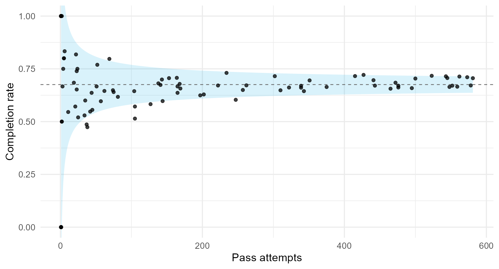
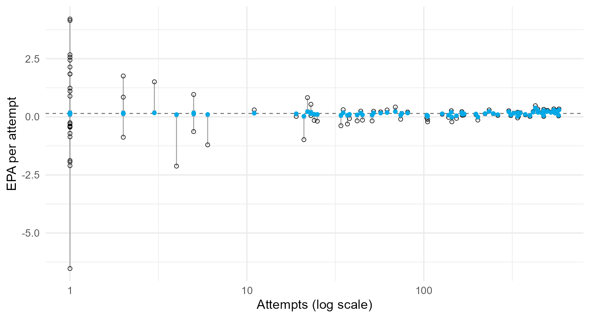
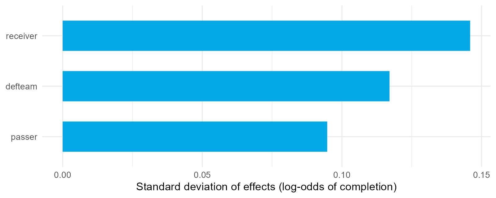
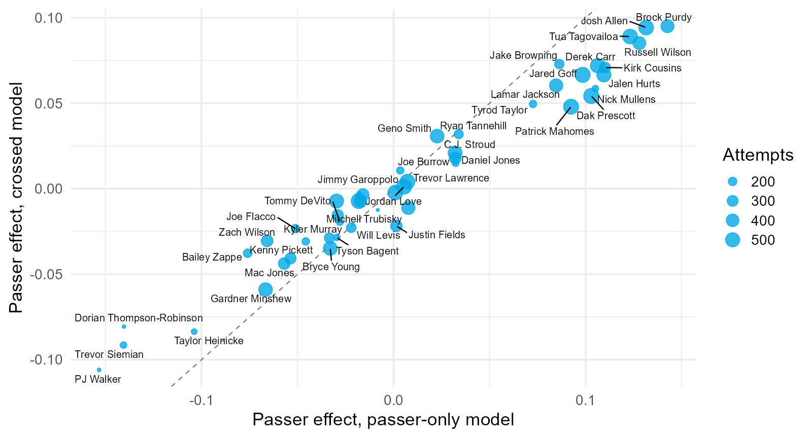
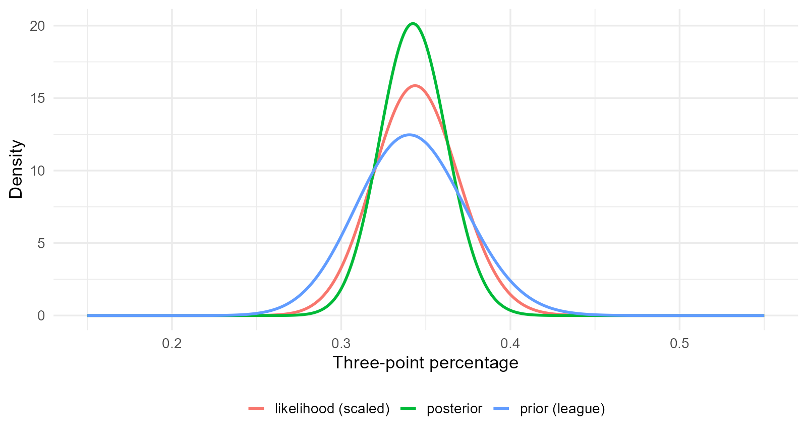
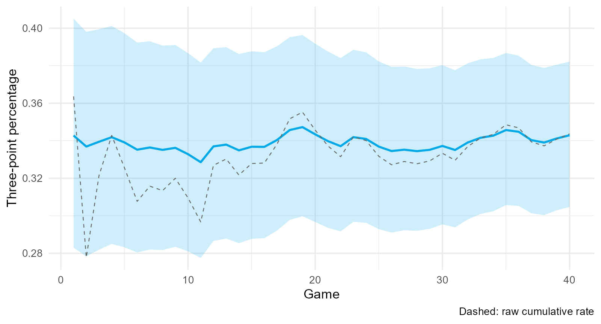
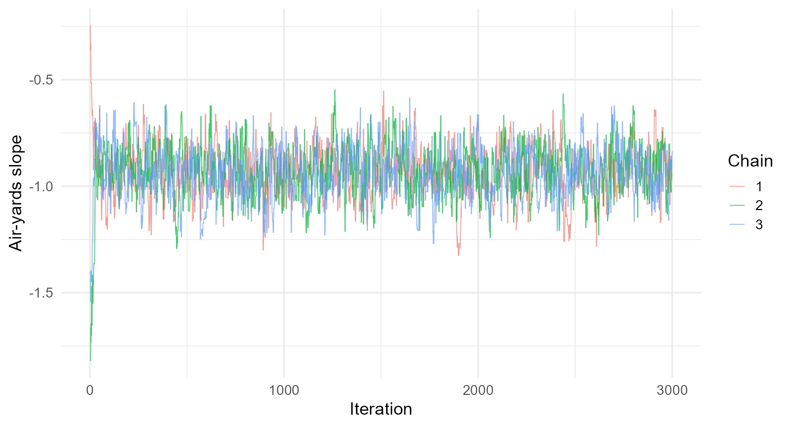
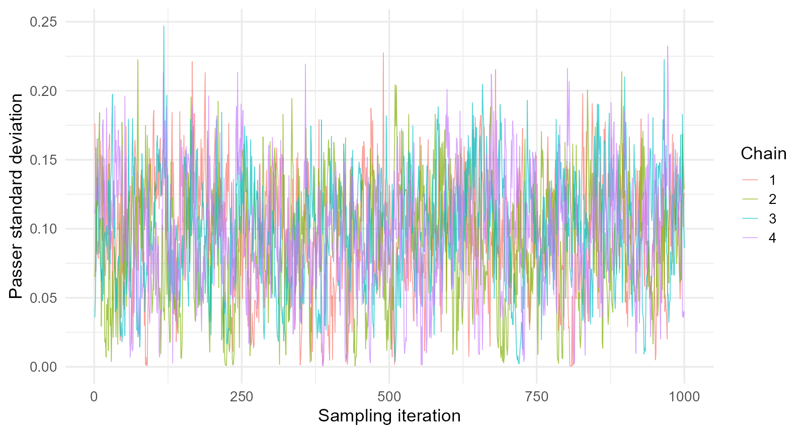
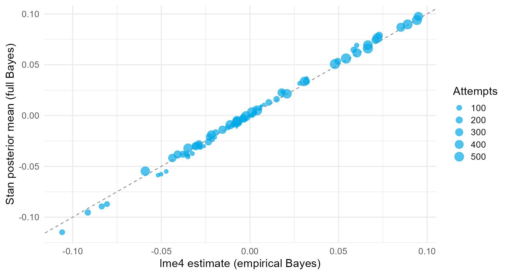
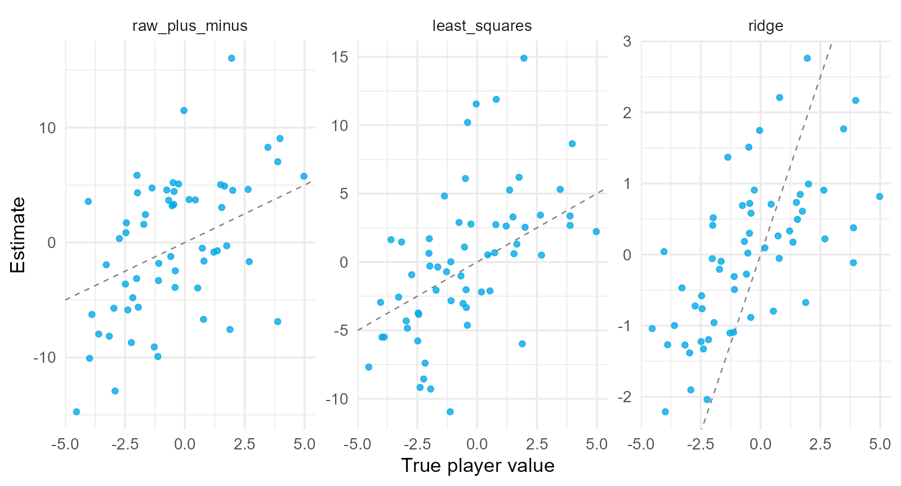

## 4.0.1 How good is a quarterback?

A 2023 passer completed 72% of 40 attempts. Another completed 68% of 560.

$$
\text{observed average}=\text{ability}+\text{context}+\text{chance}.
$$

::: {.question}
Which passer is better? What would you need to know before answering?
:::

::: {.notes}
Collect the objections: sample size, who the receivers were, which defenses, how deep the throws were. Each one maps to a tutorial in this lecture.
:::

## 4.0.2 One idea runs through the lecture

For the intercept-only Gaussian model, with population quantities treated as known,

$$
\hat\theta_j=\mu+w_j\left(\bar y_j-\mu\right),
\qquad
w_j=\frac{n_j\tau^2}{n_j\tau^2+\sigma^2},
$$

a weighted compromise between the player's own average and the league.

- $\tau^2$: how much players truly differ
- $\sigma^2$: how noisy one play is
- $n_j$: how much we have seen of this player

## 4.0.3 Section map: from a raw average to a posterior

| Section | Question |
|---|---|
| **4.1** Player Evaluation and Small Samples | How much of an average is noise? |
| **4.2** Multilevel Models with Varying Intercepts | How does a model estimate $\tau^2$ and shrink? |
| **4.3** Covariates, Slopes, and Crossed Effects | How do we separate passer, receiver, and defense? |
| **4.4** Bayesian Thinking and the Connection | Why is the multilevel model a Bayesian model? |
| **4.5** Computing Posteriors | How do we compute a posterior when there is no formula? |
| **4.6** Regularization and Plus-Minus | Why is ridge regression a prior, and what is RAPM? |

## 4.1 Player Evaluation and Small Samples {.section-slide}

An observed average is an estimate. Measure its reliability before comparing players.

::: {.notes}
Source and code: Tutorial 4.1, `4.1-player-evaluation-small-samples.qmd`. Numerical examples use the bundled datasets or the explicitly identified simulation described there. Treat ratings as conditional on the stated model and sample.
:::

## 4.1.1 A raw statistic is a group mean

For attempt $i$ by passer $j$, with $n_j$ attempts,

$$
\bar y_j=\frac{1}{n_j}\sum_{i=1}^{n_j}y_{ij}
\quad\text{estimates}\quad
\theta_j,
$$

the long-run rate the passer would produce in average circumstances.

| Passer | Attempts | Completion rate | EPA per attempt |
|---|---:|---:|---:|
| Dak Prescott | 581 | .706 | .339 |
| Jared Goff | 573 | .710 | .289 |
| Patrick Mahomes | 562 | .714 | .217 |
| Josh Allen | 545 | .706 | .283 |

::: {.notes}
Source and code: Tutorial 4.1, `4.1-player-evaluation-small-samples.qmd`. Numerical examples use the bundled datasets or the explicitly identified simulation described there. Treat ratings as conditional on the stated model and sample.
:::

## 4.1.2 Raw averages are noisy

{fig-align="center" width="74%"}

::: {.small}
Band: $\bar p\pm2\sqrt{\bar p(1-\bar p)/n}$. The extreme rates belong to passers with a handful of throws.
:::

::: {.notes}
Source and code: Tutorial 4.1, `4.1-player-evaluation-small-samples.qmd`. Numerical examples use the bundled datasets or the explicitly identified simulation described there. Treat ratings as conditional on the stated model and sample.
:::

## 4.1.3 Signal plus noise

$$
\bar y_j=\theta_j+\varepsilon_j,
\qquad
\operatorname{Var}(\bar y_j)=\underbrace{\tau^2}_{\text{signal}}+\underbrace{\sigma^2/n_j}_{\text{noise}}.
$$

The **reliability** of the average is the signal share,

$$
R_j=\frac{\tau^2}{\tau^2+\sigma^2/n_j}=\frac{n_j}{n_j+\sigma^2/\tau^2}.
$$

::: {.takeaway}
$\sigma^2/\tau^2$ is the number of attempts at which an average becomes half signal.
:::

::: {.notes}
Source and code: Tutorial 4.1, `4.1-player-evaluation-small-samples.qmd`. Numerical examples use the bundled datasets or the explicitly identified simulation described there. Treat ratings as conditional on the stated model and sample.
:::

## 4.1.4 Estimates from 2023

Method of moments: $\hat\tau^2=\operatorname{Var}(\bar y_j)-\overline{\sigma^2/n_j}$.

| Statistic | Within variance $\sigma^2$ | Between sd $\tau$ | Attempts for half reliability |
|---|---:|---:|---:|
| completion rate | .219 | .031 | 231 |
| EPA per attempt | 2.34 | .107 | 206 |

A single game of 35 attempts is almost entirely noise for either statistic.

::: {.notes}
Source and code: Tutorial 4.1, `4.1-player-evaluation-small-samples.qmd`. Numerical examples use the bundled datasets or the explicitly identified simulation described there. Treat ratings as conditional on the stated model and sample.
:::

## 4.1.5 Regression to the mean is arithmetic

$$
E[\theta_j\mid\bar y_j]=\mu+R_j\left(\bar y_j-\mu\right).
$$

| Passer | Attempts | Completion rate | $R_j$ | Expected ability |
|---|---:|---:|---:|---:|
| Mason Rudolph | 69 | .797 | .23 | .703 |
| Jake Browning | 234 | .731 | .50 | .703 |
| Brock Purdy | 427 | .721 | .65 | .705 |

The remaining gap is noise that will not repeat.

::: {.notes}
Source and code: Tutorial 4.1, `4.1-player-evaluation-small-samples.qmd`. Numerical examples use the bundled datasets or the explicitly identified simulation described there. Treat ratings as conditional on the stated model and sample.
:::

## 4.1.6 Reliability depends on the population

Split each passer's season into odd and even attempts and correlate the halves.

| Statistic | Observed split-half $r$ | Predicted, $\tau^2$ from all passers | Predicted, $\tau^2$ from the same 34 starters |
|---|---:|---:|---:|
| completion rate | .165 | .479 | .226 |
| EPA per attempt | .613 | .507 | .496 |

::: {.takeaway}
Starters differ from each other far less than starters differ from backups. A reliability is a property of a statistic *and* a population.
:::

::: {.notes}
Source and code: Tutorial 4.1, `4.1-player-evaluation-small-samples.qmd`. Numerical examples use the bundled datasets or the explicitly identified simulation described there. Treat ratings as conditional on the stated model and sample.
:::

## 4.1.7 Context: not every pass is equally hard

Fit an expectation model without the passer,

$$
\hat p_i=\sigma\!\left(\beta_0+\mathbf x_i^{\mathsf T}\boldsymbol\beta\right),
\qquad
\mathrm{CPOE}_i=y_i-\hat p_i.
$$

| Term | Estimate |
|---|---:|
| air yards (per yard) | $-.073$ |
| passer hit | $-.823$ |
| receiver is a tight end | $+.092$ |

A passer's CPOE is the average of their residuals.

::: {.notes}
Source and code: Tutorial 4.1, `4.1-player-evaluation-small-samples.qmd`. Numerical examples use the bundled datasets or the explicitly identified simulation described there. Treat ratings as conditional on the stated model and sample.
:::

## 4.1.8 Residual allocation is an assumption

Averaging residuals by passer credits the passer with **everything** the expectation model did not explain.

::: {.danger}
The receiver who caught it, the defense that allowed it, the protection, and chance are all in the residual.
:::

Two separate problems, two remedies: shrinkage for sampling noise, a joint model for credit assignment. The multilevel model does both.

::: {.notes}
Source and code: Tutorial 4.1, `4.1-player-evaluation-small-samples.qmd`. Numerical examples use the bundled datasets or the explicitly identified simulation described there. Treat ratings as conditional on the stated model and sample.
:::

## 4.2 Multilevel Models with Varying Intercepts {.section-slide}

Estimate how much players differ, then let that estimate decide how far to trust each player's data.

::: {.notes}
Source and code: Tutorial 4.2, `4.2-multilevel-varying-intercepts.qmd`. Numerical examples use the bundled datasets or the explicitly identified simulation described there. Treat ratings as conditional on the stated model and sample.
:::

## 4.2.1 Three estimators

$$
\hat\theta_j^{\text{pool}}=\bar y,
\qquad
\hat\theta_j^{\text{none}}=\bar y_j,
\qquad
\hat\theta_j^{\text{partial}}=\bar y+w_j\left(\bar y_j-\bar y\right).
$$

- complete pooling ignores the player;
- no pooling ignores the league; and
- partial pooling weights them by reliability, and the model estimates the weight.

::: {.notes}
Source and code: Tutorial 4.2, `4.2-multilevel-varying-intercepts.qmd`. Numerical examples use the bundled datasets or the explicitly identified simulation described there. Treat ratings as conditional on the stated model and sample.
:::

## 4.2.2 The two-level model

Level one, attempts within a passer:

$$
y_{ij}=\beta_{0j}+\varepsilon_{ij},
\qquad
\varepsilon_{ij}\sim N(0,\sigma^2).
$$

Level two, passers within the league:

$$
\beta_{0j}=\beta_0+u_j,
\qquad
u_j\sim N(0,\tau^2).
$$

Composite: $y_{ij}=\beta_0+u_j+\varepsilon_{ij}$.

::: {.notes}
Source and code: Tutorial 4.2, `4.2-multilevel-varying-intercepts.qmd`. Numerical examples use the bundled datasets or the explicitly identified simulation described there. Treat ratings as conditional on the stated model and sample.
:::

## 4.2.3 Laird-Ware form

$$
\mathbf y=X\boldsymbol\beta+Z\mathbf u+\boldsymbol\varepsilon,
\qquad
\mathbf u\sim N(\mathbf 0,\tau^2I_J),
\qquad
\boldsymbol\varepsilon\sim N(\mathbf 0,\sigma^2I_N).
$$

Integrating out $\mathbf u$,

$$
\mathbf y\sim N\!\left(X\boldsymbol\beta,\ \tau^2ZZ^{\mathsf T}+\sigma^2I\right).
$$

Two attempts by the same passer have covariance $\tau^2$; attempts by different passers are independent. Maximum likelihood fits this marginal model.

::: {.notes}
Source and code: Tutorial 4.2, `4.2-multilevel-varying-intercepts.qmd`. Numerical examples use the bundled datasets or the explicitly identified simulation described there. Treat ratings as conditional on the stated model and sample.
:::

## 4.2.4 Fixed and random effects

| | Fixed effect $\beta_0$ | Random effects $u_j$ |
|---|---|---|
| what it is | one league constant | one deviation per passer |
| what is estimated | the value | the variance $\tau^2$, then each $u_j$ |
| "random" means | nothing | modeled as draws from a population |

"Random" does not mean the passers were sampled at random. It means we borrow strength across them.

::: {.notes}
Source and code: Tutorial 4.2, `4.2-multilevel-varying-intercepts.qmd`. Numerical examples use the bundled datasets or the explicitly identified simulation described there. Treat ratings as conditional on the stated model and sample.
:::

## 4.2.5 Fit and variance components

```r
library(lme4)
epa_fit <- lmer(qb_epa ~ 1 + (1 | passer), data = passes)
```

| Component | Standard deviation |
|---|---:|
| passer $\tau$ | .115 |
| residual $\sigma$ | 1.540 |

Intraclass correlation:

$$
\rho=\frac{\tau^2}{\tau^2+\sigma^2}=.0056.
$$

Less than 1% of per-attempt variance is between passers; hundreds of attempts are needed before it shows.

::: {.notes}
Source and code: Tutorial 4.2, `4.2-multilevel-varying-intercepts.qmd`. Numerical examples use the bundled datasets or the explicitly identified simulation described there. Treat ratings as conditional on the stated model and sample.
:::

## 4.2.6 Deep dive: the shrinkage estimator

Treat $u_j\sim N(0,\tau^2)$ as a prior and $\bar y_j\mid u_j\sim N(\beta_0+u_j,\sigma^2/n_j)$ as data. Precisions add:

$$
E[u_j\mid\bar y_j]=\frac{\dfrac{n_j}{\sigma^2}(\bar y_j-\beta_0)+\dfrac{1}{\tau^2}\cdot0}{\dfrac{n_j}{\sigma^2}+\dfrac{1}{\tau^2}}
=\boxed{\frac{n_j\tau^2}{n_j\tau^2+\sigma^2}\left(\bar y_j-\beta_0\right)}.
$$

Called the **BLUP** in the mixed-model literature and the **posterior mean** in the Bayesian literature. Same formula.

::: {.notes}
Source and code: Tutorial 4.2, `4.2-multilevel-varying-intercepts.qmd`. Numerical examples use the bundled datasets or the explicitly identified simulation described there. Treat ratings as conditional on the stated model and sample.
:::

## 4.2.7 The hand calculation matches lme4

| Passer | Attempts | $\bar y_j$ | $w_j$ | by hand | `ranef()` |
|---|---:|---:|---:|---:|---:|
| Dak Prescott | 581 | .339 | .76 | .148 | .148 |
| Tyrod Taylor | 164 | .225 | .48 | .038 | .038 |
| Jerick McKinnon | 1 | 1.105 | .006 | .005 | .005 |

A passer with one attempt is estimated at almost exactly the league mean.

::: {.notes}
Source and code: Tutorial 4.2, `4.2-multilevel-varying-intercepts.qmd`. Numerical examples use the bundled datasets or the explicitly identified simulation described there. Treat ratings as conditional on the stated model and sample.
:::

## 4.2.8 Every estimate is pulled toward the mean

{fig-align="center" width="72%"}

::: {.small}
Open circles: no pooling. Filled: partial pooling. Short arrows for high-volume passers, long arrows for backups.
:::

::: {.notes}
Source and code: Tutorial 4.2, `4.2-multilevel-varying-intercepts.qmd`. Numerical examples use the bundled datasets or the explicitly identified simulation described there. Treat ratings as conditional on the stated model and sample.
:::

## 4.2.9 ML and REML

- **ML** maximizes the full marginal likelihood; variance estimates are biased downward because $\boldsymbol\beta$ was estimated from the same data.
- **REML** maximizes the likelihood of contrasts free of $\boldsymbol\beta$; it corrects the bias, like dividing by $n-1$.

`lmer()` defaults to REML. Use `REML = FALSE` to compare models with different fixed effects.

::: {.takeaway}
Estimating the prior variance from the data and then conditioning on it is **empirical Bayes**.
:::

::: {.notes}
Source and code: Tutorial 4.2, `4.2-multilevel-varying-intercepts.qmd`. Numerical examples use the bundled datasets or the explicitly identified simulation described there. Treat ratings as conditional on the stated model and sample.
:::

## 4.2.10 A binary outcome: the GLMM

$$
\operatorname{logit}P(y_{ij}=1)=\beta_0+u_j,
\qquad
u_j\sim N(0,\tau^2).
$$

```r
glmer(complete ~ 1 + (1 | passer), data = passes, family = binomial())
```

$\hat\tau=.102$ on the log-odds scale; the latent residual variance is fixed at $\pi^2/3$.

| Passer | Attempts | Raw rate | Shrunken rate |
|---|---:|---:|---:|
| a receiver, one trick play | 1 | 1.000 | .672 |
| C.J. Stroud | 476 | .670 | .671 |

::: {.notes}
Source and code: Tutorial 4.2, `4.2-multilevel-varying-intercepts.qmd`. Numerical examples use the bundled datasets or the explicitly identified simulation described there. Treat ratings as conditional on the stated model and sample.
:::

## 4.2.11 Uncertainty about each effect

$$
\operatorname{Var}(u_j\mid\mathbf y)=\left(\frac{1}{\tau^2}+\frac{n_j}{\sigma^2}\right)^{-1}
=\frac{\sigma^2\tau^2}{n_j\tau^2+\sigma^2}.
$$

`ranef(fit, condVar = TRUE)` returns it. On raw completion, nearly every passer's interval crosses zero.

::: {.question}
If one season cannot separate most passers on raw completion, what is missing from the model?
:::

::: {.notes}
Source and code: Tutorial 4.2, `4.2-multilevel-varying-intercepts.qmd`. Numerical examples use the bundled datasets or the explicitly identified simulation described there. Treat ratings as conditional on the stated model and sample.
:::

## 4.3 Covariates, Varying Slopes, and Crossed Effects {.section-slide}

Separate the passer from the throw, the receiver, and the defense in one model.

::: {.notes}
Source and code: Tutorial 4.3, `4.3-covariates-slopes-crossed-effects.qmd`. Numerical examples use the bundled datasets or the explicitly identified simulation described there. Treat ratings as conditional on the stated model and sample.
:::

## 4.3.1 Level-one covariates

$$
\operatorname{logit}P(y_{ij}=1)=\beta_{0j}+\mathbf x_{ij}^{\mathsf T}\boldsymbol\beta,
\qquad
\beta_{0j}=\beta_0+u_j.
$$

The expectation model and the passer effects are now estimated **jointly**.

| Term | Estimate |
|---|---:|
| air yards (standardized) | $-.63$ |
| passer hit | $-.85$ |

Passer sd rises from .102 to .117: the logistic residual variance is fixed, so explaining variation rescales the latent scale.

::: {.notes}
Source and code: Tutorial 4.3, `4.3-covariates-slopes-crossed-effects.qmd`. Numerical examples use the bundled datasets or the explicitly identified simulation described there. Treat ratings as conditional on the stated model and sample.
:::

## 4.3.2 A level-two covariate

$$
\beta_{0j}=\gamma_0+\gamma_1w_j+u_j,
$$

with $w_j$ describing the passer. Here $w_j$ is the passer's average air yards.

| Term | Estimate | SE |
|---|---:|---:|
| air yards of this throw | $-.630$ | .019 |
| passer's average air yards | $+.035$ | .020 |

Aggressiveness carries no penalty once each throw's depth is in the model.

::: {.notes}
Source and code: Tutorial 4.3, `4.3-covariates-slopes-crossed-effects.qmd`. Numerical examples use the bundled datasets or the explicitly identified simulation described there. Treat ratings as conditional on the stated model and sample.
:::

## 4.3.3 Varying slopes

$$
\begin{pmatrix}u_{0j}\\u_{1j}\end{pmatrix}\sim N\!\left(\mathbf 0,
\begin{pmatrix}\tau_0^2&\rho\tau_0\tau_1\\\rho\tau_0\tau_1&\tau_1^2\end{pmatrix}\right)
$$

```r
glmer(complete ~ air_yards_z + ... + (1 + air_yards_z | passer), ...)
```

| $\tau_0$ | $\tau_1$ | $\rho$ | LRT $p$ |
|---:|---:|---:|---:|
| .112 | .087 | .89 | .015 |

Passers who complete more short throws also hold up better on deep ones.

::: {.notes}
Source and code: Tutorial 4.3, `4.3-covariates-slopes-crossed-effects.qmd`. Numerical examples use the bundled datasets or the explicitly identified simulation described there. Treat ratings as conditional on the stated model and sample.
:::

## 4.3.4 Nested and crossed structures

**Nested**: each level of the inner factor belongs to one level of the outer factor.

```r
(1 | passer / game_id)   # games within passers
```

**Crossed**: levels of one factor combine with many levels of another.

```r
(1 | passer) + (1 | receiver) + (1 | defteam)
```

Every pass has a passer, a receiver, and a defense; each catches passes from many of the others.

::: {.notes}
Source and code: Tutorial 4.3, `4.3-covariates-slopes-crossed-effects.qmd`. Numerical examples use the bundled datasets or the explicitly identified simulation described there. Treat ratings as conditional on the stated model and sample.
:::

## 4.3.5 The crossed model shares the residual

$$
\operatorname{logit}P(y_i=1)=\beta_0+\mathbf x_i^{\mathsf T}\boldsymbol\beta+u_{q(i)}+v_{r(i)}+d_{k(i)}
$$

{fig-align="center" width="70%"}

On completion, who catches the ball matters at least as much as who throws it.

::: {.notes}
Source and code: Tutorial 4.3, `4.3-covariates-slopes-crossed-effects.qmd`. Numerical examples use the bundled datasets or the explicitly identified simulation described there. Treat ratings as conditional on the stated model and sample.
:::

## 4.3.6 What changes when receivers and defenses are in the model

{fig-align="center" width="66%"}

::: {.small}
Above the line: passers whose receivers were below average. Below: passers who had lent credit to strong receivers.
:::

::: {.notes}
Source and code: Tutorial 4.3, `4.3-covariates-slopes-crossed-effects.qmd`. Numerical examples use the bundled datasets or the explicitly identified simulation described there. Treat ratings as conditional on the stated model and sample.
:::

## 4.3.7 Uncertainty for variance components

Variance estimates are skewed and bounded at zero, so use a **parametric bootstrap**:

1. simulate new random effects and residuals from the fitted model;
2. refit; 3. record $\hat\tau$; 4. repeat 200 times.

| Component (EPA model) | Estimate | 95% interval |
|---|---:|:--:|
| defense | .053 | [.000, .078] |
| passer | .097 | [.054, .131] |
| receiver | .112 | [.063, .145] |

One season cannot establish stable defense effects on EPA.

::: {.notes}
Source and code: Tutorial 4.3, `4.3-covariates-slopes-crossed-effects.qmd`. Numerical examples use the bundled datasets or the explicitly identified simulation described there. Treat ratings as conditional on the stated model and sample.
:::

## 4.3.8 Two kinds of uncertainty

| Question | Tool |
|---|---|
| how well do we know $\tau^2$? | parametric bootstrap with `use.u = FALSE` |
| how well do we know passer $j$'s effect, given $\tau^2$? | conditional variance (`condVar = TRUE`) |
| both at once? | a posterior distribution (Section 4.5) |

::: {.takeaway}
A bootstrap that resimulates the random effects describes the population, not any particular passer.
:::

::: {.notes}
Source and code: Tutorial 4.3, `4.3-covariates-slopes-crossed-effects.qmd`. Numerical examples use the bundled datasets or the explicitly identified simulation described there. Treat ratings as conditional on the stated model and sample.
:::

## 4.4 Bayesian Thinking and the Multilevel Connection {.section-slide}

Priors, posteriors, conjugacy, and why the multilevel model is a Bayesian model estimated two ways.

::: {.notes}
Source and code: Tutorial 4.4, `4.4-bayesian-thinking-multilevel-connection.qmd`. Numerical examples use the bundled datasets or the explicitly identified simulation described there. Treat ratings as conditional on the stated model and sample.
:::

## 4.4.1 Bayes' rule for a parameter

$$
p(\theta\mid y)=\frac{p(y\mid\theta)\,p(\theta)}{p(y)}
\ \propto\
\underbrace{p(y\mid\theta)}_{\text{likelihood}}\ \underbrace{p(\theta)}_{\text{prior}}.
$$

- A frequentist probability is a long-run frequency.
- A Bayesian probability is a degree of belief about anything uncertain, including $\theta$.

Everything learned from the data is in the posterior.

::: {.notes}
Source and code: Tutorial 4.4, `4.4-bayesian-thinking-multilevel-connection.qmd`. Numerical examples use the bundled datasets or the explicitly identified simulation described there. Treat ratings as conditional on the stated model and sample.
:::

## 4.4.2 Beta-binomial conjugacy

Likelihood $s\mid\theta\sim\text{Binomial}(n,\theta)$; prior $\theta\sim\text{Beta}(a,b)$:

$$
p(\theta\mid s)\propto\theta^{s+a-1}(1-\theta)^{n-s+b-1}
\ \Longrightarrow\
\theta\mid s\sim\text{Beta}(a+s,\ b+n-s).
$$

The posterior mean is a weighted average,

$$
E[\theta\mid s]=\frac{a+b}{a+b+n}\cdot\frac{a}{a+b}+\frac{n}{a+b+n}\cdot\frac{s}{n}.
$$

$a+b$ acts like a prior sample size.

::: {.notes}
Source and code: Tutorial 4.4, `4.4-bayesian-thinking-multilevel-connection.qmd`. Numerical examples use the bundled datasets or the explicitly identified simulation described there. Treat ratings as conditional on the stated model and sample.
:::

## 4.4.3 Caitlin Clark's three-point shooting

- 2024 regular season: 122 makes in 355 attempts (.344).
- League prior fitted by marginal likelihood from 84 other shooters: $\text{Beta}(75.1,\ 144.7)$, mean .342.

$$
\theta\mid\text{data}\sim\text{Beta}(197.1,\ 377.7).
$$

| | Mean | 95% interval |
|---|---:|:--:|
| prior | .342 | [.281, .406] |
| posterior | .343 | [.305, .382] |

::: {.notes}
Source and code: Tutorial 4.4, `4.4-bayesian-thinking-multilevel-connection.qmd`. Numerical examples use the bundled datasets or the explicitly identified simulation described there. Treat ratings as conditional on the stated model and sample.
:::

## 4.4.4 Prior, likelihood, posterior

{fig-align="center" width="74%"}

::: {.notes}
Source and code: Tutorial 4.4, `4.4-bayesian-thinking-multilevel-connection.qmd`. Numerical examples use the bundled datasets or the explicitly identified simulation described there. Treat ratings as conditional on the stated model and sample.
:::

## 4.4.5 Sequential updating

{fig-align="center" width="74%"}

::: {.small}
Yesterday's posterior is today's prior. The final posterior is the same in any order.
:::

::: {.notes}
Source and code: Tutorial 4.4, `4.4-bayesian-thinking-multilevel-connection.qmd`. Numerical examples use the bundled datasets or the explicitly identified simulation described there. Treat ratings as conditional on the stated model and sample.
:::

## 4.4.6 Posterior predictive probability

For $m$ future attempts, integrate the binomial over the posterior:

$$
P(\tilde s=k\mid s)=\binom{m}{k}\frac{B(k+a',\ m-k+b')}{B(a',b')}.
$$

| $P(\text{at least 5 of the next 10})$ | |
|---|---:|
| posterior predictive | .235 |
| plug-in binomial at the posterior mean | .233 |

The predictive is slightly wider because $\theta$ itself is uncertain.

::: {.notes}
Source and code: Tutorial 4.4, `4.4-bayesian-thinking-multilevel-connection.qmd`. Numerical examples use the bundled datasets or the explicitly identified simulation described there. Treat ratings as conditional on the stated model and sample.
:::

## 4.4.7 Normal-normal conjugacy

$$
\bar y_j\mid\theta_j\sim N(\theta_j,\sigma^2/n_j),
\qquad
\theta_j\sim N(\mu,\tau^2)
$$

$$
\theta_j\mid\bar y_j\sim N(m_j,v_j),
\qquad
\frac1{v_j}=\frac1{\tau^2}+\frac{n_j}{\sigma^2},
\qquad
m_j=\mu+\frac{n_j\tau^2}{n_j\tau^2+\sigma^2}(\bar y_j-\mu).
$$

::: {.takeaway}
The multilevel BLUP **is** this posterior mean, and the conditional variance **is** $v_j$.
:::

::: {.notes}
Source and code: Tutorial 4.4, `4.4-bayesian-thinking-multilevel-connection.qmd`. Numerical examples use the bundled datasets or the explicitly identified simulation described there. Treat ratings as conditional on the stated model and sample.
:::

## 4.4.8 Where do $\mu$ and $\tau^2$ come from?

| Approach | Treatment of $\mu,\tau^2$ | Software | Consequence |
|---|---|---|---|
| subjective prior | fixed from outside | any | depends on the choice |
| empirical Bayes | estimated by ML or REML, then treated as known | `lme4` | uncertainty in $\tau^2$ ignored |
| fully Bayesian | given priors, integrated over | Stan, `rstanarm`, `brms` | uncertainty propagates |

`lme4` is the middle row.

::: {.notes}
Source and code: Tutorial 4.4, `4.4-bayesian-thinking-multilevel-connection.qmd`. Numerical examples use the bundled datasets or the explicitly identified simulation described there. Treat ratings as conditional on the stated model and sample.
:::

## 4.4.9 Uncertainty in the population spread

The grid in Tutorial 4.4 integrates over $\tau$ while fixing $\mu$ and $\sigma$. This is a conditional illustration. Full Bayes integrates over all unknown parameters.

- The law of total variance includes variation within and between conditional posteriors.
- Few groups can leave the population spread uncertain. Interval width also depends on the prior.

::: {.notes}
Source and code: Tutorial 4.4, `4.4-bayesian-thinking-multilevel-connection.qmd`. Numerical examples use the bundled datasets or the explicitly identified simulation described there. Treat ratings as conditional on the stated model and sample.
:::

## 4.4.10 The dictionary

| Multilevel (`lme4`) | Bayesian hierarchical |
|---|---|
| fixed effect $\beta$ | parameter with a weak prior |
| random effect $u_j\sim N(0,\tau^2)$ | parameter with a hierarchical prior |
| variance component $\tau^2$ | hyperparameter |
| BLUP $\hat u_j$ | posterior mean given $\hat\tau^2$ |
| conditional variance | posterior variance given $\hat\tau^2$ |
| ML / REML | marginal / restricted likelihood |
| bootstrap: new datasets, refitting | posterior draws: parameters given observed data |

::: {.notes}
Source and code: Tutorial 4.4, `4.4-bayesian-thinking-multilevel-connection.qmd`. Numerical examples use the bundled datasets or the explicitly identified simulation described there. Treat ratings as conditional on the stated model and sample.
:::

## 4.4.11 The full hierarchical model

$$
\begin{aligned}
y_{ij}\mid\theta_j,\sigma&\sim N(\theta_j,\sigma^2)\\
\theta_j\mid\mu,\tau&\sim N(\mu,\tau^2)\\
\mu\sim N(0,1),\quad\tau&\sim\text{half-}N(0,1),\quad\sigma\sim\text{half-}N(0,5)
\end{aligned}
$$

The first two lines are the level-one and level-two equations of Section 4.2. The third line makes it fully Bayesian.

::: {.notes}
Source and code: Tutorial 4.4, `4.4-bayesian-thinking-multilevel-connection.qmd`. Numerical examples use the bundled datasets or the explicitly identified simulation described there. Treat ratings as conditional on the stated model and sample.
:::

## 4.5 Computing Posteriors: From Grids to Stan {.section-slide}

Grid and Laplace approximation, Metropolis-Hastings, Gibbs sampling, Hamiltonian Monte Carlo, and a Stan model.

::: {.notes}
Source and code: Tutorial 4.5, `4.5-computing-posteriors.qmd`. Numerical examples use the bundled datasets or the explicitly identified simulation described there. Treat ratings as conditional on the stated model and sample.
:::

## 4.5.1 Why computation is needed

$$
p(\theta\mid y)=\frac{p(y\mid\theta)p(\theta)}{\int p(y\mid\theta)p(\theta)\,d\theta}
$$

Outside conjugate families the denominator has no closed form, and neither do posterior means, intervals, or $P(\theta_A>\theta_B\mid y)$.

::: {.takeaway}
Every posterior summary is an integral. The methods differ in how they compute integrals.
:::

::: {.notes}
Source and code: Tutorial 4.5, `4.5-computing-posteriors.qmd`. Numerical examples use the bundled datasets or the explicitly identified simulation described there. Treat ratings as conditional on the stated model and sample.
:::

## 4.5.2 A two-parameter example

Patrick Mahomes, 562 attempts:

$$
P(y_i=1)=\sigma(\beta_0+\beta_1x_i),
\qquad
\beta_0,\beta_1\sim N(0,2.5^2),
$$

with $x_i$ standardized air yards. The prior rules out absurd coefficients without favoring plausible ones.

::: {.notes}
Source and code: Tutorial 4.5, `4.5-computing-posteriors.qmd`. Numerical examples use the bundled datasets or the explicitly identified simulation described there. Treat ratings as conditional on the stated model and sample.
:::

## 4.5.3 Grid approximation

Evaluate the log posterior on a $121\times121$ grid, exponentiate, normalize.

| Parameter | Mean | SD |
|---|---:|---:|
| $\beta_0$ | .904 | .102 |
| $\beta_1$ | $-.916$ | .098 |

::: {.danger}
Ten parameters would need $121^{10}$ evaluations. Grids stop at two dimensions.
:::

::: {.notes}
Source and code: Tutorial 4.5, `4.5-computing-posteriors.qmd`. Numerical examples use the bundled datasets or the explicitly identified simulation described there. Treat ratings as conditional on the stated model and sample.
:::

## 4.5.4 Laplace approximation

$$
p(\theta\mid y)\approx N\!\left(\hat\theta,\ \left[-\nabla^2\log p(\hat\theta\mid y)\right]^{-1}\right)
$$

| Parameter | Mode | SD |
|---|---:|---:|
| $\beta_0$ | .902 | .102 |
| $\beta_1$ | $-.925$ | .113 |

Cheap in any dimension; it is what `glmer()` uses. Poor for skewed posteriors such as variance parameters.

::: {.notes}
Source and code: Tutorial 4.5, `4.5-computing-posteriors.qmd`. Numerical examples use the bundled datasets or the explicitly identified simulation described there. Treat ratings as conditional on the stated model and sample.
:::

## 4.5.5 Markov chain Monte Carlo

Replace integrals with averages over draws:

$$
E[g(\theta)\mid y]\approx\frac1S\sum_{s=1}^{S}g\!\left(\theta^{(s)}\right).
$$

MCMC builds a Markov chain whose stationary distribution is the posterior. Draws are correlated and early draws depend on the start, so discard a warm-up and run long enough.

::: {.notes}
Source and code: Tutorial 4.5, `4.5-computing-posteriors.qmd`. Numerical examples use the bundled datasets or the explicitly identified simulation described there. Treat ratings as conditional on the stated model and sample.
:::

## 4.5.6 Metropolis-Hastings

1. propose $\theta^{*}=\theta+\epsilon$, $\epsilon\sim N(\mathbf 0,s^2I)$;
2. compute $r=p(\theta^{*}\mid y)/p(\theta\mid y)$; the constant cancels;
3. accept with probability $\min(1,r)$, else stay;
4. repeat.

Proposals that raise the posterior are always accepted; those that lower it are accepted in proportion to the ratio.

::: {.notes}
Source and code: Tutorial 4.5, `4.5-computing-posteriors.qmd`. Numerical examples use the bundled datasets or the explicitly identified simulation described there. Treat ratings as conditional on the stated model and sample.
:::

## 4.5.7 Three chains from three starting points

{fig-align="center" width="74%"}

::: {.notes}
Source and code: Tutorial 4.5, `4.5-computing-posteriors.qmd`. Numerical examples use the bundled datasets or the explicitly identified simulation described there. Treat ratings as conditional on the stated model and sample.
:::

## 4.5.8 Diagnosing a chain

**Effective sample size** with autocorrelations $\rho_k$:

$$
S_{\text{eff}}=\frac{S}{1+2\sum_{k\ge1}\rho_k}.
$$

**Split $\hat R$**: within-piece variance $W$, between-piece variance $B$,

$$
\hat R=\sqrt{\frac{\frac{n-1}{n}W+\frac1nB}{W}}.
$$

| Kept draws | $S_{\text{eff}}$ | $\hat R$ |
|---:|---:|---:|
| 12,000 | 1,152 | 1.001 |

::: {.notes}
Source and code: Tutorial 4.5, `4.5-computing-posteriors.qmd`. Numerical examples use the bundled datasets or the explicitly identified simulation described there. Treat ratings as conditional on the stated model and sample.
:::

## 4.5.9 The proposal scale decides efficiency

| Proposal sd | Acceptance rate | $S_{\text{eff}}$ from 4,000 draws |
|---:|---:|---:|
| .01 | .96 | 8 |
| .10 | .58 | 385 |
| 1.00 | .03 | 60 |

Tiny steps are accepted and go nowhere. Huge steps are rejected. Tune for the middle.

::: {.notes}
Source and code: Tutorial 4.5, `4.5-computing-posteriors.qmd`. Numerical examples use the bundled datasets or the explicitly identified simulation described there. Treat ratings as conditional on the stated model and sample.
:::

## 4.5.10 Gibbs sampling

Draw each parameter from its **full conditional**. For the normal hierarchical model with known $\sigma^2$:

$$
\begin{aligned}
\theta_j\mid\cdot&\sim N\!\left(\frac{n_j\bar y_j/\sigma^2+\mu/\tau^2}{n_j/\sigma^2+1/\tau^2},\ \frac{1}{n_j/\sigma^2+1/\tau^2}\right)\\
\mu\mid\cdot&\sim N\!\left(\bar\theta,\ \tau^2/J\right)\\
\tau^2\mid\cdot&\sim\text{Inv-Gamma}\!\left(a_0+\tfrac J2,\ b_0+\tfrac12\textstyle\sum_j(\theta_j-\mu)^2\right)
\end{aligned}
$$

No proposals, no rejections. The first line is the normal-normal update per passer.

::: {.notes}
Source and code: Tutorial 4.5, `4.5-computing-posteriors.qmd`. Numerical examples use the bundled datasets or the explicitly identified simulation described there. Treat ratings as conditional on the stated model and sample.
:::

## 4.5.11 Gibbs on the 2023 passers

| Parameter | Posterior mean | Posterior sd | `lme4` (REML) |
|---|---:|---:|---:|
| $\mu$ | .152 | .020 | .146 |
| $\tau$ | .101 | .020 | .115 |

::: {.takeaway}
Same model, and now $\tau$ comes with a posterior standard deviation instead of a point estimate.
:::

::: {.notes}
Source and code: Tutorial 4.5, `4.5-computing-posteriors.qmd`. Numerical examples use the bundled datasets or the explicitly identified simulation described there. Treat ratings as conditional on the stated model and sample.
:::

## 4.5.12 Hamiltonian Monte Carlo

Add a momentum $\mathbf r\sim N(\mathbf 0,M)$ and simulate motion under

$$
H(\theta,\mathbf r)=-\log p(\theta\mid y)+\tfrac12\mathbf r^{\mathsf T}M^{-1}\mathbf r
$$

with leapfrog steps of size $\epsilon$; accept with probability $\min\{1,\exp(H_{\text{start}}-H_{\text{end}})\}$.

| Sampler | Acceptance | $S_{\text{eff}}$ per 1,500 kept draws |
|---|---:|---:|
| Metropolis-Hastings | .57 | 393 (per 4,000) |
| HMC | .997 | 1,500 |

Gradients let the particle travel far with high acceptance. Stan's NUTS tunes $\epsilon$, $L$, and $M$ automatically.

::: {.notes}
Source and code: Tutorial 4.5, `4.5-computing-posteriors.qmd`. Numerical examples use the bundled datasets or the explicitly identified simulation described there. Treat ratings as conditional on the stated model and sample.
:::

## 4.5.13 The completion model in Stan

```stan
parameters {
  real alpha;  vector[K] beta;
  vector[J_qb] z_qb;  vector[J_rec] z_rec;  vector[J_def] z_def;
  real<lower=0> tau_qb;  real<lower=0> tau_rec;  real<lower=0> tau_def;
}
transformed parameters {
  vector[J_qb] u_qb = tau_qb * z_qb;   // non-centered
  ...
}
model {
  z_qb ~ std_normal();  tau_qb ~ normal(0, 1);  ...
  y ~ bernoulli_logit(alpha + X * beta + u_qb[qb] + u_rec[rec] + u_def[def]);
}
```

::: {.notes}
Source and code: Tutorial 4.5, `4.5-computing-posteriors.qmd`. Numerical examples use the bundled datasets or the explicitly identified simulation described there. Treat ratings as conditional on the stated model and sample.
:::

## 4.5.14 Why the non-centered parameterization

Writing $u_j=\tau z_j$ with $z_j\sim N(0,1)$ instead of $u_j\sim N(0,\tau^2)$:

- when $\tau$ is small, $u_j$ must be small, and $(u_j,\tau)$ forms a narrow **funnel**;
- a fixed step size cannot traverse the funnel, and Stan reports divergences;
- $z_j$ is approximately standard normal regardless of $\tau$, so the funnel disappears.

Same model, better geometry.

::: {.notes}
Source and code: Tutorial 4.5, `4.5-computing-posteriors.qmd`. Numerical examples use the bundled datasets or the explicitly identified simulation described there. Treat ratings as conditional on the stated model and sample.
:::

## 4.5.15 Posterior of the hyperparameters

| Parameter | Mean | 90% interval | $\hat R$ | ESS |
|---|---:|:--:|---:|---:|
| $\tau_{\text{qb}}$ | .096 | [.022, .165] | 1.006 | 639 |
| $\tau_{\text{rec}}$ | .143 | [.078, .200] | 1.005 | 685 |
| $\tau_{\text{def}}$ | .124 | [.082, .173] | 1.003 | 1,430 |

Four chains, 1,000 draws each, zero divergent transitions, about 3.5 minutes on a laptop.

::: {.notes}
Source and code: Tutorial 4.5, `4.5-computing-posteriors.qmd`. Numerical examples use the bundled datasets or the explicitly identified simulation described there. Treat ratings as conditional on the stated model and sample.
:::

## 4.5.16 Chains that have mixed

{fig-align="center" width="74%"}

::: {.notes}
Source and code: Tutorial 4.5, `4.5-computing-posteriors.qmd`. Numerical examples use the bundled datasets or the explicitly identified simulation described there. Treat ratings as conditional on the stated model and sample.
:::

## 4.5.17 Comparing conditional modes and posterior means

{fig-align="center" width="66%"}

::: {.small}
For this dataset, posterior means are close to the `lme4` conditional modes. The value of the draws is in what they let us compute next.
:::

::: {.notes}
Source and code: Tutorial 4.5, `4.5-computing-posteriors.qmd`. Numerical examples use the bundled datasets or the explicitly identified simulation described there. Treat ratings as conditional on the stated model and sample.
:::

## 4.5.18 Questions only draws can answer

$$
P(u_{\text{Purdy}}>u_{\text{Mahomes}}\mid y)=.66
$$

| Passer | $P(\text{top 5})$ | Expected rank |
|---|---:|---:|
| Brock Purdy | .45 | 8.5 |
| Josh Allen | .42 | 8.6 |
| Tua Tagovailoa | .39 | 9.0 |
| Russell Wilson | .39 | 9.3 |

::: {.takeaway}
No passer is a lock for the top five. A ranking hides that; a table of rank probabilities shows it.
:::

::: {.notes}
Source and code: Tutorial 4.5, `4.5-computing-posteriors.qmd`. Numerical examples use the bundled datasets or the explicitly identified simulation described there. Treat ratings as conditional on the stated model and sample.
:::

## 4.6 Regularization as a Prior and Adjusted Plus-Minus {.section-slide}

Ridge regression is a Gaussian prior, and regularized adjusted plus-minus is a multilevel model in disguise.

::: {.notes}
Source and code: Tutorial 4.6, `4.6-regularization-priors-plus-minus.qmd`. Numerical examples use the bundled datasets or the explicitly identified simulation described there. Treat ratings as conditional on the stated model and sample.
:::

## 4.6.1 From a Gaussian prior to a ridge penalty

With $\mathbf y=X\boldsymbol\beta+\boldsymbol\varepsilon$, $\varepsilon\sim N(0,\sigma^2I)$, and $\beta_j\sim N(0,\tau^2)$,

$$
\log p(\boldsymbol\beta\mid\mathbf y)=-\frac{1}{2\sigma^2}\lVert\mathbf y-X\boldsymbol\beta\rVert^2-\frac{1}{2\tau^2}\lVert\boldsymbol\beta\rVert^2+\text{const}.
$$

Maximizing it minimizes

$$
\lVert\mathbf y-X\boldsymbol\beta\rVert^2+\lambda\lVert\boldsymbol\beta\rVert^2,
\qquad
\boxed{\lambda=\sigma^2/\tau^2},
$$

$$
\hat{\boldsymbol\beta}=\left(X^{\mathsf T}X+\lambda I\right)^{-1}X^{\mathsf T}\mathbf y,
\qquad
\operatorname{Cov}=\sigma^2\left(X^{\mathsf T}X+\lambda I\right)^{-1}.
$$

::: {.notes}
Source and code: Tutorial 4.6, `4.6-regularization-priors-plus-minus.qmd`. Numerical examples use the bundled datasets or the explicitly identified simulation described there. Treat ratings as conditional on the stated model and sample.
:::

## 4.6.2 Three consequences

- **The penalty is a prior.** Large $\lambda$ means strong belief that coefficients are near zero.
- **Ridge is a multilevel model.** $u_j\sim N(0,\tau^2)$ is this prior; the multilevel model estimates $\lambda$ by maximum likelihood, ridge by cross-validation.
- **Other priors, other penalties.** A Laplace prior gives the lasso, whose posterior mode sets coefficients to exactly zero.

::: {.notes}
Source and code: Tutorial 4.6, `4.6-regularization-priors-plus-minus.qmd`. Numerical examples use the bundled datasets or the explicitly identified simulation described there. Treat ratings as conditional on the stated model and sample.
:::

## 4.6.3 Adjusted plus-minus

Unit: a **stint** with the same ten players on the floor.

$$
x_{sj}=\begin{cases}+1&j\text{ on court for home}\\-1&j\text{ on court for away}\\0&\text{otherwise}\end{cases},
\qquad
y_s=\sum_jx_{sj}\beta_j+\varepsilon_s,
\quad
\operatorname{Var}(\varepsilon_s)=\frac{\sigma^2}{w_s},
$$

with $w_s$ = possessions / 100. $\beta_j$ is the player's margin contribution per 100 possessions against average teammates and opponents.

::: {.notes}
Source and code: Tutorial 4.6, `4.6-regularization-priors-plus-minus.qmd`. Numerical examples use the bundled datasets or the explicitly identified simulation described there. Treat ratings as conditional on the stated model and sample.
:::

## 4.6.4 Why least squares fails

Teammates who always share the floor produce nearly identical columns. $X^{\mathsf T}X$ is nearly singular; two teammates can get $+30$ and $-28$ when the truth is $+1$ and $+1$.

::: {.takeaway}
The sum is identified; the split is not. Ridge pulls every coefficient toward zero and stabilizes the split. That is **RAPM**.
:::

::: {.notes}
Source and code: Tutorial 4.6, `4.6-regularization-priors-plus-minus.qmd`. Numerical examples use the bundled datasets or the explicitly identified simulation described there. Treat ratings as conditional on the stated model and sample.
:::

## 4.6.5 A simulation with known truth

60 players, six teams, 2,500 stints, true values $N(0,2^2)$, noise sd 25 per 100 possessions.

| Estimator | Correlation with truth | RMSE |
|---|---:|---:|
| raw plus-minus | .50 | 5.37 |
| least squares | .55 | 4.51 |
| ridge, $\lambda=10$ | .59 | 3.14 |
| ridge, $\lambda=\sigma^2/\tau^2=156$ | .64 | 1.82 |

::: {.notes}
Source and code: Tutorial 4.6, `4.6-regularization-priors-plus-minus.qmd`. Numerical examples use the bundled datasets or the explicitly identified simulation described there. Treat ratings as conditional on the stated model and sample.
:::

## 4.6.6 The three estimators against the truth

{fig-align="center" width="86%"}

::: {.notes}
Source and code: Tutorial 4.6, `4.6-regularization-priors-plus-minus.qmd`. Numerical examples use the bundled datasets or the explicitly identified simulation described there. Treat ratings as conditional on the stated model and sample.
:::

## 4.6.7 Choosing the penalty

**Cross-validation** over stints: a flat U with its minimum near $\lambda\approx100$ to $150$.

**Marginal likelihood**, integrating the player values out:

$$
\tilde{\mathbf y}\sim N\!\left(\mathbf 0,\ \tau^2\tilde X\tilde X^{\mathsf T}+\sigma^2I\right).
$$

| | $\hat\tau$ | $\hat\sigma$ | $\hat\lambda$ |
|---|---:|---:|---:|
| estimate | 2.48 | 25.5 | 106 |
| truth | 2.00 | 25.0 | 156 |

The multilevel estimate of $\lambda$, with no cross-validation.

::: {.notes}
Source and code: Tutorial 4.6, `4.6-regularization-priors-plus-minus.qmd`. Numerical examples use the bundled datasets or the explicitly identified simulation described there. Treat ratings as conditional on the stated model and sample.
:::

## 4.6.8 Posterior intervals and rank probabilities

Posterior: $N\!\left(\hat{\boldsymbol\beta},\ \hat\sigma^2(\tilde X^{\mathsf T}\tilde X+\hat\lambda I)^{-1}\right)$.

- 95% intervals covered all 60 true values.
- Posterior sd about 2 points for every player, comparable to the spread of true values.
- The estimated top player had $P(\text{top 5})=.55$ and a true rank of 9.

::: {.danger}
One season of stints ranks players with far less certainty than a published RAPM leaderboard suggests.
:::

::: {.notes}
Source and code: Tutorial 4.6, `4.6-regularization-priors-plus-minus.qmd`. Numerical examples use the bundled datasets or the explicitly identified simulation described there. Treat ratings as conditional on the stated model and sample.
:::

## 4.6.9 RAPM in practice

- offense and defense coefficients per player;
- several seasons pooled with decaying weights, sparse solvers such as `glmnet`;
- **informative priors**: $\hat{\boldsymbol\beta}=(X^{\mathsf T}WX+\lambda I)^{-1}(X^{\mathsf T}W\mathbf y+\lambda\boldsymbol\beta_0)$ with $\boldsymbol\beta_0$ from box scores or last season;
- hockey shifts and soccer substitution segments use the same design;
- lineup collinearity cannot be fixed by any penalty.

::: {.notes}
Source and code: Tutorial 4.6, `4.6-regularization-priors-plus-minus.qmd`. Numerical examples use the bundled datasets or the explicitly identified simulation described there. Treat ratings as conditional on the stated model and sample.
:::

## 4.6.10 Reporting checklist for a player rating

- outcome and unit of observation;
- covariates defining "expectation" and the prediction moment;
- grouping factors, nested or crossed;
- prior or penalty, how it was chosen, estimated variance components;
- point estimates with credible or bootstrap intervals;
- comparisons as probabilities, not a bare ranking;
- what the model attributes to the player because it cannot see anything else.

::: {.notes}
Source and code: Tutorial 4.6, `4.6-regularization-priors-plus-minus.qmd`. Numerical examples use the bundled datasets or the explicitly identified simulation described there. Treat ratings as conditional on the stated model and sample.
:::

## 4.6.11 Exit problem: design the model

You have every NHL shot from one season with the shooter, goalie, and skaters on the ice.

::: {.question}
Write the level-one and level-two equations for a shooter rating. Which effects are crossed? What is the prior on each? How would you report whether shooter A is better than shooter B?
:::

::: {.notes}
Source and code: Tutorial 4.6, `4.6-regularization-priors-plus-minus.qmd`. Numerical examples use the bundled datasets or the explicitly identified simulation described there. Treat ratings as conditional on the stated model and sample.
:::

## 4.7 Guided Lab: Player Comparisons {.section-slide}

An explicit hierarchy, joint posterior comparisons, and later-game predictions.

## 4.7.1 The Week-10 decision

- Unit: one included NFL pass attempt.
- Target: the passer's mean EPA in the sample's context.
- Training: Weeks 1–10 of 2023.
- Check: subsequent complete games, among returning passers.

The simple lab model isolates pooling. Receiver and opponent adjustment require the crossed model in Tutorial 4.3.

::: {.notes}
Ask students to state the target before looking at a table. Data are the locally stored filtered nflverse 2023 attempts described in data/README.md. This lab does not estimate the causal effect of replacing a quarterback. See Tutorial 4.7 for runnable code.
:::

## 4.7.2 Every unknown belongs in the model

$$
\begin{aligned}
y_{ij}\mid\theta_j,\sigma^2&\sim N(\theta_j,\sigma^2),\\
\theta_j\mid\mu,\tau^2&\sim N(\mu,\tau^2),\\
\mu&\sim N(0,1),\\
\tau^2&\sim\operatorname{IG}(2,0.04),\quad
\sigma^2\sim\operatorname{IG}(2,4).
\end{aligned}
$$

$N(m,v)$ uses variance. $\operatorname{IG}(a,b)$ means $1/v\sim\operatorname{Gamma}(a,\text{rate}=b)$.

Full Bayes samples the player means and the population parameters.

::: {.notes}
The inverse-gamma priors make this teaching Gibbs sampler conjugate. They are not default recommendations. Tutorial 4.5 demonstrates half-normal standard-deviation priors in Stan. The lab includes sensitivity to the prior on tau squared.
:::

## 4.7.3 Shrinkage inside each Gibbs iteration

$$
v_j=\left(n_j/\sigma^2+1/\tau^2\right)^{-1},\qquad
m_j=v_j\left(\sum_i y_{ij}/\sigma^2+\mu/\tau^2\right).
$$

```r
v <- 1 / (stats$n / sigma2 + 1 / tau2)
m <- v * (stats$sy / sigma2 + mu / tau2)
theta <- rnorm(J, m, sqrt(v))
```

The next updates sample $\mu$, $\tau^2$, and $\sigma^2$. Repeating the cycle integrates uncertainty in the amount of pooling.

## 4.7.4 Computation before interpretation

```r
posterior::summarise_draws(
  posterior::as_draws_array(draw_array)
)
```

- Four chains with different initial values.
- Trace plots and rank-normalized $\widehat R$.
- Bulk and tail effective sample sizes.

Good chain behavior supports computation. Predictive checks assess the model.

## 4.7.5 A comparison is a difference of joint draws

```r
delta <- draws[, pair[1]] - draws[, pair[2]]
quantile(delta, c(.025, .975))
mean(delta > 0)
mean(delta > .05)
```

The final two lines distinguish a positive difference from an illustrative practically useful difference of 0.05 EPA per attempt.

## 4.7.6 Ability uncertainty and future variation

$$
\operatorname{Var}(\widetilde{\bar y}_j\mid y)
=\operatorname{Var}(\theta_j\mid y)+E(\sigma^2\mid y)/m.
$$

```r
future_40 <- rnorm(nrow(draws), draws[, pair[1]],
                   draws[, "sigma"] / sqrt(40))
```

An interval for the next 40 attempts includes future noise as well as uncertainty about the passer's mean.

## 4.7.7 Worked shrinkage check

With $\mu=0$, $\tau=0.2$, $\sigma=2$, and observed mean 0.3:

| Attempts | Data weight | Posterior mean |
|---|---:|---:|
| 25 | $1/(1+4)=0.20$ | 0.06 |
| 400 | $16/(16+4)=0.80$ | 0.24 |

These are conditional calculations at fixed population parameters. The full hierarchy averages over such calculations.

## 4.7.8 Lab deliverable

A four-sentence player report:

1. The outcome, sample, and target.
2. The comparison estimate and interval.
3. The probability of a practically useful difference.
4. One assumption that could change the conclusion.

::: {.notes}
Use the actual output from Tutorial 4.7. Ask students to identify game dependence and omitted context. A higher posterior mean alone is insufficient to recommend a personnel change.
:::


## 4.7.9 Readings and tutorial code

The matching tutorials contain derivations, executable R code, data provenance, and discussion answers.

- [lme4 conditional modes](https://lme4.github.io/lme4/reference/ranef.html)
- [Bayes Rules!, hierarchical models](https://www.bayesrulesbook.com/chapter-17)
- [Stan posterior diagnostics](https://mc-stan.org/docs/reference-manual/analysis.html)
- [Ron Yurko, Statistical Thinking in Sports Analytics](https://statthinksportsanalytics.substack.com/p/statistical-thinking-in-sports-analytics)
